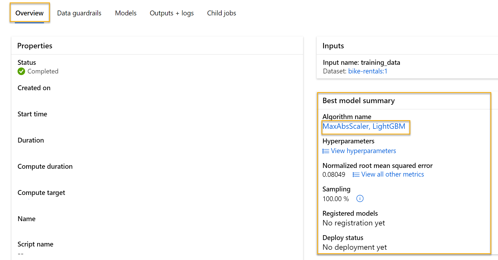

---
lab:
  title: استكشاف التعلم الآلي التلقائي في Azure ML
---

# استكشاف التعلم الآلي التلقائي في Azure ML

في هذا التمرين، ستستخدم ميزة التعلم الآلي التلقائي في Azure التعلم الآلي لتدريب نموذج التعلم الآلي وتقييمه. ثم ستقوم بنشر النموذج المدرب واختباره.

يجب أن يستغرق هذا التمرين حوالي **30** دقيقة لإكماله.

> **ملاحظة** لإكمال هذا النشاط المعملي، ستحتاج إلى [اشتراك Azure](https://azure.microsoft.com/free) الذي لديك فيه حق الوصول الإداري.

## إنشاء مساحة عمل "التعلم الآلي من Azure"

لاستخدام Azure التعلم الآلي، تحتاج إلى توفير مساحة عمل Azure التعلم الآلي في اشتراك Azure الخاص بك. ثم ستتمكن من استخدام Azure التعلم الآلي studio للعمل مع الموارد في مساحة العمل الخاصة بك.

> **تلميح**: إذا كان لديك بالفعل مساحة عمل Azure التعلم الآلي، يمكنك استخدام ذلك والتخطي إلى المهمة التالية.

1. سجل الدخول إلى [مدخل](https://portal.azure.com) Microsoft Azure باستخدام `https://portal.azure.com` بيانات اعتماد Microsoft.

1. حدد **+ Create a resource**، وابحث عن *التعلم الآلي*، وأنشئ مورد Azure التعلم الآلي** جديد **بالإعدادات التالية:
    - **الاشتراك**: *اشتراك Azure الخاص بك*.
    - **Resource group**: *أنشئ مجموعة موارد أو حددها*.
    - **الاسم**: *أدخل اسما فريدا لمساحة* العمل الخاصة بك.
    - **Region**: *حدد أقرب منطقة جغرافية لك*.
    - **Storage account**: *لاحظ حساب التخزين الجديد الافتراضي الذي سيتم إنشاؤه لمساحة العمل الخاصة بك*.
    - **Key vault**: *لاحظ الحاوية الرئيسية الجديدة الافتراضية التي سيتم إنشاؤها لمساحة العمل الخاصة بك*.
    - **Application insights**: *لاحظ مورد application insights الجديد الافتراضي الذي سيتم إنشاؤه لمساحة العمل الخاصة بك*.
    - **Container registry**: None (*سيتم إنشاء سجل واحد تلقائيًا عند أول مرة تقوم فيها بتوزيع نموذج في حاوية*).

1. حدد **Review + create**، ثم حدد **Create**. انتظر حتى يتم إنشاء مساحة العمل الخاصة بك (قد يستغرق الأمر بضع دقائق)، ثم انتقل إلى المورد الموزع.

1. حدد **Launch studio** (أو افتح علامة تبويب جديدة في مستعرض الويب، وانتقل إلى [https://ml.azure.com](https://ml.azure.com?azure-portal=true)، وسجل الدخول إلى Azure Machine Learning studio باستخدام حساب Microsoft). أغلق أي رسائل يتم عرضها.

1. في Azure Machine Learning studio، يجب أن تشاهد مساحة العمل التي تم إنشاؤها حديثًا. إذا لم يكن الأمر كما هو، فحدد **جميع مساحات** العمل في القائمة اليسرى ثم حدد مساحة العمل التي أنشأتها للتو.

## تمكين ميزات المعاينة

بعض ميزات Azure التعلم الآلي قيد المعاينة، وتحتاج إلى تمكينها بشكل صريح في مساحة العمل الخاصة بك.

1. في Azure التعلم الآلي Studio، انقر فوق **إدارة ميزات** المعاينة (أيقونة السماعة الصاخبة - #128363;).

    

1. تمكين ميزة المعاينة التالية:

    - *تجربة إرشادية لإرسال مهام التدريب باستخدام الحوسبة بلا خادم*

## استخدام التعلم الآلي التلقائي لتدريب نموذج

يتيح لك التعلم الآلي التلقائي تجربة خوارزميات ومعلمات متعددة لتدريب نماذج متعددة، وتحديد أفضل نموذج لبياناتك. في هذا التمرين، ستستخدم مجموعة بيانات من تفاصيل تأجير الدراجات التاريخية لتدريب نموذج يتنبأ بعدد إيجارات الدراجات التي يجب توقعها في يوم معين، استنادا إلى الميزات الموسمية والأرصاد الجوية.

> **الاقتباس**: *البيانات المستخدمة في هذا التمرين مشتقة من [Capital Bikeshare](https://www.capitalbikeshare.com/system-data) وتستخدم وفقا لاتفاقية*[ ترخيص البيانات ](https://www.capitalbikeshare.com/data-license-agreement)المنشورة.


1. في [Azure التعلم الآلي studio](https://ml.azure.com?azure-portal=true)، اعرض **صفحة التعلم الآلي** التلقائي (ضمن **التأليف**).

1. إنشاء مهمة ML تلقائية جديدة باستخدام الإعدادات التالية، باستخدام **Next** كما هو مطلوب للتقدم من خلال واجهة المستخدم:

    **الإعدادات** الأساسية:

    - **اسم** الوظيفة: mslearn-bike-automl
    - **اسم** التجربة الجديد: mslearn-bike-rental
    - **الوصف**: التعلم الآلي التلقائي للتنبؤ باستئجار الدراجات
    - **العلامات**: *بلا*

   **نوع المهمة والبيانات**:

    - **تحديد نوع** المهمة: الانحدار
    - **حدد مجموعة** البيانات: إنشاء مجموعة بيانات جديدة بالإعدادات التالية:
        - **Data type**:
            - **الاسم**: تأجير الدراجات
            - **الوصف**: بيانات تأجير الدراجات التاريخية
            - **النوع**: جدولي
        - **مصدر** البيانات:
            - تحديد **من ملفات الويب**
        - **عنوان URL الخاص بالويب**:
            - **عنوان URL الخاص بالويب**: `https://aka.ms/bike-rentals`
            - **تخطى التحقق من صحة البيانات**: *لا تختاره*
        - **** الإعدادات:
            - **File format**: Delimited
            - **Delimiter**: Comma
            - **Encoding**: UTF-8
            - **عناوين الأعمدة**: يحتوي الملف الأول فقط على عناوين
            - **Skip rows**: None
            - **Dataset contains multi-line data**: *لا تحددها*
        - **Schema**:
            - قم بتضمين كل الأعمدة بخلاف **Path**
            - مراجعة الأنواع التي تم اكتشافها تلقائيًا

        **حدد مجموعة بيانات تأجير الدراجات** بعد إنشائها.

    **إعدادات** المهمة:

    - **نوع** المهمة: الانحدار
    - **مجموعة** البيانات: تأجير الدراجات
    - **العمود** الهدف: الإيجارات (عدد صحيح)
    - **إعدادات** التكوين الإضافية:
        - **المقياس** الأساسي: خطأ تربيعي متوسط الجذر الطبيعي
        - **شرح أفضل نموذج**: *غير محدد*
        - **استخدام جميع النماذج المدعومة**: <u>غير</u> محدد. *ستقيد الوظيفة لتجربة عدد قليل من الخوارزميات المحددة فقط.*
        - **Allowed models**: *حدد فقط **RandomForest** و**LightGBM** — عادة ما ترغب في تجربة أكبر عدد ممكن، ولكن كل نموذج مضاف يزيد من الوقت الذي يستغرقه تشغيل الوظيفة.*
    - **** الحدود: *توسيع هذا القسم*
        - **الحد الأقصى للتجارب**: 3
        - **الحد الأقصى للتجارب المتزامنة**: 3
        - **الحد الأقصى للعقد**: 3
        - **حد** درجة المقياس: 0.85 (*بحيث إذا حقق النموذج متوسط درجة مقياس الخطأ التربيعي للجذر الذي تمت تسويتها وهو 0.085 أو أقل، تنتهي المهمة.*)
        - **المهلة**: 15
        - **مهلة** التكرار: 5
        - **تمكين الإنهاء** المبكر: *محدد*
    - **التحقق من الصحة والاختبار**:
        - **نوع التحقق من** الصحة: تقسيم التحقق من صحة التدريب
        - **النسبة المئوية لبيانات** التحقق من الصحة: 10
        - **اختبار مجموعة** البيانات: بلا

    **الحساب**:

    - **حدد نوع** الحساب: بلا خادم
    - **Virtual machine type**: معالج
    - **Virtual machine tier**: Dedicated
    - **حجم** الجهاز الظاهري: Standard_DS3_V2
    - **عدد المثيلات**: 1

1. تقديم وظيفة التدريب. يبدأ تلقائيا.

1. انتظر حتى تنتهي المهمة. قد يستغرق بعض الوقت - الآن قد يكون الوقت المناسب لفترة استراحة لتناول القهوة!

## مراجعة أفضل نموذج

عند اكتمال مهمة التعلم الآلي التلقائي، يمكنك مراجعة أفضل نموذج تم تدريبه.

1. في علامة التبويب **Overview** شغّل التعلم الآلي التلقائي، لاحظ أفضل ملخص نموذج.
    

    > **ملاحظة** قد ترى رسالة ضمن الحالة "تحذير: تم الوصول إلى درجة الخروج المحددة من قبل المستخدم...". هذه رسالة متوقعة. تابع إلى الخطوة التالية.
  
1. حدد النص الموجود أسفل **اسم الخوارزمية** لأفضل نموذج لعرض تفاصيله.

1. **حدد علامة التبويب Metrics** وحدد القيم المتبقية **** والمخططات **predicted_true** إذا لم تكن محددة بالفعل. 

    راجع المخططات البيانية التي توضح أداء النموذج. **يعرض مخطط القيم** المتبقية *القيم المتبقية* (الاختلافات بين القيم المتوقعة والقيم الفعلية) كمخطط تكراري. يقارن **المخطط predicted_true** القيم المتوقعة بالقيم الحقيقية. 

## نشر النموذج واختباره

1. في **علامة التبويب Model** للحصول على أفضل نموذج تم تدريبه بواسطة مهمة التعلم الآلي المؤتمتة، حدد **Deploy** واستخدم **خيار Web service** لنشر النموذج بالإعدادات التالية:
    - **الاسم**: predict-rentals
    - **الوصف**: توقع إيجارات الدورة
    - **نوع الحساب**: Azure Container Instance
    - **تمكين المصادقة**: *محدد*

1. انتظر حتى بدء التوزيع - قد يستغرق هذا بضع ثوانٍ. **سيتم الإشارة إلى حالة** التوزيع لنقطة **نهاية predict-rentals** في الجزء الرئيسي من الصفحة ك *قيد التشغيل*.
1. انتظر حتى **تتغير حالة** التوزيع إلى *Succeeded*. قد يستغرق هذا 5-10 دقائق.

## اختبار الخدمة المنشورة

يمكنك الآن اختبار الخدمة التي تم توزيعها.

1. في Azure التعلم الآلي studio، في القائمة اليسرى، حدد **Endpoints** وافتح **نقطة النهاية predict-rentals** في الوقت الفعلي.

1. في **صفحة نقطة نهاية predict-rentals** في الوقت الحقيقي، اعرض **علامة التبويب Test** .

1. في **جزء Input data to test endpoint** ، استبدل القالب JSON ببيانات الإدخال التالية:

    ```JSON
    {
      "Inputs": { 
        "data": [
          {
            "day": 1,
            "mnth": 1,   
            "year": 2022,
            "season": 2,
            "holiday": 0,
            "weekday": 1,
            "workingday": 1,
            "weathersit": 2, 
            "temp": 0.3, 
            "atemp": 0.3,
            "hum": 0.3,
            "windspeed": 0.3 
          }
        ]    
      },   
      "GlobalParameters": 1.0
    }
    ```

1. **انقر فوق الزر اختبار**.

1. راجع نتائج الاختبار، والتي تتضمن عددا متنبأ به من الإيجارات استنادا إلى ميزات الإدخال - على غرار هذا:

    ```JSON
    {
      "Results": [
        444.27799000000000
      ]
    }
    ```

    أخذ جزء الاختبار بيانات الإدخال واستخدم النموذج الذي دربته لإرجاع العدد المتوقع من الإيجارات.

دعونا نستعرض ما فعلته. لقد استخدمت مجموعة بيانات من بيانات تأجير الدراجات التاريخية لتدريب نموذج. يتوقع النموذج عدد مرات تأجير الدراجات المتوقع في يوم معين، استناداً إلى *الميزات*الموسمية والأرصاد الجوية.

## التنظيف

تتم استضافة خدمة الويب التي قمت بإنشائها في *Azure Container Instance*. إذا كنت لا تنوي إجراء المزيد من التجارب عليها، فإنه يجب عليك حذف نقطة النهاية لتجنب تراكم استخدام Azure غير الضروري.

1. في [Azure التعلم الآلي studio](https://ml.azure.com?azure-portal=true)، في **علامة التبويب Endpoints**، حدد **نقطة نهاية predict-rentals**. ثم حدد **Delete**، وقم بالتأكيد على رغبتك في حذف نقطة النهاية.

    يضمن حذف الحوسبة عدم فرض رسوم على اشتراكك مقابل موارد الحوسبة. ومع ذلك، سيتم تحصيل مبلغ صغير لتخزين البيانات طالما أن مساحة عمل التعلم الآلي من Azure موجودة في اشتراكك. إذا انتهيت من استكشاف التعلم الآلي من Azure، فإنه يمكنك حذف مساحة عمل التعلم الآلي من Azure والموارد المقترنة بها.

لحذف مساحة العمل لديك:

1. في [مدخل Azure](https://portal.azure.com?azure-portal=true)، ومن صفحة **Resource groups**، افتح مجموعة الموارد التي حددتها عند إنشاء مساحة عمل Azure Machine Learning.
2. انقر فوق **حذف مجموعة الموارد**، واكتب اسم مجموعة الموارد لتأكيد أنك ترغب في حذفها، ثم حدد **Delete**.
