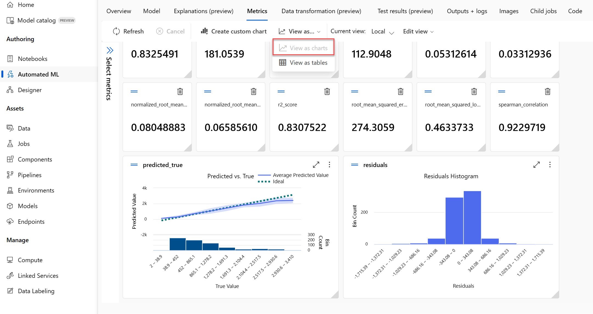

---
lab:
  title: استكشاف التعلم الآلي التلقائي في Azure ML
---

# استكشاف التعلم الآلي التلقائي في Azure ML

> **ملاحظة** لإكمال هذا النشاط المعملي، ستحتاج إلى [اشتراك Azure](https://azure.microsoft.com/free?azure-portal=true) الذي لديك فيه حق الوصول الإداري.

في هذا التمرين، ستستخدم مجموعة بيانات من التفاصيل القديمة لتأجير الدراجات لتدريب نموذج يتنبأ بعدد مرات تأجير الدراجات التي ينبغي توقعها في يوم معين، بناءً على الميزات الموسمية والأرصاد الجوية.

## إنشاء مساحة عمل التعلم الآلي من Azure  

1. سجل الدخول إلى [مدخل Azure](https://portal.azure.com?azure-portal=true) باستخدام بيانات اعتماد Microsoft الخاصة بك.

1. حدد **+ Create a resource**، وابحث عن *Machine Learning*، وأنشئ مورد **Azure Machine Learning** جديد باستخدام خطة *Azure Machine Learning*. استخدام الإعدادات التالية:
    - **الاشتراك**: *اشتراك Azure الخاص بك*.
    - **Resource group**: *أنشئ مجموعة موارد أو حددها*.
    - **Workspace name**: *أدخل اسم فريد لمساحة العمل الخاصة بك*.
    - **Region**: *حدد أقرب منطقة جغرافية لك*.
    - **Storage account**: *لاحظ حساب التخزين الجديد الافتراضي الذي سيتم إنشاؤه لمساحة العمل الخاصة بك*.
    - **Key vault**: *لاحظ الحاوية الرئيسية الجديدة الافتراضية التي سيتم إنشاؤها لمساحة العمل الخاصة بك*.
    - **Application insights**: *لاحظ مورد application insights الجديد الافتراضي الذي سيتم إنشاؤه لمساحة العمل الخاصة بك*.
    - **Container registry**: None (*سيتم إنشاء سجل واحد تلقائيًا عند أول مرة تقوم فيها بتوزيع نموذج في حاوية*).

1. حدد **Review + create**، ثم حدد **Create**. انتظر حتى يتم إنشاء مساحة العمل الخاصة بك (قد يستغرق الأمر بضع دقائق)، ثم انتقل إلى المورد الموزع.

1. حدد **Launch studio** (أو افتح علامة تبويب جديدة في مستعرض الويب، وانتقل إلى [https://ml.azure.com](https://ml.azure.com?azure-portal=true)، وسجل الدخول إلى Azure Machine Learning studio باستخدام حساب Microsoft).

1. أغلق أي رسائل يتم عرضها.

1. في Azure Machine Learning studio، يجب أن تشاهد مساحة العمل التي تم إنشاؤها حديثًا. إذا لم يكن الأمر كذلك، فحدد دليل Azure في القائمة اليسرى. ثم من القائمة اليسرى الجديدة، حدد **مساحات العمل**، حيث يتم سرد جميع مساحات العمل المقترنة بالدليل، وحدد تلك التي أنشأتها لهذا التمرين.

> **ملاحظة** تعد هذه الوحدة هي واحدة من العديد من الوحدات التي تستخدم Azure Machine Learning workspace، بما في ذلك الوحدات الأخرى في مسار التعليم [أساسيات Microsoft Azure AI: استكشاف الأدوات المرئية للتعلم الآلي](https://docs.microsoft.com/learn/paths/create-no-code-predictive-models-azure-machine-learning/). إذا كنت تستخدم اشتراكك على Azure، فيمكنك إنشاء مساحة العمل مرة واحدة وإعادة استخدامها في وحدات أخرى. سيتم تحصيل مبلغ صغير من اشتراكك على Azure لتخزين البيانات طالما أن مساحة عمل التعلم الآلي من Microsoft Azure موجودة في اشتراكك، لذا نوصي بحذف مساحة عمل التعلم الآلي من Microsoft Azure عندما لا تكون مطلوبة.

## إنشاء أصل البيانات

1. عرض البيانات المفصولة بفواصل في ⁧[⁩⁧https://aka.ms/bike-rentals⁩⁧](https://aka.ms/bike-rentals?azure-portal=true)⁩ في مستعرض الويب.

1. في [استوديو التعلم الآلي من Microsoft Azure](https://ml.azure.com?azure-portal=true)، قم بتوسيع الجزء الأيمن عن طريق تحديد أيقونة القائمة في أعلى يسار الشاشة. اعرض صفحة **Data** (ضمن **Assets**). تحتوي صفحة "Data" على ملفات بيانات أو جداول معينة تخطط للعمل معها في Azure ML. يمكنك إنشاء مجموعات بيانات من هذه الصفحة أيضًا.

1. في صفحة **البيانات** ، ضمن علامة التبويب **أصول البيانات** ، حدد **+ إنشاء**. ثم قم بتكوين أصل بيانات بالإعدادات التالية:
    * **Data type**:
        * ⁧**⁩الاسم⁧**⁩: تأجير الدراجات
        * ⁧**⁩الوصف⁧**⁩: بيانات تأجير الدراجات
        * ⁧**⁩نوع مجموعة البيانات⁧**⁩: جدولي
    * **Data source**: From Web Files
    * **عنوان URL الخاص بالويب**: 
        * **عنوان URL الخاص بالويب**: [https://aka.ms/bike-rentals](https://aka.ms/bike-rentals?azure-portal=true)
        * **تخطى التحقق من صحة البيانات**: *لا تختاره*
    * ⁧**⁩الإعدادات⁧**⁩:
        * **تنسيق الملف**: محدد
        * **المحدِّد**: فاصلة
        * **الترميز**: UTF-8
        * **عناوين الأعمدة**: يحتوي الملف الأول فقط على عناوين
        * **تخطي الصفوف**: لا يوجد
        * **Dataset contains multi-line data**: *لا تحددها*
    * **المخطط**:
        * قم بتضمين كل الأعمدة بخلاف العمود **"Path"**
        * مراجعة الأنواع التي تم اكتشافها تلقائيًا
    * **مراجعة**
        * حدد ⁧**⁩Create⁧**⁩

1. بعد إنشاء مجموعة البيانات، افتحها وعرض صفحة ⁧**⁩Explore⁧**⁩ لمشاهدة عينة من البيانات. تحتوي هذه البيانات على ميزات وتسميات تاريخية لتأجير الدراجات.

> **Citation**: *هذه البيانات مشتقة من [Capital Bikeshare](https://www.capitalbikeshare.com/system-data) وتستخدم وفقًا [لاتفاقية ترخيص](https://www.capitalbikeshare.com/data-license-agreement)البيانات المنشورة*.

## تمكين الحوسبة بلا خادم

1. في Azure Machine Learning Studio، انقر فوق **إدارة ميزات المعاينة** (أيقونة السماعة الصاخبة).


1. تمكين ميزة "التجربة الإرشادية لإرسال مهام التدريب باستخدام الحوسبة بلا خادم".


## شغّل وظيفة تعلم آلي تلقائية

اتبع الخطوات التالية لتشغيل وظيفة تستخدم التعلم الآلي التلقائي لتدريب نموذج التراجع الذي يتنبأ باستئجارات الدراجات.

1. في [استوديو التعلم الآلي من Microsoft Azure](https://ml.azure.com?azure-portal=true)، اعرض صفحة **التعلم الآلي التلقائي** (ضمن **التأليف**).

1. أنشئ وظيفة التعلم الآلي التلقائية بالإعدادات التالية:
    - **Select data asset**:
        - ⁧**⁩مجموعة البيانات⁧**⁩: تأجير الدراجات
    - **Configure job**:
        - ⁧**⁩اسم التجربة الجديدة⁧**⁩: mslearn-bike-rental
        - **Target column**: الإيجارات (*هذه هي التسمية التي تم تدريب النموذج على التنبؤ بها)*
        - **Select Azure ML compute cluster**: *نظام مجموعة الحساب الذي أنشأته مسبقًا*.
    - **حدد task and settings**: 
        - **Task type**: Regression *(سيتنبأ النموذج بقيمة رقمية)* 

    

    لاحظ تحت task type هناك إعدادات *View additional configuration settings* و*View featurization settings*. الآن قم بتكوين هذه الإعدادات.

    - ⁧**⁩إعدادات تكوين إضافية:⁧**⁩
        - **Primary metric**: حدد **Normalized root mean squared error**
        - **شرح أفضل نموذج**: محدد - *هذا الخيار يتسبب في قيام التعلم الآلي التلقائي بحساب أهمية ميزة أفضل نموذج مما يجعل من الممكن تحديد تأثير كل ميزة على التسمية المتوقعة.*
        - **استخدام جميع النماذج المدعومة**: <u>غير</u> محدد. *ستقيد الوظيفة لتجربة عدد قليل من الخوارزميات المحددة فقط.*
        - **Allowed models**: *حدد فقط **RandomForest** و**LightGBM** — عادة ما ترغب في تجربة أكبر عدد ممكن، ولكن كل نموذج مضاف يزيد من الوقت الذي يستغرقه تشغيل الوظيفة.*

        
لاحظ ضمن *View additional configuration settings* هو قسم *Limits* . قم بتوسيع القسم لتكوين الإعدادات:
        - **المهلة (بالدقائق)**: 30 — *تنتهي المهمة بعد 30 دقيقة كحد أقصى.*
        - **Metric score threshold**: 0.085 — *إذا حقق النموذج درجة مقياس خطأ لمتوسط ​​الجذر التربيعي بقيمة 0.085 أو أقل، تنتهي الوظيفة.*
        - انقر فوق⁧**⁩التالي⁧**⁩
        - **الحساب**: لا توجد تغييرات مطلوبة هنا
        - انقر فوق⁧**⁩التالي⁧**⁩
1. عند الانتهاء من إرسال تفاصيل وظيفة التعلم الآلي التلقائية، فإنها تبدأ تلقائيًا.

1. انتظر حتى تنتهي المهمة. قد يستغرق بعض الوقت - الآن قد يكون الوقت المناسب لفترة استراحة لتناول القهوة!

## مراجعة أفضل نموذج

1. في علامة التبويب **Overview** شغّل التعلم الآلي التلقائي، لاحظ أفضل ملخص نموذج.
    

    > **ملاحظه** قد ترى رسالة ضمن الحالة "تحذير: تم الوصول إلى درجة الخروج المحددة من قبل المستخدم...". هذه رسالة متوقعة. تابع إلى الخطوة التالية.  
1. حدد النص الموجود أسفل **اسم الخوارزمية** لأفضل نموذج لعرض تفاصيله.

1. بجوار قيمة ⁧*⁩خطأ في متوسط الجذر المُطَرَح⁧*⁩ حدد ⁧**⁩View all other metrics⁧**⁩ لرؤية قيم مقاييس التقييم المحتملة الأخرى لنموذج التراجع.

    

1. حدد علامة التبويب ⁧**⁩Metrics⁧**⁩ وحدد ⁧**⁩residuals⁧**⁩ و⁧**⁩predicted_true⁧**⁩ إذا لم تكن محددة بالفعل. 
    

    راجع المخططات البيانية التي توضح أداء النموذج. يقارن المخطط البياني القيم المتوقعة بالقيم الحقيقية، ويظهر *residuals*، والاختلافات بين القيم المتوقعة والقيم الفعلية، كمدرج تكراري. يقارن الرسم البياني الثاني القيم المتوقعة مقابل القيم الحقيقية.

1. حدد علامة التبويب **Explanations**. حدد معرّف التفسير ثم حدد **Aggregate feature Importance**. يوضح هذا المخطط مدى تأثير كل ميزة في مجموعة البيانات على توقع التسمية، على هذا الشكل:

    

## توزيع خدمة تنبؤية

1. في [Azure Machine Learning studio](https://ml.azure.com?azure-portal=true)، في صفحة **Automated ML**، حدد وظيفة التعلم الآلي التلقائية الخاصة بك.

1. في علامة التبويب **Overview**، اختر اسم الخوارزمية لأفضل نموذج.

    

1. في علامة التبويب **Models** ، حدد الزر **Deploy** واستخدم خيار **Web service** لتوزيع النموذج بالإعدادات التالية:
    - ⁧**⁩الاسم⁧**⁩: توقع الإيجارات
    - ⁧**⁩وصف⁧**⁩: توقع تأجيرات الدورة
    - **نوع الحساب**: Azure Container Instance
    - ⁧**⁩تمكين المصادقة⁧**⁩: محدد

1. انتظر حتى بدء التوزيع - قد يستغرق هذا بضع ثوانٍ.

1. في استوديو التعلم الآلي من Microsoft Azure، في القائمة اليسرى، حدد **Endpoints** وافتح نقطة النهاية **predict-rentals** في الوقت الحقيقي.
1. انتظر حتى تتغير **حالة النشر** إلى **سليم** - قد يستغرق هذا بضع دقائق.

## اختبار الخدمة المنشورة

يمكنك الآن اختبار الخدمة التي تم توزيعها.

1. في صفحة نقطة نهاية **predict-rentals** في الوقت الحقيقي، ارفع علامة التبويب **Test** .

1. في جزء **Input data لاختبار نقطة النهاية** ، استبدل القالب JSON ببيانات الإدخال التالية:

    ```JSON
    {
      "Inputs": { 
        "data": [
          {
            "day": 1,
            "mnth": 1,   
            "year": 2022,
            "season": 2,
            "holiday": 0,
            "weekday": 1,
            "workingday": 1,
            "weathersit": 2, 
            "temp": 0.3, 
            "atemp": 0.3,
            "hum": 0.3,
            "windspeed": 0.3 
          }
        ]    
      },   
      "GlobalParameters": 1.0
    }
    ```

1. انقر فوق الزر **Test**.

1. راجع نتائج الاختبار، التي تتضمن عدداً متوقعاً من الإيجارات استناداً إلى ميزات الإدخال. أخذ جزء الاختبار بيانات الإدخال واستخدم النموذج الذي دربته لإرجاع العدد المتوقع من الإيجارات.

    

دعونا نستعرض ما فعلته. لقد استخدمت مجموعة بيانات من بيانات تأجير الدراجات التاريخية لتدريب نموذج. يتوقع النموذج عدد مرات تأجير الدراجات المتوقع في يوم معين، استناداً إلى *الميزات*الموسمية والأرصاد الجوية. في هذه الحالة، *التسميات* هي عدد مرات تأجير الدراجات.

لقد اختبرت للتو خدمة جاهزة للاتصال بتطبيق عميل باستخدام بيانات الاعتماد في علامة التبويب **Consume**. سننهي التدريب العملي هنا. نرحب بمواصلة تجربة الخدمة التي قمت بتوزيعها للتو.

## التنظيف

تتم استضافة خدمة الويب التي قمت بإنشائها في *Azure Container Instance*. إذا كنت لا تنوي إجراء المزيد من التجارب عليها، فإنه يجب عليك حذف نقطة النهاية لتجنب تراكم استخدام Azure غير الضروري. يجب عليك أيضا حذف نظام مجموعة الحوسبة.

1. في ⁧[⁩Azure Machine Learning studio⁧](https://ml.azure.com?azure-portal=true)⁩، في علامة التبويب ⁧**⁩Endpoints⁧**⁩ حدد نقطة النهاية ⁧**⁩predict-rentals⁧**⁩. ثم حدد **Delete**، وقم بالتأكيد على رغبتك في حذف نقطة النهاية.

> **ملاحظه** يضمن حذف الحساب الخاص بك عدم فرض رسوم على اشتراكك مقابل موارد الحوسبة. ومع ذلك، سيتم تحصيل مبلغ صغير لتخزين البيانات طالما أن مساحة عمل التعلم الآلي من Azure موجودة في اشتراكك. إذا انتهيت من استكشاف التعلم الآلي من Azure، فإنه يمكنك حذف مساحة عمل التعلم الآلي من Azure والموارد المقترنة بها. ومع ذلك، إذا كنت تخطط لإكمال أي معامل تجريبية أخرى في هذه السلسلة، سوف تحتاج إلى إعادة إنشائها.
>
> لحذف مساحة العمل لديك:
> 1. في ⁧[⁩مدخل Microsoft Azure⁧](https://portal.azure.com?azure-portal=true)⁩، في صفحة ⁧**⁩Resource groups⁧**⁩ افتح مجموعة الموارد التي حددتها عند إنشاء مساحة عمل التعلم الآلي من Microsoft Azure.
> 2. انقر فوق **"حذف مجموعة الموارد"**، واكتب اسم مجموعة الموارد لتأكيد أنك ترغب في حذفها، ثم حدد **"Delete"**.
