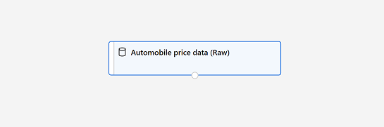
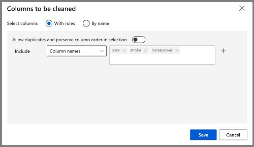

---
lab:
  title: استكشاف التراجع باستخدام مصمم Azure Machine Learning
---

# استكشاف التراجع باستخدام مصمم Azure Machine Learning

> **ملاحظة** لإكمال هذا النشاط المعملي، ستحتاج إلى [اشتراك Azure](https://azure.microsoft.com/free?azure-portal=true) الذي لديك فيه حق الوصول الإداري.

في هذا التمرين، سوف تقوم بتدريب نموذج انحدار يتنبأ بسعر السيارة بناءً على خصائصها.

## إنشاء مساحة عمل التعلم الآلي من Azure  

1. سجل الدخول إلى [مدخل Azure](https://portal.azure.com?azure-portal=true) باستخدام بيانات اعتماد Microsoft الخاصة بك.

1. حدد **+ Create a resource**، وابحث عن *Machine Learning*، وأنشئ مورد **Azure Machine Learning** جديد باستخدام خطة *Azure Machine Learning*. استخدام الإعدادات التالية:
    - **الاشتراك**: *اشتراك Azure الخاص بك*.
    - **Resource group**: *أنشئ مجموعة موارد أو حددها*.
    - **Workspace name**: *أدخل اسم فريد لمساحة العمل الخاصة بك*.
    - **Region**: *حدد أقرب منطقة جغرافية لك*.
    - **Storage account**: *لاحظ حساب التخزين الجديد الافتراضي الذي سيتم إنشاؤه لمساحة العمل الخاصة بك*.
    - **Key vault**: *لاحظ الحاوية الرئيسية الجديدة الافتراضية التي سيتم إنشاؤها لمساحة العمل الخاصة بك*.
    - **Application insights**: *لاحظ مورد application insights الجديد الافتراضي الذي سيتم إنشاؤه لمساحة العمل الخاصة بك*.
    - **Container registry**: لا شيء (*سيتم إنشاء واحد تلقائياً عند أول مرة تقوم فيها بنشر نموذج في حاوية*)

1. حدد **Review + create**، ثم حدد **Create**. انتظر حتى يتم إنشاء مساحة العمل الخاصة بك (قد يستغرق الأمر بضع دقائق)، ثم انتقل إلى المورد الموزع.

1. حدد **Launch studio** (أو افتح علامة تبويب جديدة في مستعرض الويب، وانتقل إلى [https://ml.azure.com](https://ml.azure.com?azure-portal=true)، وسجل الدخول إلى Azure Machine Learning studio باستخدام حساب Microsoft).

1. في Azure Machine Learning studio، يجب أن تشاهد مساحة العمل التي تم إنشاؤها حديثًا. إذا لم يكن الأمر كذلك، فحدد دليل Azure في القائمة اليسرى. ثم من القائمة اليسرى الجديدة، حدد **مساحات العمل**، حيث يتم سرد جميع مساحات العمل المقترنة بالدليل، وحدد تلك التي أنشأتها لهذا التمرين.

> **ملاحظة** تعد هذه الوحدة هي واحدة من العديد من الوحدات التي تستخدم Azure Machine Learning workspace، بما في ذلك الوحدات الأخرى في مسار التعليم [أساسيات Microsoft Azure AI: استكشاف الأدوات المرئية للتعلم الآلي](https://docs.microsoft.com/learn/paths/create-no-code-predictive-models-azure-machine-learning/). إذا كنت تستخدم اشتراكك على Azure، فيمكنك إنشاء مساحة العمل مرة واحدة وإعادة استخدامها في وحدات أخرى. سيتم تحصيل مبلغ صغير من اشتراكك على Azure لتخزين البيانات طالما أن مساحة عمل التعلم الآلي من Microsoft Azure موجودة في اشتراكك، لذا نوصي بحذف مساحة عمل التعلم الآلي من Microsoft Azure عندما لا تكون مطلوبة.

## أنشئ حساب

1. في [استوديو التعلم الآلي من Microsoft Azure](https://ml.azure.com?azure-portal=true)، حدد أيقونة **&#8801;** (أيقونة قائمة تبدو كمكدس من ثلاثة أسطر) في الجزء العلوي الأيسر لعرض الصفحات المختلفة في الواجهة (قد تحتاج إلى زيادة حجم الشاشة إلى أقصى حد). يمكنك استخدام هذه الصفحات في الجزء الأيسر لإدارة الموارد في مساحة العمل. حدد صفحة **Compute** (ضمن **Manage**).

1. في صفحة **Compute**، حدد علامة التبويب **Compute Clusters**، وأضف نظام مجموعة حساب جديد بالإعدادات التالية لتدريب نموذج التعلم الآلي:
    - **Location**: *اختر نفس مساحة العمل التي تعمل فيها. إذا لم يكن هذا الموقع مدرجًا، فاختر أقرب موقع إليك*.
    - **Virtual machine tier**: Dedicated
    - **Virtual machine type**: معالج
    - **Virtual machine size**:
        - اختر **Select from all options**
        - ابحث عن **Standard_DS11_v2** وحدده
    - حدد **التالي**
    - **اسم الحساب**: *أدخل اسماً فريداً*
    - **الحد الأدنى من عدد العقد**: 0
    - **الحد الأقصى من عدد العقد**: 2
    - **ثواني الخمول قبل تقليص الحجم**: 120
    - **Enable SSH access**: غير محدد
    - حدد ⁧**⁩Create⁧**⁩

> **ملاحظة** تستند مثيلات الحساب ومجموعاته إلى صور جهاز Azure الظاهري القياسية. في هذه الوحدة، ينصح باستخدام صورة *Standard_DS11_v2* لتحقيق التوازن الأمثل بين التكلفة والأداء. إذا كان اشتراكك يحتوي على حصة نسبية لا تتضمن هذه الصورة، فاختر صورة بديلة؛ ولكن ضع في اعتبارك أن الصورة الأكبر قد تنطوي على تكلفة أعلى وقد لا تكون الصورة الأصغر كافية لإكمال المهام. بدلاً من ذلك، اطلب من مسؤول Azure توسيع الحصة النسبية.

سيستغرق إنشاء نظام مجموعة الحساب بعض الوقت. يمكنك الانتقال إلى الخطوة التالية في أثناء الانتظار.

## إنشاء البنية الأساسية لبرنامج ربط العمليات التجارية في Designer 

1. في [استوديو التعلم الآلي من Microsoft Azure](https://ml.azure.com?azure-portal=true)، قم بتوسيع الجزء الأيسر عن طريق تحديد أيقونة القائمة في أعلى يسار الشاشة. اعرض صفحة **Designer** (ضمن **Author**)، وحدد **+** لإنشاء مسار جديد.

1. في الجانب الأيمن العلوي من الشاشة، حدد **Settings**. إذا لم يكن جزء **Settings** مرئياً، فحدد أيقونة العجلة الموجودة بجانب اسم المسار في الأعلى.

1. في **Settings**، يتعين عليك تحديد هدف حوسبة لتشغيل المسار عليه. ضمن **Select compute type**، حدد **Compute cluster**. ثم ضمن **Select Azure ML compute cluster**، حدد نظام مجموعة الحساب التي أنشأتها مسبقًا.

1. في **Settings**، ضمن **Draft details**، قم بتغيير اسم المسودة (**Pipeline-Created-on-* date***) إلى **Auto Price Training**.

1. حدد أيقونة *الإغلاق* في الجزء العلوي الأيسر من جزء **الإعدادات** لإغلاق الجزء. 


## إضافة مجموعة بيانات واستكشافها

يتضمن التعلم الآلي من Azure نموذج مجموعة بيانات يمكنك استخدامها لنموذج التراجع.

1. بجوار اسم المسار على اليسار، حدد أيقونة الأسهم لتوسيع اللوحة إذا لم يتم توسيعها بالفعل. يجب فتح اللوحة بشكل افتراضي إلى جزء **Asset library**، المشار إليها بواسطة أيقونة الكتب في أعلى اللوحة. يوجد شريط بحث لتحديد موقع الأصول في الجزء وزرين، **Data** و**Component**.

    

1. انقر فوق **Component**. ابحث عن مجموعة البيانات **Automobile price data (Raw)** وضعها على اللوحة.

1. انقر بزر الماوس الأيمن (Ctrl+النقر فوق Mac) على مجموعة البيانات **Automobile price data (Raw)** على اللوحة، وانقر على **Preview data**.

1. راجع *Dataset output*، مع الإشارة إلى أنه يمكنك مشاهدة توزيعات الأعمدة المختلفة كمدرجات تكرارية.

1. قم بالتمرير إلى يمين مجموعة البيانات حتى ترى عمود **Price**، وهو التصنيف الذي يتوقعه النموذج.

1. مرر إلى الخلف وإلى الجانب الأيسر وحدد رأس عمود **خسائر تمت تسويتها**. ثم راجع الإحصائيات بالنسبة لهذا العمود. لاحظ أن هناك عدداً قليلاً جداً من القيم المفقودة في هذا العمود. تحد القيم المفقودة من فائدة العمود في التنبؤ بتسمية **price**، لذا قد ترغب في استبعاده من التدريب.

1. أغلق نافذة **مرئيات نتائج بيانات سعر السيارات (Raw)** حتى تتسنى لك رؤية مجموعة البيانات على اللوحة هكذا:

    

## إضافة تحويلات البيانات

عادةً ما تُطبق تحويلات البيانات لإعداد البيانات من أجل النمذجة. ففي حالة بيانات سعر السيارات، ستضيف التحويلات لمعالجة المشكلات التي حددتها عند استكشاف البيانات.

1. في جزء **Asset Library** على اليسار، انقر فوق **Component**، والتي تحتوي على مجموعة واسعة من الوحدات التي يمكنك استخدامها لتحويل البيانات وتدريب النموذج. يمكنك أيضا استخدام شريط البحث لتحديد موقع الوحدات بسرعة.

1. ابحث عن الوحدة **Select Columns in Dataset** واسحبها إلى اللوحة، وذلك أسفل الوحدة **Automobile price data (Raw)**. ثم اربط الإخراج الموجود أسفل الوحدة النمطية **Automobile price data (Raw)** بالإدخال الموجود أعلى الوحدة النمطية **Select Columns in Dataset**، هكذا:

    

1. انقر نقراً مزدوجاً فوق الوحدة **Select Columns in Dataset** للوصول إلى الجزء على الجانب الأيمن. حدد **Edit column**. ثم في نافذة **Select columns**، حدد **By name** و**Add all** لإضافة كل الأعمدة. ثم قم بإزالة **normalized-losses**، بحيث يبدو تحديد العمود النهائي كما يلي:

    

1. انقر فوق زر **حفظ**.

في بقية هذا التمرين، ستمر بخطوات إنشاء مسار يبدو هكذا:


اتبع الخطوات المتبقية، مستخدماً الصورة أعلاه كمرجع بينما تقوم بإضافة الوحدات النمطية المطلوبة وتكوينها.

1. في **Asset library**، ابحث عن وحدة **Clean Missing Data** وضعها ضمن وحدة **Select Columns in Dataset** على اللوحة. ثم اربط الإخراج من الوحدة النمطية **Select Columns in Dataset** بإدخال الوحدة النمطية **Clean Missing Data**.

1. انقر مرتين الوحدة **Clean Missing Data**، وفي جزء على الجانب الأيمن، انقر فوق **Edit column**. ثم في نافذة **Columns to be cleaned**، حدد **With rules**، وفي قائمة **Include**، حدد **Column names**، وفي مربع أسماء الأعمدة، أدخل **bore** و**stroke** و**horsepower** هكذا:

    

1. مع استمرار تحديد الوحدة **Clean Missing Data**، وفي الجزء على الجانب الأيمن، قم بتعيين إعدادات التكوين التالية:
    - **الحد الأدنى لنسبة القيمة المفقودة**: 0.0
    - **الحد الأقصى لنسبة القيمة المفقودة**: 1.0
    - **وضع التنظيف**: إزالة الصف بالكامل

    >**تلميح** إذا عرضت إحصائيات أعمدة **bore** و**stroke** و**horsepower** سترى عدد القيم المفقودة. تتضمن هذه الأعمدة عدداً أقل بكثير من القيم المفقودة عن عمود **normalized-losses**، لذا فإنها لا تزال ذات فائدة في التنبؤ بـ**price** إذا استبعدت الصفوف التي بها قيم مفقودة من التدريب.

1. في **Asset library**، ابحث عن وحدة **Normalize Data** وضعها على اللوحة، أسفل الوحدة النمطية **Clean Missing Data**. ثم اربط إخراج الوحدة النمطية **Clean Missing Data** الموجود أقصى اليسار بإدخال الوحدة النمطية **Normalize Data**.

1. انقر نقرا مزدوجا فوق الوحدة **Normalize Data** لعرض جزء المعلمات الخاص بها. ستحتاج إلى تحديد طريقة التحويل والأعمدة المراد تحويلها. عيّن أسلوب التحويل إلى **MinMax**. تطبيق قاعدة عبر تحديد الأعمدة لتضمين **Edit column** لتضمين **Column names** التالية:
    - **الترميز**
    - **قاعدة العجلات**
    - **الطول**
    - **العرض**
    - **الارتفاع**
    - **الوزن الفارغ**
    - **حجم المحرك**
    - **قطر الأسطوانة**
    - **الشوط**
    - **نسبة الضغط**
    - **القدرة الحصانية**
    - **أقصى حد لعدد اللفات في الدقيقة**
    - **عدد الأميال لكل جالون في المدينة**
    - **عدد الأميال لكل جالون على الطريق السريع**

    

    >**تلميح** إذا قارنت القيم في أعمدة **stroke**، و**peak-rpm**، و**city-mpg**، فجميعها تقاس بمقاييس مختلفة، ومن المحتمل أن القيم الأكبر لـ **peak-rpm** قد تحيز خوارزمية التدريب وتخلق تبعية مفرطة في هذا العمود مقارنة بالأعمدة ذات القيم الأقل، مثل **stroke**. عادة ما يقوم علماء البيانات بتقليل هذا الانحياز المحتمل عن طريق *تسوية* الأعمدة الرقمية كي تكون على مقاييس مماثلة.

## تشغيل المسار

لتطبيق تحويلات البيانات الخاصة بك، يجب عليك تشغيل البنية الأساسية لبرنامج ربط العمليات التجارية.

1. تأكد من أن مسارك يشبه هذا الصورة:

    

1. حدد **Submit**، وأنشئ تجربة جديدة باسم **mslearn-auto-training**على نظام مجموعة الحساب الخاص بك.

1. انتظر حتى ينتهي التشغيل، الأمر الذي قد يستغرق 5 دقائق أو أكثر.

    

    لاحظ أن اللوحة اليسرى موجودة الآن في جزء **Submitted Jobs**. ستعرف وقت اكتمال التشغيل لأن حالة المهمة ستتغير إلى **Complete**. 

1. عند اكتمال التشغيل، انقر فوق **Job detail**. سيتم فتح علامة تبويب جديدة، وسترى المكونات التي اكتملت بعلامات اختيار مثل هذه:

    

وقد أعدت مجموعة البيانات الآن للتدريب على النماذج. أغلق نافذة Job detail للعودة إلى المسار.

## إنشاء البنية الأساسية لبرنامج ربط العمليات التجارية للتدريب

بعد استخدام تحويلات البيانات لإعداد البيانات، يمكنك استخدامها لتدريب نموذج التعلم الآلي. العمل من خلال الخطوات التالية لتوسيع البنية الأساسية لبرنامج ربط العمليات التجارية **للتدريب على السعر التلقائي**.

1. عُد إلى مسار "**Auto Price Training**" الذي أنشأته في الوحدة السابقة إذا لم يكن مفتوحًا بالفعل.

1. في جزء **Asset library** الموجود في جهة اليسار، ابحث عن الوحدة **Split Data** وضعها في اللوحة ضمن الوحدة **Normalize Data**. ثم اربط إخراج *Transformed Dataset* للوحدة النمطية **Normalize Data** (على الجانب الأيسر) بإدخال الوحدة النمطية **Split Data**.

    >**تلميح** استخدم شريط البحث لتحديد موقع الوحدات بسرعة. 

1. انقر نقرًا مزدوجًا على الوحدة **Split Data**، وكوّن إعداداتها كما يلي:
    * **وضع التقسيم**: تقسيم الصفوف
    * **كسر الصفوف في مجموعة بيانات الإخراج الأولى**: 0.7
    * **تقسيم عشوائي**: صحيح
    * **القيمة الأولية العشوائية**: 123
    * **التقسيم الطبقي**: خطأ

1. في **Asset library**، ابحث عن الوحدة **Train Model** وضعها في اللوحة، ضمن الوحدة **Split Data**. ثم اربط إخراج *Results dataset1* للوحدة **Split Data** (على الجانب الأيسر) بإدخال *Dataset* للوحدة **Train Model** (على الجانب الأيمن).

1. سوف يتنبأ النموذج الذي نقوم بتدريبه بقيمة **price**، لذا حدد الوحدة **Train Model** وعدل إعداداتها لتعيين **Label column** على **price** (مطابقة الحالة والتدقيق الإملائي بالضبط!)

    تُعدُّ تسمية **السعر** الذي سيتنبأ به النموذج قيمة رقمية، لذا يتعين علينا تدريب النموذج باستخدام خوارزمية *انحدار*.

1. في **Asset library**، ابحث عن الوحدة **Linear Regression** وضعها في اللوحة، على يسار الوحدة **Split Data** وفوق الوحدة **Train Model**. ثم اربط ناتجه بإدخال **النموذج غير المدرب** للوحدة النمطية **Train Model** (على الجانب الأيسر).

    > **ملاحظة** هناك العديد من الخوارزميات التي يُمكنك استخدامها لتدريب نموذج التراجع. للمساعدة على اختيار إحداها، ألقِ نظرة على [ورقة المعلومات المرجعية لخوارزميات التعلم الآلي لمصمم التعلم الآلي من Azure](https://aka.ms/mlcheatsheet?azure-portal=true).

    لاختبار النموذج المدرب، يتعين علينا استخدامه من أجل *تسجيل درجة* مجموعة بيانات التحقق التي احتفظنا بها عند تقسيم البيانات الأصلية، بعبارة أخرى، التنبؤ بتسميات الميزات في مجموعة بيانات التحقق.
 
1. في **Asset library**، ابحث عن الوحدة **Score Model** وضعها في اللوحة، أسفل الوحدة **Train Model**. ثم اربط إخراج الوحدة النمطية **تدريب النموذج** بإدخال **النموذج المدرب** للوحدة النمطية **تسجيل نقاط النموذج** (على الجانب الأيسر)؛ واسحب إخراج **نتائج dataset2** للوحدة النمطية **تقسيم البيانات** (على الجانب الأيمن) بإدخال **مجموعة البيانات** للوحدة النمطية **تسجيل النموذج** (على الجانب الأيمن).

1. تأكد من أن المسار لديك يبدو كهذه الصورة:

    

## تشغيل مسار التدريب

أنت الآن مستعد لتشغيل مسار التدريب وتدريب النموذج.

1. حدد **"Submit"**، وقم بتشغيل المسار باستخدام التجربة الموجودة المسماة **mslearn-auto-training**.

1. سيستغرق تشغيل التجربة 5 دقائق أو أكثر لإكمالها. عند اكتمال تشغيل التجربة، انقر فوق "**Job details**". ستُنقل إلى علامة تبويب أخرى.

1. في النافذة الجديدة، انقر بزر الماوس الأيمن فوق الوحدة "**Score Model**" وحدد "**Preview data**" ثم "**Scored dataset**" لعرض النتائج.

1. مرر إلى اليمين، ولاحظ أن بجانب عمود **price** (الذي يحتوي على القيم الصحيحة المعروفة للوصف) يوجد عمود جديد باسم **Scored Labels**، يحتوي على قيم الأوصاف المتوقعة.

1. أغلق علامة تبويب **Score Model result visualization**.

يتنبأ النموذج بقيم تسمية **السعر**، ولكن ما مدى موثوقية تنبؤاته؟ لتقييم ذلك، يتعين عليك تقييم النموذج.

## تقييم النموذج

تتمثل إحدى الطرق لتقييم نموذج الانحدار في مقارنة التسميات المتوقعة بالتسميات الفعلية في مجموعة بيانات التحقق من الصحة للتراجع أثناء التدريب. هناك طريقة أخرى تتمثل في مقارنة أداء نماذج متعددة.

1. افتح البنية الأساسية لبرنامج ربط العمليات التجارية **للتدريب على سعر السيارات** الذي قمت بإنشائه.

1. في **Asset library** ابحث عن الوحدة **Evaluate Model** وضعها في اللوحة، ضمن الوحدة **Score Model**، ووصل الإخراج الخاص بالوحدة **Score Model** بإدخال **Scored dataset** (الموجود على اليسار) الخاص بالوحدة **Evaluate Model**.

1. تأكد من أن المسار لديك يبدو هكذا:

    

1. حدد **"Submit"**، وقم بتشغيل المسار باستخدام التجربة الموجودة المسماة **mslearn-auto-training**.

1. انتظر تشغيل التجربة للإتمام.

    

1. عند اكتمال تشغيل التجربة، حدد **Job detail**، والتي ستفتح علامة تبويب أخرى. ابحث عن الوحدة **Evaluate Model** وانقر بزر الماوس الأيمن فوقها. حدد "**Preview data**" ثم "**Evaluation results**".

    

1. في جزء *Evaluation_results*، راجع مقاييس أداء التراجع.
    - **متوسط الخطأ المطلق (MAE)**
    - **خطأ تربيعي متوسط الجذر (RMSE)**
    - **خطأ تربيع نسبي (RSE)**
    - **خطأ مطلق نسبي (RAE)**
    - **معامل التحديد (R<sup>2</sup>)**
1. أغلق جزء "*Evaluation_results*".

عندما تكون قد حددت نموذجاً باستخدام مقاييس التقييم التي تلبي احتياجاتك، يُمكنك الاستعداد لاستخدام هذا النموذج بالبيانات الجديدة.

## إنشاء مسار استدلال وتشغيله

1. في استوديو التعلم الآلي من Microsoft Azure، قم بتوسيع الجزء الأيسر عن طريق تحديد أيقونة القائمة في أعلى يسار الشاشة. انقر فوق **Jobs** (ضمن **Assets**) لعرض جميع المهام التي قمت بتشغيلها. حدد تجربة **mslearn-auto-training**، ثم حدد مسار **mslearn-auto-training**. 

    

1. حدد موقع القائمة أعلى اللوحة وانقر فوق **Create inference pipeline**. قد تحتاج إلى توسيع الشاشة إلى وضع الشاشة الكاملة والنقر على أيقونة النقاط الثلاث **...** في الزاوية العلوية اليمنى من الشاشة من أجل العثور على **Create inference pipeline** في القائمة.  

    

1. في القائمة المنسدلة **إنشاء مسار الاستدلال**، انقر فوق **مسار الاستدلال في الوقت الفعلي**. بعد بضع ثوانٍ، سيتم فتح إصدار جديد من مسارك باسم **الاستدلال في الوقت الفعلي على تدريب سعر السيارات**.

    *إذا كان المسار لا يتضمن الوحدتين النمطيتين **Web Service Input** و**Web Service Output**، فعُد إلى صفحة **Designer** ثم أعد فتح المسار **Auto Price Training-real time inference**.*

1. أعد تسمية المسار الجديد ليكون **التنبؤ بسعر السيارات**، ثم راجع المسار الجديد. يحتوي على إدخال خدمة ويب للبيانات الجديدة التي سيتم إرسالها، وإخراج خدمة ويب لإرجاع النتائج. بعض التحويلات وخطوات التدريب هي جزء من هذا المسار. سيتم استخدام النموذج المدرب لتسجيل البيانات الجديدة.

    ستقوم بإجراء التغييرات التالية على البنية الأساسية للاستدلال في الخطوات التالية من 5 إلى 9:

    

   استخدم الصورة كمرجع أثناء تعديل البنية الأساسية في الخطوات التالية.

1. يفترض مسار الاستدلال أن البيانات الجديدة ستطابق مخطط بيانات التدريب الأصلية، وذلك كي تكون مجموعة البيانات التي تخص **بيانات سعر السيارات (Raw)** من مسار التدريب مضمنة. ومع ذلك، تتضمن بيانات الإدخال هذه تسمية **price** التي يتنبأ بها النموذج، والتي يعد من غير البديهي تضمينها في بيانات السيارة الجديدة التي لم يتم إجراء التنبؤ بسعرها بعد. احذف هذه الوحدة النمطية واستبدلها بوحدة نمطية من وحدات **Enter Data Manually** من قسم **إدخال وإخراج البيانات**، والتي تحتوي على بيانات CSV التالية، التي تتضمن قيم الميزات دون التسميات لثلاث سيارات (انسخ والصق الكتلة الكاملة للنص):

    ```CSV
    symboling,normalized-losses,make,fuel-type,aspiration,num-of-doors,body-style,drive-wheels,engine-location,wheel-base,length,width,height,curb-weight,engine-type,num-of-cylinders,engine-size,fuel-system,bore,stroke,compression-ratio,horsepower,peak-rpm,city-mpg,highway-mpg
    3,NaN,alfa-romero,gas,std,two,convertible,rwd,front,88.6,168.8,64.1,48.8,2548,dohc,four,130,mpfi,3.47,2.68,9,111,5000,21,27
    3,NaN,alfa-romero,gas,std,two,convertible,rwd,front,88.6,168.8,64.1,48.8,2548,dohc,four,130,mpfi,3.47,2.68,9,111,5000,21,27
    1,NaN,alfa-romero,gas,std,two,hatchback,rwd,front,94.5,171.2,65.5,52.4,2823,ohcv,six,152,mpfi,2.68,3.47,9,154,5000,19,26
    ```

1. اربط الوحدة النمطية الجديدة **Enter Data Manually** بإدخال **مجموعة بيانات** نفسها للوحدة النمطية **Select Columns in Dataset** باعتبارها **إدخال خدمة الويب**.

1. والآن بعد أن غيرت مخطط البيانات الواردة لاستبعاد حقل **السعر**، يتعين عليك إزالة أي استخدامات صريحة لهذا الحقل في الوحدات النمطية المتبقية. حدد الوحدة النمطية **Select Columns in Dataset** ثم من جزء "settings"، حرر الأعمدة لإزالة حقل **السعر**.

1. تتضمن البنية الأساسية للاستدلال الوحدة **Evaluate Model**، والتي تعد غير مفيدة عند إجراء التنبؤ باستخدام البيانات الجديدة، لذا احذف هذه الوحدة.

1. يتضمن الإخراج الوارد من الوحدة النمطية **Score Model** جميع ميزات الإدخال وكذلك التسمية المتوقعة. لتعديل الإخراج كي يتضمن التنبؤ فقط:
    - احذف الارتباط بين الوحدة النمطية **Score Model** و**إخراج خدمة الويب**.
    - أضف وحدة من وحدات **Execute Python Script** من قسم **"Python Language"**، مستبدلاً جميع نصوص Python الافتراضية بالرمز التالي (الذي يحدد عمود **التسميات المسجلة** فقط ويعيد تسميته ليكون **predicted_price**):

```Python
import pandas as pd

def azureml_main(dataframe1 = None, dataframe2 = None):

    scored_results = dataframe1[['Scored Labels']]
    scored_results.rename(columns={'Scored Labels':'predicted_price'},
                        inplace=True)
    return scored_results
```

1. اربط إخراج الوحدة النمطية **Score Model** بإدخال **Dataset1** الذي يخص **Execute Python Script** (الموجود أقصى اليسار)، واربط إخراج الوحدة النمطية **Execute Python Script****بإخراج خدمة الويب**.

1. تحقق من أن البنية الأساسية تشبه الصورة التالية:

    

1. أرسل المسار باعتباره تجربة جديدة باسم **mslearn-auto-inference** إلى نظام مجموعة الحساب الخاص بك. قد تستغرق التجربة بعض الوقت لتشغيلها.

1. عند اكتمال المسار، حدد **Job detail**. في علامة التبويب الجديدة، انقر بزر الماوس الأيمن فوق وحدة **Execute Python Script**. حدد أيقونة **معاينة البيانات** ثم **مجموعة بيانات النتائج** لمشاهدة الأسعار المتوقعة للسيارات الثلاث في بيانات الإدخال.

1. أغلق علامة تبويب المرئيات.

يتنبأ مسار الاستدلال الخاص بك بأسعار السيارات بناءً على ميزاتها. الآن أنت جاهز لنشر البنية الأساسية بحيث يمكن استخدام تطبيقات العميل.

## توزيع النموذج

بعد إنشاء واختبار المسار الاستدلالي من أجل الاستدلال في الوقت الفعلي، يمكنك نشرها كخدمة لتطبيقات العميل لاستخدامها.

> **ملاحظة**: في هذا التمرين، ستقوم بتوزيع خدمة الويب على حل Azure Container Instance (ACI). يتم إنشاء هذا النوع من الحساب بشكل حيوي، وهو مفيد للتطوير والاختبار. للإنتاج، يجب عليك إنشاء *"inference cluster"*، والتي توفر مجموعة "Azure Kubernetes Service (AKS)" التي توفر قابلية التوسع والأمن أفضل.

## نشر خدمة

1. قم بعرض مسار استدلال **سعر السيارات المتوقع** الذي قمت بإنشائه في الوحدة السابقة.

1. حدد **Job detail** في الجزء الأيسر، والذي سيفتح علامة تبويب ثانية.

    

1. في علامة التبويب الجديدة، حدد **Deploy**.

    

1. في شاشة التكوين، حدد "**Deploy a new real-time endpoint**" باستخدام الإعدادات التالية:
    -  **الاسم**: predict-auto-price
    -  **الوصف**: تراجع سعر السيارات
    - **نوع الحساب**: Azure Container Instance

1. انتظر بضع دقائق حتى يتم توزيع خدمة الويب. تظهر حالة النشر في الجزء العلوي الأيمن من واجهة المصمم.

## اختبار الخدمة

1. من صفحة **"Endpoints"**، افتح النقطة النهائية في الوقت الحقيقي **predict-auto-price**.

    

1. عند فتح نقطة نهاية **predict-auto-price**، حدد علامة التبويب "**Test**". سنستخدمه لاختبار نموذجنا ببيانات جديدة. احذف البيانات الحالية ضمن "**Input data to test real-time endpoint**". انسخ البيانات أدناه والصقها في قسم البيانات:  

    ```json
    {
    "Inputs": {
                "WebServiceInput0":
                [
                    {
                        "symboling": 3,
                        "normalized-losses": 1.0,
                        "make": "alfa-romero",
                        "fuel-type": "gas",
                        "aspiration": "std",
                        "num-of-doors": "two",
                        "body-style": "convertible",
                        "drive-wheels": "rwd",
                        "engine-location": "front",
                        "wheel-base": 88.6,
                        "length": 168.8,
                        "width": 64.1,
                        "height": 48.8,
                        "curb-weight": 2548,
                        "engine-type": "dohc",
                        "num-of-cylinders": "four",
                        "engine-size": 130,
                        "fuel-system": "mpfi",
                        "bore": 3.47,
                        "stroke": 2.68,
                        "compression-ratio": 9,
                        "horsepower": 111,
                        "peak-rpm": 5000,
                        "city-mpg": 21,
                        "highway-mpg": 27
                    }
                ]
            },
    "GlobalParameters": {}
    }
    ```

1. حدد **اختبار**. على الجانب الأيمن من الشاشة، يجب أن تشاهد الإخراج **'predicted_price'**. الإخراج هو السعر المتوقع للسيارة مع ميزات الإدخال المحددة في البيانات. 

    

دعونا نستعرض ما فعلته. قمت بتنظيف وتحويل مجموعة بيانات من بيانات السيارات، ثم استخدمت *ميزات* السيارة لتدريب نموذج. يتنبأ النموذج بسعر السيارة، وهو *التسمية*.

لقد اختبرت خدمة جاهزة للاتصال بتطبيق عميل باستخدام بيانات الاعتماد في علامة التبويب **Consume**. سننهي التمرين المعملي هنا. نرحب بمواصلة تجربة الخدمة التي قمت بتوزيعها للتو.

## التنظيف

تتم استضافة خدمة الويب التي قمت بإنشائها في *Azure Container Instance*. إذا كنت لا تنوي إجراء المزيد من التجارب عليها، فإنه يجب عليك حذف نقطة النهاية لتجنب تراكم استخدام Azure غير الضروري. يجب عليك أيضا حذف نظام مجموعة الحوسبة.

1. في [أستوديو التعلم الآلي من Azure](https://ml.azure.com?azure-portal=true)، ومن علامة التبويب **نقاط النهاية**، حدد نقطة النهاية **predict-auto-price**. ثم حدد **Delete**، وقم بالتأكيد على رغبتك في حذف نقطة النهاية.

1. في صفحة **Compute**، وفي علامة التبويب **Compute clusters**، حدد نظام مجموعة الحساب ثم حدد **Delete**.

>**ملاحظه** يضمن حذف الحساب عدم فرض رسوم على اشتراكك مقابل موارد الحوسبة. ومع ذلك، سيتم تحصيل مبلغ صغير لتخزين البيانات طالما أن مساحة عمل التعلم الآلي من Azure موجودة في اشتراكك. إذا انتهيت من استكشاف التعلم الآلي من Azure، فإنه يمكنك حذف مساحة عمل التعلم الآلي من Azure والموارد المقترنة بها. ومع ذلك، إذا كنت تخطط لإكمال أي معامل تجريبية أخرى في هذه السلسلة، سوف تحتاج إلى إعادة إنشائها.
>
> لحذف مساحة العمل لديك:
>
> 1. في ⁧[⁩مدخل Microsoft Azure⁧](https://portal.azure.com?azure-portal=true)⁩، في صفحة ⁧**⁩Resource groups⁧**⁩ افتح مجموعة الموارد التي حددتها عند إنشاء مساحة عمل التعلم الآلي من Microsoft Azure.
> 1. انقر فوق **"حذف مجموعة الموارد"**، واكتب اسم مجموعة الموارد لتأكيد أنك ترغب في حذفها، ثم حدد **"Delete"**.
