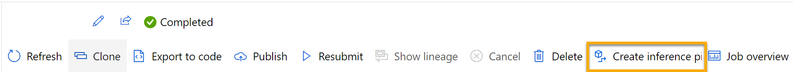

---
lab:
  title: استكشاف التصنيف باستخدام مصمم Azure Machine Learning Azure
---

# استكشاف التصنيف باستخدام مصمم Azure Machine Learning Azure

> **ملاحظة** لإكمال هذا النشاط المعملي، ستحتاج إلى [اشتراك Azure](https://azure.microsoft.com/free?azure-portal=true) الذي لديك فيه حق الوصول الإداري.

## إنشاء مساحة عمل "التعلم الآلي من Azure"  

1. سجل الدخول إلى [مدخل Azure](https://portal.azure.com?azure-portal=true) باستخدام بيانات اعتماد Microsoft الخاصة بك.

1. حدد **+ Create a resource**، وابحث عن *Machine Learning*، وأنشئ مورد **Azure Machine Learning** جديد باستخدام خطة *Azure Machine Learning*. استخدم الإعدادات التالية:
    - **الاشتراك**: *اشتراك Azure الخاص بك*.
    - **Resource group**: *أنشئ مجموعة موارد أو حددها*.
    - **Workspace name**: *أدخل اسم فريد لمساحة العمل الخاصة بك*.
    - **Region**: *حدد أقرب منطقة جغرافية لك*.
    - **Storage account**: *لاحظ حساب التخزين الجديد الافتراضي الذي سيتم إنشاؤه لمساحة العمل الخاصة بك*.
    - **Key vault**: *لاحظ الحاوية الرئيسية الجديدة الافتراضية التي سيتم إنشاؤها لمساحة العمل الخاصة بك*.
    - **Application insights**: *لاحظ مورد application insights الجديد الافتراضي الذي سيتم إنشاؤه لمساحة العمل الخاصة بك*.
    - **Container registry**: لا شيء (*سيتم إنشاء سجل واحد تلقائياً عند أول مرة تقوم فيها بنشر نموذج في حاوية*)

1. حدد **Review + create**، ثم حدد **Create**. انتظر حتى يتم إنشاء مساحة العمل الخاصة بك (قد يستغرق الأمر بضع دقائق)، ثم انتقل إلى المورد الموزع.

1. حدد **Launch studio** (أو افتح علامة تبويب جديدة في مستعرض الويب، وانتقل إلى [https://ml.azure.com](https://ml.azure.com?azure-portal=true)، وسجل الدخول إلى Azure Machine Learning studio باستخدام حساب Microsoft).

1. في Azure Machine Learning studio، يجب أن تشاهد مساحة العمل التي تم إنشاؤها حديثًا. إذا لم يكن الأمر كذلك، فحدد دليل Azure في القائمة اليسرى. ثم من القائمة اليسرى الجديدة، حدد **مساحات العمل**، حيث يتم سرد جميع مساحات العمل المقترنة باشتراكك، وقم بتحديد مسحة العمل التي أنشأتها لتمرينك.

> **ملاحظة** تعد هذه الوحدة هي واحدة من العديد من الوحدات التي تستخدم Azure Machine Learning workspace، بما في ذلك الوحدات الأخرى في مسار التعليم [أساسيات Microsoft Azure AI: استكشاف الأدوات المرئية للتعلم الآلي](https://docs.microsoft.com/learn/paths/create-no-code-predictive-models-azure-machine-learning/). إذا كنت تستخدم اشتراكك على Azure، فيمكنك إنشاء مساحة العمل مرة واحدة وإعادة استخدامها في وحدات أخرى. سيتم تحصيل مبلغ صغير من اشتراكك على Azure لتخزين البيانات طالما أن مساحة عمل التعلم الآلي من Azure موجودة في اشتراكك، لذا نوصي بحذف مساحة عمل التعلم الآلي من Azure عندما لا تكون مطلوبة.

## إنشاء حساب

1. في [استوديو التعليم الآلي من Microsoft Azure](https://ml.azure.com?azure-portal=true)، حدد أيقونة **≡** (الأيقونة التي تشبة الثلاثة أسطر فوق بعضها) في أعلى اليسار لعرض الصفحات المختلفة في الواجهة (قد تحتاج إلى زيادة حجم الشاشة إلى أقصى حد). يمكنك استخدام هذه الصفحات في الجزء الأيسر لإدارة الموارد في مساحة العمل. حدد صفحة **Compute** (ضمن **Manage**).

1. في صفحة **Compute**، حدد علامة التبويب **Compute clusters**، وأضف نظام مجموعة حساب جديد بالإعدادات التالية. ستستخدمه لتدريب أحد نماذج التعلم الآلي:
    - **Location**: *اختر نفس مساحة العمل التي تعمل فيها. إذا لم يكن هذا الموقع مدرجًا، فاختر أقرب موقع إليك*.
    - **Virtual machine tier**: Dedicated
    - **Virtual machine type**: معالج
    - **Virtual machine size**:
        - اختر **Select from all options**
        - ابحث عن **Standard_DS11_v2** وحدده
    - حدد **التالي**
    - **Compute name**: *أدخل اسمًا فريدًا*.
    - **الحد الأدنى من عدد العقد**: 0
    - **الحد الأقصى من عدد العقد**: 2
    - **ثواني الخمول قبل تقليص الحجم**: 120
    - **Enable SSH access**: غير محدد
    - حدد **إنشاء**.

> **ملاحظة** تستند مثيلات الحساب ومجموعاته إلى صور جهاز Azure الظاهري القياسية. في هذه الوحدة، ينصح باستخدام صورة *Standard_DS11_v2* لتحقيق التوازن الأمثل بين التكلفة والأداء. إذا كان اشتراكك يحتوي على حصة نسبية لا تتضمن هذه الصورة، فاختر صورة بديلة؛ ولكن ضع في اعتبارك أن الصورة الأكبر قد تنطوي على تكلفة أعلى وقد لا تكون الصورة الأصغر كافية لإكمال المهام. بدلاً من ذلك، اطلب من مسؤول Azure توسيع الحصة النسبية.

سيستغرق إنشاء نظام مجموعة الحساب بعض الوقت. يمكنك الانتقال إلى الخطوة التالية في أثناء الانتظار.


## إنشاء مجموعة بيانات

1. في [استوديو التعلم الآلي في Microsoft Azure](https://ml.azure.com?azure-portal=true)، قم بتوسيع الجزء الأيسر عن طريق تحديد أيقونة القائمة في الجزء العلوي الأيسر من الشاشة. حدد صفحة **البيانات** (ضمن **الأصول**). تحتوي صفحة "Data" على ملفات بيانات أو جداول معينة تخطط للعمل معها في Azure ML. يمكنك إنشاء مجموعات بيانات من هذه الصفحة أيضًا.

1. في صفحة **البيانات**، ضمن علامة التبويب **أصول البيانات**، حدد **+ إنشاء**. ثم قم بتكوين أصل بيانات بالإعدادات التالية:
    - **Data type**:
        - **Name**: diabetes-data
        - **Description**: Diabetes data
        - **نوع مجموعة البيانات**: جدولي
    - **مصدر البيانات**: من ملفات الويب
    - **عنوان URL الخاص بالويب**:
        - **عنوان URL الخاص بالويب**: https://aka.ms/diabetes-data
        - **تخطى التحقق من صحة البيانات**: *لا تختاره*
    - **الإعدادات**:
        - **File format**: Delimited
        - **Delimiter**: Comma
        - **Encoding**: UTF-8
        - **عناوين الأعمدة**: يحتوي الملف الأول فقط على عناوين
        - **Skip rows**: None
        - **Dataset contains multi-line data**: *لا تحددها*
    - **Schema**:
        - قم بتضمين كل الأعمدة بخلاف **Path**
        - مراجعة الأنواع التي تم اكتشافها تلقائيًا
    - **مراجعة**
        - حدد **إنشاء**.

1. بعد إنشاء مجموعة البيانات، افتحها واستعرض صفحة **"Explore"** لرؤية عينة من البيانات. تمثل هذه البيانات تفاصيل من المرضى الذين تم اختبارهم لمرض السكري.

## إنشاء مسار في المصمم وتحميل البيانات إلى اللوحة

للبدء مع مصمم التعلم الآلي من Azure، يجب أولاً إنشاء مسار وإضافة مجموعة البيانات التي تريد العمل معها.

1. في [استوديو التعلم الآلي في Microsoft Azure](https://ml.azure.com?azure-portal=true) على الجزء السفلي، حدد **المصمم** (ضمن **التأليف**)، وحدد **+** لإنشاء مسار جديد.

1. تغيير اسم المسودة من **Pipeline-Created-on-*date*** إلى **تدريب مرض السكري**.

1. ثم في هذا المشروع، بجوار اسم البنية الأساسية لبرنامج ربط العمليات التجارية على اليسار، حدد أيقونة "arrows" لتوسيع اللوحة إذا لم يتم توسيعها بالفعل. يجب فتح اللوحة بشكل افتراضي إلى جزء **Asset library**، المشار إليها بواسطة أيقونة الكتب في أعلى اللوحة. لاحظ أن هناك شريط بحث لتحديد موقع الأصول. لاحظ زرين، **Data** و**Component**.

    

1. حدد **البيانات**. ابحث عن مجموعة بيانات **diabetes-data** وضعها في اللوحة.

1. انقر بزر الماوس الأيمن (Ctrl+انقر في جهاز Mac) فوق مجموعة البيانات **diabetes-data** على اللوحة، وانقر فوق **معاينة البيانات**.

1. راجع مخطط *Profile* للبيانات، مع الإشارة إلى أنه يمكنك مشاهدة توزيعات الأعمدة المختلفة كمدرجات تكرارية.

1. قم بالتمرير لأسفل، وحدد عنوان العمود لعمود **Diabetic**، ولاحظ أنه يحتوي على القيمتين **0** و**1**. تمثل هذه القيم فئتين ممكنتين لـ *label* التي سيتنبأ بها نموذجك، بقيمة **0** بمعنى أن المريض لا يعاني من مرض السكري، والقيمة **1** تعني أن المريض مصاب بالسكري.

1. قم بالتمرير للخلف، وراجع الأعمدة الأخرى التي تمثل *الميزات* التي سيتم استخدامها للتنبؤ بالتسمية. لاحظ أن معظم هذه الأعمدة رقمية، لكن كل ميزة تكون في نطاقها الخاص. على سبيل المثال، تتراوح قيم **Age** من 21 إلى 77، بينما تتراوح قيم **DiabetesPedigree** من 0.078 إلى 2.3016. عند تدريب نموذج التعلم الآلي، من الممكن أحيانًا أن تهيمن القيم الكبرى على الوظيفة التنبؤية الناتجة، ما يقلل من تأثير الميزات على نطاق أصغر. عادة ما يقوم علماء البيانات بتقليل هذا الانحياز المحتمل عن طريق *تسوية* الأعمدة الرقمية كي تكون على مقاييس مماثلة.

1. أغلق علامة التبويب **DataOutput** بحيث يمكنك رؤية مجموعة البيانات على اللوحة كما يلي:

    

## إضافة تحويلات

قبل أن تتمكن من تدريب نموذج معين، تحتاج عادةً إلى تطبيق بعض تحويلات المعالجة المسبقة على البيانات.

1. في جزء **مكتبة الأصول** على اليسار، انقر فوق **المكون**، والذي يحتوي على مجموعة واسعة من الوحدات التي يمكنك استخدامها لتحويل البيانات وتدريب النموذج. يمكنك أيضا استخدام شريط البحث لتحديد موقع الوحدات بسرعة.

    

1. ابحث عن الوحدة **حدد الأعمدة في مجموعة البيانات** وضعها على اللوحة، أسفل مجموعة البيانات **diabetes-data**. ثم قم بتوصيل الإخراج من الجزء السفلي لمجموعة بيانات **diabetes-data** بالإدخال الموجود في الجزء العلوي من وحدة **Select Columns in Dataset**.

1. انقر نقراً مزدوجاً فوق الوحدة **Select Columns in Dataset** للوصول إلى الجزء على الجانب الأيمن. حدد **Edit column**. ثم في نافذة **تحديد الأعمدة**، حدد **حسب الاسم** و**أضف الجميع** لإضافة كل الأعمدة. ثم قم بإزالة **هوية المريض** وانقر فوق **حفظ**.

1. ابحث عن الوحدة **تقليل تكرار البيانات** وضعها على اللوحة، أسفل الوحدة **تحديد الأعمدة في مجموعة البيانات**. ثم قم بتوصيل الإخراج من الجزء السفلي لوحدة **Select Columns in Dataset** بالإدخال الموجود في الجزء العلوي من وحدة **Normalize Data**، مثل ما يلي:

    

1. انقر نقرًا مزدوجًا فوق وحدة **Normalize Data** لعرض إعداداتها، مع ملاحظة أنها تتطلب منك تحديد طريقة التحويل والأعمدة المراد تحويلها.

1. عيّن *Transformation method* إلى **MinMax** و*Use 0 for constant columns when checked* إلى **True**. تحرير الأعمدة للتحويل باستخدام **تحرير الأعمدة**. حدد الأعمدة **باستخدام القواعد** وانسخ القائمة التالية والصقها ضمن تضمين أسماء الأعمدة:  

```
Pregnancies, PlasmaGlucose, DiastolicBloodPressure, TricepsThickness, SerumInsulin, BMI, DiabetesPedigree, Age
```


انقر فوق **حفظ** وأغلق مربع التحديد.

يعمل تحويل البيانات على تسوية الأعمدة الرقمية لوضعها على نفس النطاق، ما يساعد على منع الأعمدة ذات القيم الكبيرة السيطرة على تدريب النموذج. عادةً ما تقوم بتطبيق مجموعة كاملة من تحويلات المعالجة المسبقة مثل هذه لإعداد بياناتك للتدريب، لكننا سنبقي الأمور بسيطة في هذا التمرين.

## قم بتشغيل البنية الأساسية

لتطبيق تحويلات البيانات الخاصة بك، تحتاج إلى تشغيل البنية الأساسية كتجربة.

1. حدد **تكوين وإرسال** في أعلى الصفحة لفتح مربع حوار **إعداد مهمة مسار**.

1. في صفحة**الأساسيات** حدد **‘نشاء جديد** وضبط اسم التجربة على **mslearn-diabetes-training** ثم حدد **التالي** .

1. في صفحة **الإدخالات والمخرجات**، حدد **التالي** دون إجراء أي تغييرات.

1. في صفحة **إعدادات وقت التشغيل** يظهر خطأ حيث ليس لديك حساب افتراضي لتشغيل المسار. في القائمة المنسدلة **تحديد نوع الحوسبة** حدد *حساب بنظام مجموعة* وفي القائمة المنسدلة **حدد مجموعة Azure ML للحوسبة** حدد مجموعة الحوسبة التي تم إنشاؤها مؤخرًا.

1. حدد **مراجعة + إرسال** لمراجعة مهمة المسار ثم حدد **إرسال** لتشغيل مسار التدريب.

1. انتظر بضع دقائق حتى تنتهي عملية التشغيل. يمكنك التحقق من حالة المهمة عن طريق تحديد **المهام** ضمن **الأصول**. من هناك، حدد تجربة **mslearn-diabetes-training**، ثم حدد مهمة **تدريب مرض السكري**.

## اعرض البيانات المحولة

عند اكتمال التشغيل، يتم الآن إعداد مجموعة البيانات لتدريب النموذج.

1. انقر بزر الماوس الأيمن (Ctrl+انقر في جهاز Mac) فوق وحدة **تقليل تكرار البيانات** على اللوحة، وحدد **معاينة البيانات**. حدد **Transformed dataset**.

1. اعرض البيانات، مع ملاحظة أنه تم تسوية الأعمدة الرقمية التي حددتها إلى نطاق مشترك.

1. قم بإغلاق مرئيات نتائج البيانات التي تم تطبيعها. ارجع إلى علامة التبويب السابقة.

بعد استخدام تحويلات البيانات لإعداد البيانات، يمكنك استخدامها لتدريب نموذج التعلم الآلي.

## إضافة وحدات تدريبية

من الشائع تدريب النموذج باستخدام مجموعة فرعية من البيانات، مع الاحتفاظ ببعض البيانات التي يمكن من خلالها اختبار النموذج المدرب. يُمكّنك ذلك من المقارنة بين التسميات التي يتنبأ بها النموذج والتسميات المعروفة الفعلية في مجموعة البيانات الأصلية.

ستتبع في هذا التمرين خطوات لتمديد البنية الأساسية لبرنامج ربط العمليات التجارية لـ **Diabetes Training** كما هو موضح هنا:


اتبع الخطوات الموجودة أدناه، باستخدام الصورة الموجودة أعلاه كمرجع عند إضافة الوحدات النمطية المطلوبة وتكوينها.

1. عد إلى صفحة **المصمم** وحدد مسار **تدريب مرض السكري**.

1. في جزء **Asset Library** الموجود في جهة اليسار، ضمن **Component**، ابحث عن الوحدة **Split Data** وضعها في اللوحة ضمن الوحدة **Normalize Data**. ثم اربط إخراج *Transformed Dataset* للوحدة **Normalize Data** (على الجانب الأيسر) بإدخال الوحدة **Split Data**.

    >**تلميح** استخدم شريط البحث لتحديد موقع الوحدات بسرعة.

1. حدد الوحدة **Split Data**، وكوّن إعداداتها كما يلي:
    - **وضع التقسيم**: تقسيم الصفوف
    - **كسر الصفوف في مجموعة بيانات الإخراج الأولى**: 0.7
    - **Randomized split**: True
    - **القيمة الأولية العشوائية**: 123
    - **التقسيم الطبقي**: خطأ

1. في **Asset library**، ابحث عن الوحدة **Train Model** وضعها في اللوحة، ضمن الوحدة **Split Data**. ثم اربط إخراج *Results dataset1* للوحدة **Split Data** (على الجانب الأيسر) بإدخال *Dataset* للوحدة **Train Model** (على الجانب الأيمن).

1. سيتنبأ النموذج الذي نُدربه بقيمة "**Diabetic**"، لذلك حدد وحدة "**Train Model**"، وعدل إعداداته لتعيين "**Label column**" إلى "**Diabetic**".

    تسمية **Diabetic** التي سيتنبأ بها النموذج هي فئة (0 أو 1)، لذلك نحتاج إلى تدريب النموذج باستخدام خوارزمية *التصنيف*. على وجه التحديد، هناك فئتان محتملتان، لذلك نحن بحاجة إلى خوارزمية *تصنيف ثنائية*.

1. في **Asset Library**، ابحث عن الوحدة **Two-Class Logistic Regression** وضعها في اللوحة، على يسار الوحدة **Split Data** وفوق الوحدة **Train Model**. ثم اربط ناتجه بإدخال *النموذج غير المدرب* للوحدة النمطية **Train Model** (على الجانب الأيسر).

   لاختبار النموذج المدرب، يتعين علينا استخدامه من أجل *تسجيل درجة* مجموعة بيانات التحقق التي احتفظنا بها عند تقسيم البيانات الأصلية. بعبارة أخرى، التنبؤ بتسميات الميزات في مجموعة بيانات التحقق.

1. في **Asset Library**، ابحث عن الوحدة **Score Model** وضعها في اللوحة، أسفل الوحدة **Train Model**. ثم قم بتوصيل إخراج الوحدة **Train Model** بإدخال *Trained model* (الموجود على اليسار) من الوحدة **Score Model**، وقم بتوصيل ناتج *مجموعة بيانات النتائج 2* (الموجودة على اليمين) من الوحدة **Split Data** بإدخال *Dataset* (الموجود على اليمين) من الوحدة **Score Model**.

## تشغيل المسار الخاص بالتدريب

الآن أنت مستعد لتشغيل البنية الأساسية للتدريب وتدريب النموذج.

1. حدد **تكوين وإرسال**، وقم بتشغيل المسار باستخدام التجربة الحالية التي تسمى **mslearn-diabetes-training**.

1. انتظر حتى انتهاء تشغيل التجربة. قد يستغرق ذلك 5 دقائق أو أكثر.

1. تحقق من حالة المهمة عن طريق تحديد **المهام** ضمن **الأصول**. من هناك، حدد تجربة **mslearn-diabetes-training**، ثم حدد أحدث مهمة **تدريب مرض السكري**.

1. في علامة التبويب الجديدة، انقر بزر الماوس الأيمن (Ctrl+نقر لأجهزة Mac) فوق الوحدة **وحدة الناتج** وحدد **معاينة البيانات** ثم **مجموعة البيانات المسجلة** لعرض النتائج.

1. قم بالتمرير إلى اليمين، ولاحظ أن بجانب عمود **Diabetic** (الذي يحتوي على القيم الحقيقية المعروفة للتسمية) يوجد عمود جديد يسمى **Scored Labels**، والذي يحتوي على قيم التسمية المتوقعة، وعمود **Scored Probabilities** والذي يحتوي على قيمة الاحتمال بين 0 و1. يشير هذا إلى احتمال التنبؤ *positive*، لذا فإن الاحتمالات التي تزيد عن 0.5 تؤدي إلى تسمية متوقعة بقيمة ***1***( مريض بالسكري)، في حين تؤدي الاحتمالات بين 0 و0.5 إلى تسمية متوقعة بقيمة ***0*** (غير مريض بالسكري).

1. أغلق علامة التبويب **Scored_dataset**.

يتنبأ النموذج بقيم تسمية **Diabetic**، ولكن ما مدى موثوقية تنبؤاته؟ لتقييم ذلك، تحتاج إلى تقييم النموذج.

تتضمن بيانات التحقق التي احتفظت بها واستخدمتها لتسجيل النموذج، القيم المعروفة للتسمية. لذلك للتحقق من صحة النموذج، يمكنك مقارنة القيم الحقيقية للتسمية بقيم التسمية التي تم توقعها عند تسجيل مجموعة بيانات التحقق من الصحة. بناءً على هذه المقارنة، يمكنك حساب مقاييس مختلفة تصف مدى أداء النموذج.

## إضافة وحدة نموذج للتقييم

1. ارجع إلى **المصمم** وافتح مسار **تدريب مرض السكري** الذي أنشأته.

1. في **Asset library** ابحث عن الوحدة **Evaluate Model** وضعها في اللوحة، ضمن الوحدة **Score Model**، ووصل الإخراج الخاص بالوحدة **Score Model** بإدخال *Scored dataset* (الموجود على اليسار) الخاص بالوحدة **Evaluate Model**.

1. تأكد من أن البنية الأساسية تبدو على هذا النحو:

    

1. حدد **تكوين وإرسال**، وقم بتشغيل المسار باستخدام التجربة الحالية التي تسمى **mslearn-diabetes-training**.

1. انتظر حتى انتهاء تشغيل التجربة.

1. تحقق من حالة المهمة عن طريق تحديد **المهام** ضمن **الأصول**. من هناك، حدد تجربة **mslearn-diabetes-training**، ثم حدد أحدث مهمة **تدريب مرض السكري**.

1. في علامة التبويب الجديدة، انقر بزر الماوس الأيمن (Ctrl+click على جهاز Mac) على وحدة **تقييم الوحدة** على اللوحة، وحدد **معاينة البيانات** ثم حدد **نتائج التقييم** لعرض مقاييس الأداء. يمكن أن تساعد هذه المقاييس علماء البيانات في تقييم مدى جودة تنبؤ النموذج بناءً على بيانات التحقق من الصحة.

1. مرر لأسفل لعرض *confusion matrix* للنموذج. راقب أعداد القيم المتوقعة والفعلية لكل فئة ممكنة. 

1. راجع المقاييس الموجودة على يسار المصفوفة الدوارة، والتي تتضمن:
    - **Accuracy**: بمعنى آخر، ما هي نسبة التنبؤات الخاصة بمرض السكري التي حققها النموذج بشكل صحيح؟
    - **Precision**: بمعنى آخر، من بين جميع المرضى الذين توقع *النموذج إصابتهم بالسكري*، كانت النسبة المئوية للوقت الذي يكون فيه النموذج صحيحاً. 
    - **Recall**: بمعنى آخر، من بين جميع المرضى الذين *يعانون من مرض السكري بالفعل*، كم عدد حالات السكري التي حددها النموذج بشكل صحيح؟
    - **F1 Score**

1. استخدم شريط التمرير **Threshold** الموجود أعلى قائمة المقاييس. حاول تحريك شريط تمرير الحد ولاحظ التأثير على مصفوفة الدوار. إذا قمت بتحريكه بالكامل إلى اليسار (0)، يصبح مقياس الاستدعاء1، وإذا قمت بتحريكه بالكامل إلى اليمين (1)، يصبح مقياس الاستدعاء 0.

1. انظر فوق شريط تمرير "Threshold" في قياس **ROC curve** و**AUC** مدرجاً مع المقاييس الأخرى أدناه. للحصول على فكرة عن كيفية تمثيل هذه المساحة لأداء النموذج، تخيل خطًا قطريًا مستقيمًا من أدنى يسار إلى أعلى يمين مخطط ROC. يمثل هذا الأداء المتوقع إذا خمنت فقط أو قلبت عملة معدنية لكل مريض - يمكنك أن تتوقع الحصول على نصفها بشكل صحيح ونصفها بشكل خطأ، ومن ثمَّ فإن المساحة الواقعة تحت الخط المائل تمثل AUC بقيمة 0.5. إذا كان AUC للنموذج الخاص بك أعلى من ذلك بالنسبة إلى نموذج التصنيف الثنائي، فإن أداء النموذج أفضل من التخمين العشوائي.

1. أغلق علامة تبويب **Evaluation_results**.

لا يعتبر أداء هذا النموذج رائعًا بدرجة كبيرة، ويرجع ذلك جزئيًا إلى أننا أجرينا الحد الأدنى من هندسة الميزات والمعالجة المسبقة. يمكنك تجربة خوارزمية تصنيف مختلفة، مثل **wo-Class Decision Forest**ومقارنة النتائج. يمكنك توصيل مخرجات وحدة **Split Data** إلى عدة وحدات من **Train Model** والوحدة **Score Model**، ويمكنك توصيل وحدة **Score Model** ثانية بوحدة **Evaluate Model** لرؤية المقارنة جنباً إلى جنب. الهدف من التمرين هو ببساطة تعريفك بالتصنيف وواجهة مصمم التعلم الآلي من Azure وليس لتدريب نموذج مثالي!

## إنشاء بنية أساسية استدلالية

1. حدد موقع القائمة أعلى اللوحة وحدد **إنشاء مسار الاستنتاج**. قد تحتاج إلى توسيع الشاشة إلى وضع الشاشة الكاملة والنقر على أيقونة النقاط الثلاث **...** في الزاوية العلوية اليمنى من الشاشة من أجل العثور على **Create inference pipeline** في القائمة.  

    

1. في القائمة المنسدلة **إنشاء مسار الاستنتاج**، حدد **مسار الاستنتاج في الوقت الفعلي**. بعد بضع ثوان، سيتم فتح نسخة جديدة من البنية الأساسية لديك باسم **Diabetes Training-real time inference**.

1. أعد تسمية البنية الأساسية الجديدة إلى **Predict Diabetes**، ومن ثم مراجعة البنية الأساسية الجديدة. بعض التحويلات وخطوات التدريب هي جزء من هذا المسار. سيتم استخدام النموذج المدرب لتسجيل البيانات الجديدة. يحتوي المسار أيضًا على web service output لإرجاع النتائج.

    ستقوم بإجراء التغييرات التالية على البنية الأساسية للاستدلال:

    

    - أضف مكون **web service input** للبيانات الجديدة التي سيتم إرسالها.
    - استبدل مجموعة البيانات **diabetes-data** لتحل محلها وحدة **Enter Data Manually** والتي لا تتضمن عمود label (**Diabetic**).
    - حرر الأعمدة المحددة في الوحدة **Select Columns in Dataset**.
    - قم بإزالة الوحدة النمطية **Evaluate Model**.
    - قم بإدراج الوحدة **Execute Python Script** قبل إخراج خدمة الويب لإرجاع معرف المريض وقيمة label المتوقعة والاحتمالية.

1. لا يتضمن المسار تلقائيًا مكون **Web Service Input** للنماذج التي تم إنشاؤها من مجموعات البيانات المخصصة. ابحث عن مكون **Web Service Input** من asset library وضعه في أعلى المسار. اربط الناتج من مكوّن **مُدخل خدمة الويب** إلى مكوّن **تحديد الأعمدة في مجموعة البيانات** الموجود بالفعل على اللوحة.

1. تفترض البنية الأساسية لبرنامج الربط أن البيانات الجديدة ستتطابق مع مخطط بيانات التدريب الأصلية، لذلك يتم تضمين مجموعة البيانات **diabetes-data** من البنية الأساسية الخاصة بالتدريب. ومع ذلك، تتضمن بيانات الإدخال هذه تسمية **Diabetic** التي يتوقعها النموذج، والتي لا يمكن تضمينها في بيانات المريض الجديدة الذي لم يتم التنبؤ بإصابته بمرض السكري بعد. احذف هذه الوحدة واستبدلها بوحدة **Enter Data Manually** والتي تحتوي على بيانات CSV التالية، والتي تتضمن قيم ميزة بدون تسميات لثلاث ملاحظات جديدة للمريض:

    ```CSV
    PatientID,Pregnancies,PlasmaGlucose,DiastolicBloodPressure,TricepsThickness,SerumInsulin,BMI,DiabetesPedigree,Age
    1882185,9,104,51,7,24,27.36983156,1.350472047,43
    1662484,6,73,61,35,24,18.74367404,1.074147566,75
    1228510,4,115,50,29,243,34.69215364,0.741159926,59
    ```

1. اربط وحدة **إدخال البيانات يدويًا** الجديدة مع **مجموعة بيانات** نفسها لوحدة **تحديد الأعمدة في مجموعة البيانات** باعتبارها **إدخال خدمة الويب**.

1. حدد الوحدة **Select Columns in Dataset**. أزل **Diabetic** من *Selected Columns*.

1. تتضمن البنية الأساسية للاستدلال الوحدة **Evaluate Model**، والتي تعد غير مفيدة عند إجراء التنبؤ باستخدام البيانات الجديدة، لذا احذف هذه الوحدة.

1. يتضمن الإخراج من الوحدة **Score Model** جميع ميزات الإدخال بالإضافة إلى التسمية المتوقعة ودرجة الاحتمالية. لتحديد الإخراج إلى التنبؤ والاحتمالية فقط:
    - احذف الارتباط بين الوحدة **Score Model** و**Web Service Output**.
    - قم بإضافة الوحدة **Execute Python Script** واستبدل جميع البرامج النصية الافتراضية لـ python باستخدام التعليمة البرمجية التالية (التي تحدد فقط الأعمدة **PatientID** و**Scored Labels** و**Scored Probabilities**، وقم بإعادة تسميتها بشكل مناسب):

    ```Python
    import pandas as pd
    
    def azureml_main(dataframe1 = None, dataframe2 = None):
    
        scored_results = dataframe1[['Scored Labels', 'Scored Probabilities']]
        scored_results.rename(columns={'Scored Labels':'DiabetesPrediction',
                                    'Scored Probabilities':'Probability'},
                            inplace=True)
        return scored_results
    ```

1. قم بتوصيل الإخراج من وحدة **وحدة الناتج** إلى *Dataset1* (أقصى اليسار) لإدخال **تنفيذ برمجة Python**، وقم بتوصيل *مجموعة البيانات الناتجة* (يسار) مخرجات وحدة **تنفيذ برمجة Python** إلى **مخرجات خدمة الويب**.

1. تحقق من أن البنية الأساسية تشبه الصورة التالية:

    

1. قم بتشغيل البنية الأساسية لبرنامج الربط كتجربة جديدة تسمى **mslearn-diabetes-inference** على نظام مجموعة الحساب الخاصة بك. قد تستغرق التجربة بعض الوقت لتشغيلها.

1. ارجع إلى علامة تبويب **المهام** . من هناك، حدد تجربة **mslearn-diabetes-inference** ثم حدد مهمة**التنبؤ بمرض السكري** .

1. عند اكتمال المسار، حدد وحدة **تنفيذ برمجة Python**. حدد **Preview data** وحدد **Result dataset** لعرض الأوصاف والاحتمالات المتوقعة لملاحظات المرضى الثلاثة في بيانات الإدخال.

يتنبأ مسار الاستدلال الخاص بك بما إذا كان المرضى معرضين لخطر الإصابة بمرض السكري أم لا بناءً على ميزاتهم. الآن أنت جاهز لنشر البنية الأساسية بحيث يمكن استخدام تطبيقات العميل.

بعد أن قمت بإنشاء مسار استدلال واختبره للاستدلال في الوقت الحقيقي، يُمكنك نشره باعتباره خدمة لتطبيقات العملاء من أجل استخدامه.

> **ملاحظة**: في هذا التمرين، ستقوم بتوزيع خدمة الويب على حل Azure Container Instance (ACI). يتم إنشاء هذا النوع من الحساب بشكل حيوي، وهو مفيد للتطوير والاختبار. بالنسبة للإنتاج، يجب عليك إنشاء *نظام مجموعة استدلال*، والذي يوفر نظام مجموعة Azure Kubernetes Service (AKS) والتي توفر قابلية توسع وأمان أفضل.

## نشر خدمة

1. في أعلى نافذة المهمة **التنبؤ بمرض السكري**، حدد **نشر**.

    

1. في **إعداد نقطة النهاية في الوقت الفعلي** حدد **نشر نقطة نهاية** واستخدم الإعدادات التالية:
    - **Name**: predict-diabetes
    - **الوصف**: تصنيف مرض السكري
    - **نوع الحساب**: Azure Container Instance

1. حدد **نشر** وانتظر نشر خدمة الويب -قد يستغرق ذلك عدد دقائق.

## اختبار الخدمة

1. في صفحة **Endpoints**، افتح نقطة النهاية في الوقت الحقيقي **predict-diabetes**.

    

1. عند فتح نقطة نهاية **predict-diabetes**، حدد علامة التبويب **Test**. سنستخدمها لاختبار نموذجنا ببيانات جديدة. احذف البيانات الحالية ضمن "**Input data to test real-time endpoint**". انسخ البيانات أدناه والصقها في قسم البيانات:  

    ```JSON
    {
      "Inputs": {
        "input1":
          [
            { "PatientID": 1882185,
              "Pregnancies": 9,
              "PlasmaGlucose": 104,
              "DiastolicBloodPressure": 51,
              "TricepsThickness": 7,
              "SerumInsulin": 24,
              "BMI": 27.36983156,
              "DiabetesPedigree": 1.3504720469999998,
              "Age": 43 }
            ]
          },
      "GlobalParameters":  {}
    }
    ```

    > **ملاحظة** يحدد JSON أعلاه الميزات للمريض، ويستخدم خدمة **predict-diabetes** التي أنشأتها للتنبؤ بتشخيص مرض السكري.

1. حدد **اختبار**. على الجانب الأيمن من الشاشة، يجب أن تشاهد الإخراج **'DiabetesPrediction'**. الإخراج هو 1 إذا كان من المتوقع أن يكون المريض مصاباً بالسكري، و0 إذا كان من المتوقع أن لا يكون المريض مصاباً بالسكري.  

    

    لقد اختبرت للتو خدمة جاهزة للاتصال بتطبيق عميل باستخدام بيانات الاعتماد في علامة التبويب **Consume**. سننهي التدريب العملي هنا. نرحب بمواصلة تجربة الخدمة التي قمت بتوزيعها للتو.

## التنظيف

تتم استضافة خدمة الويب التي قمت بإنشائها في *Azure Container Instance*. إذا كنت لا تنوي إجراء المزيد من التجارب عليها، فإنه يجب عليك حذف نقطة النهاية لتجنب تراكم استخدام Azure غير الضروري. يجب عليك أيضًا حذف نظام مجموعة الحوسبة.

1. في [Azure Machine Learning studio](https://ml.azure.com?azure-portal=true)، في علامة التبويب **Endpoints**، حدد نقطة النهاية **predict-diabetes**. ثم حدد **Delete**، وقم بالتأكيد على رغبتك في حذف نقطة النهاية.

1. في صفحة **Compute**، وفي علامة التبويب **Compute clusters**، حدد نظام مجموعة الحساب ثم حدد **Delete**.

>**ملاحظة** يضمن حذف الحساب عدم تحصيل رسوم من اشتراكك مقابل موارد الحساب. ومع ذلك، سيتم تحصيل مبلغ صغير لتخزين البيانات طالما أن مساحة عمل التعلم الآلي من Azure موجودة في اشتراكك. إذا انتهيت من استكشاف التعلم الآلي من Azure، فإنه يمكنك حذف مساحة عمل التعلم الآلي من Azure والموارد المقترنة بها. ومع ذلك، إذا كنت تخطط لإكمال أي معامل تجريبية أخرى في هذه السلسلة، سوف تحتاج إلى إعادة إنشائها.
>
> لحذف مساحة العمل لديك:
>
> 1. في [مدخل Azure](https://portal.azure.com?azure-portal=true)، ومن صفحة **Resource groups**، افتح مجموعة الموارد التي حددتها عند إنشاء مساحة عمل Azure Machine Learning.
> 1. انقر فوق **حذف مجموعة الموارد**، واكتب اسم مجموعة الموارد لتأكيد أنك ترغب في حذفها، ثم حدد **Delete**.
