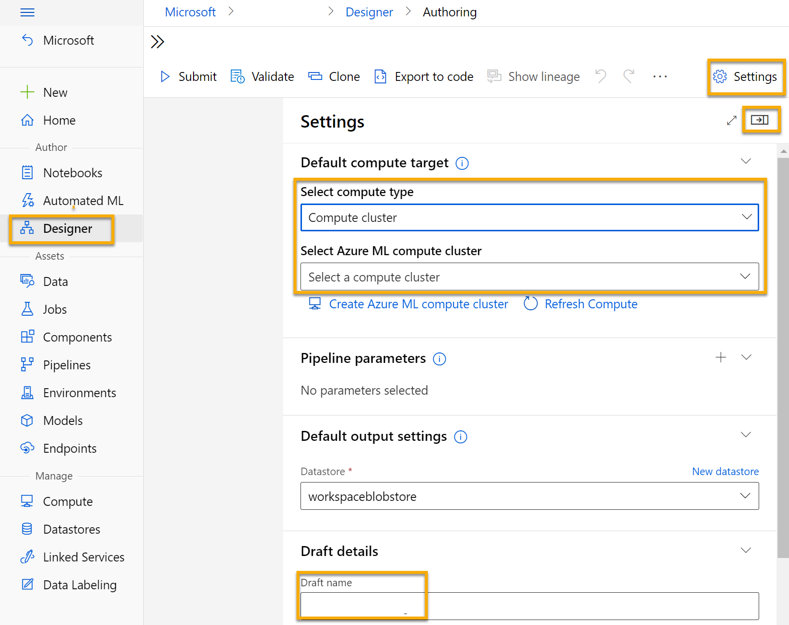
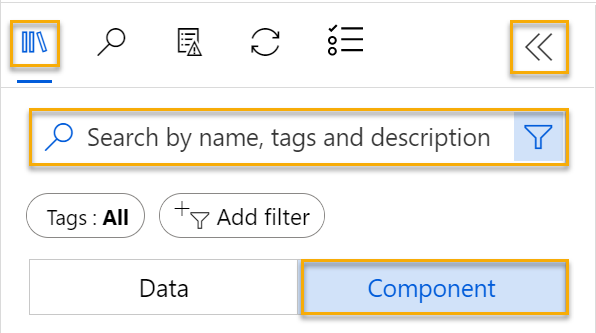
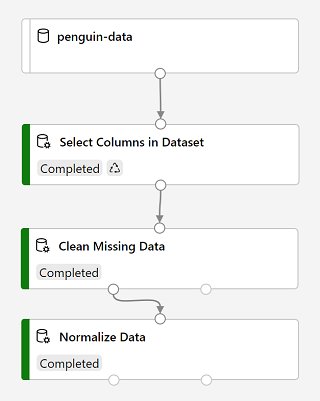
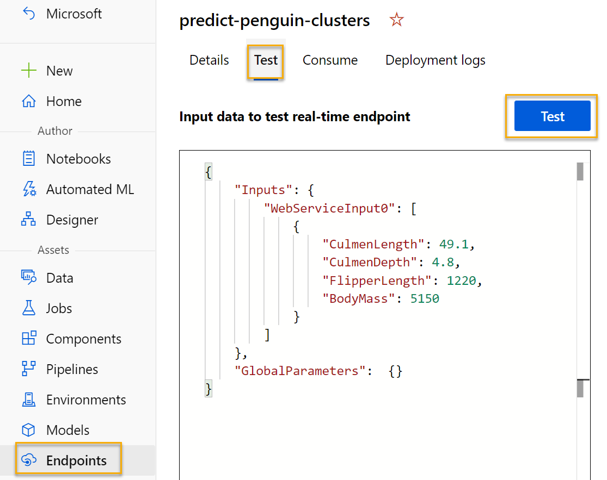

---
lab:
  title: استكشاف تكوين أنظمة المجموعات باستخدام مصمم Azure Machine Learning
---

# استكشاف تكوين أنظمة المجموعات باستخدام مصمم Azure Machine Learning

> **ملاحظة** لإكمال هذا النشاط المعملي، ستحتاج إلى [اشتراك Azure](https://azure.microsoft.com/free?azure-portal=true) الذي لديك فيه حق الوصول الإداري.

## إنشاء مساحة عمل التعلم الآلي من Azure  

1. سجل الدخول إلى [مدخل Azure](https://portal.azure.com?azure-portal=true) باستخدام بيانات اعتماد Microsoft الخاصة بك.

1. حدد **+ Create a resource**، وابحث عن *Machine Learning*، وأنشئ مورد **Azure Machine Learning** جديد باستخدام خطة *Azure Machine Learning*. استخدام الإعدادات التالية:
    - **الاشتراك**: *اشتراك Azure الخاص بك*.
    - **Resource group**: *أنشئ مجموعة موارد أو حددها*.
    - **Workspace name**: *أدخل اسم فريد لمساحة العمل الخاصة بك*.
    - **Region**: *حدد أقرب منطقة جغرافية لك*.
    - **Storage account**: *لاحظ حساب التخزين الجديد الافتراضي الذي سيتم إنشاؤه لمساحة العمل الخاصة بك*.
    - **Key vault**: *لاحظ الحاوية الرئيسية الجديدة الافتراضية التي سيتم إنشاؤها لمساحة العمل الخاصة بك*.
    - **Application insights**: *لاحظ مورد application insights الجديد الافتراضي الذي سيتم إنشاؤه لمساحة العمل الخاصة بك*.
    - **Container registry**: لا شيء (*سيتم إنشاء واحد تلقائياً عند أول مرة تقوم فيها بنشر نموذج في حاوية*)

1. حدد **Review + create**، ثم حدد **Create**. انتظر حتى يتم إنشاء مساحة العمل الخاصة بك (قد يستغرق الأمر بضع دقائق)، ثم انتقل إلى المورد الموزع.

1. حدد **Launch studio** (أو افتح علامة تبويب جديدة في مستعرض الويب، وانتقل إلى [https://ml.azure.com](https://ml.azure.com?azure-portal=true)، وسجل الدخول إلى Azure Machine Learning studio باستخدام حساب Microsoft).

1. في Azure Machine Learning studio، يجب أن تشاهد مساحة العمل التي تم إنشاؤها حديثًا. إذا لم يكن الأمر كذلك، فحدد دليل Azure في القائمة اليسرى. ثم من القائمة اليسرى الجديدة، حدد **مساحات العمل**، حيث يتم سرد جميع مساحات العمل المقترنة بالدليل، وحدد تلك التي أنشأتها لهذا التمرين.

> **ملاحظة** تعد هذه الوحدة هي واحدة من العديد من الوحدات التي تستخدم Azure Machine Learning workspace، بما في ذلك الوحدات الأخرى في مسار التعليم [أساسيات Microsoft Azure AI: استكشاف الأدوات المرئية للتعلم الآلي](https://docs.microsoft.com/learn/paths/create-no-code-predictive-models-azure-machine-learning/). إذا كنت تستخدم اشتراكك على Azure، فيمكنك إنشاء مساحة العمل مرة واحدة وإعادة استخدامها في وحدات أخرى. سيتم تحصيل مبلغ صغير من اشتراكك على Azure لتخزين البيانات طالما أن مساحة عمل التعلم الآلي من Microsoft Azure موجودة في اشتراكك، لذا نوصي بحذف مساحة عمل التعلم الآلي من Microsoft Azure عندما لا تكون مطلوبة.

## أنشئ حساب

1. في [استوديو التعلم الآلي من Microsoft Azure](https://ml.azure.com?azure-portal=true)، حدد أيقونة **&#8801;** (أيقونة قائمة تبدو كمكدس من ثلاثة أسطر) في الجزء العلوي الأيسر لعرض الصفحات المختلفة في الواجهة (قد تحتاج إلى زيادة حجم الشاشة إلى أقصى حد). يمكنك استخدام هذه الصفحات في الجزء الأيسر لإدارة الموارد في مساحة العمل. حدد صفحة **Compute** (ضمن **Manage**).

2. في صفحة **Compute**، حدد علامة التبويب **Compute clusters**، وأضف نظام مجموعة حساب جديد بالإعدادات التالية. ستستخدمه لتدريب أحد نماذج التعلم الآلي:
    - **Location**: *اختر نفس مساحة العمل التي تعمل فيها. إذا لم يكن هذا الموقع مدرجًا، فاختر أقرب موقع إليك*.
    - **Virtual machine tier**: Dedicated
    - **Virtual machine type**: معالج
    - **Virtual machine size**:
        - اختر **Select from all options**
        - ابحث عن **Standard_DS11_v2** وحدده
    - حدد **التالي**
    - **Compute name**: *أدخل اسمًا فريدًا*.
    - **الحد الأدنى من عدد العقد**: 0
    - **الحد الأقصى من عدد العقد**: 2
    - **ثواني الخمول قبل تقليص الحجم**: 120
    - **Enable SSH access**: غير محدد
    - حدد ⁧**⁩Create⁧**⁩

> **ملاحظة** تستند مثيلات الحساب ومجموعاته إلى صور جهاز Azure الظاهري القياسية. في هذه الوحدة، ينصح باستخدام صورة *Standard_DS11_v2* لتحقيق التوازن الأمثل بين التكلفة والأداء. إذا كان اشتراكك يحتوي على حصة نسبية لا تتضمن هذه الصورة، فاختر صورة بديلة؛ ولكن ضع في اعتبارك أن الصورة الأكبر قد تنطوي على تكلفة أعلى وقد لا تكون الصورة الأصغر كافية لإكمال المهام. بدلاً من ذلك، اطلب من مسؤول Azure توسيع الحصة النسبية.

سيستغرق إنشاء نظام مجموعة الحساب بعض الوقت. يمكنك الانتقال إلى الخطوة التالية في أثناء الانتظار.

## إنشاء البنية الأساسية لبرنامج ربط العمليات التجارية في المصمم

للبدء مع مصمم التعلم الآلي من Azure، يجب أولاً إنشاء بنية أساسية لبرنامج ربط العمليات التجارية.

1. في [استوديو التعلم الآلي من Microsoft Azure](https://ml.azure.com?azure-portal=true)، قم بتوسيع الجزء الأيسر عن طريق تحديد أيقونة القائمة في أعلى يسار الشاشة. اعرض صفحة **Designer** (ضمن **Author**)، وحدد علامة الجمع لإنشاء بنية أساسية جديدة لبرنامج ربط العمليات التجارية.

1. في الجانب الأيمن العلوي من الشاشة، حدد **Settings**. إذا لم يكن جزء **Settings** مرئياً، فحدد أيقونة العجلة الموجودة بجانب اسم المسار في الأعلى.

1. في **Settings**، يتعين عليك تحديد هدف حوسبة لتشغيل المسار عليه. ضمن **Select compute type**، حدد **Compute cluster**. ثم ضمن **Select Azure ML compute cluster**، حدد نظام مجموعة الحساب التي أنشأتها مسبقًا.

1. في **Settings**، ضمن **Draft Details**، غير اسم المسودة (**Pipeline-Created-on-* date***) إلى **Train Penguin Clustering**.

1. حدد *close icon* في الجزء العلوي الأيمن من جزء **Settings** لإغلاق الجزء، ثم حدد **Save**.

    

## إنشاء مجموعة بيانات

في التعلم الآلي من Azure، عادةً ما يتم تغليف بيانات تدريب النموذج والعمليات الأخرى في كائن يسمى *مجموعة بيانات*. في هذه الوحدة، سوف تستخدم مجموعة بيانات تتضمن ملاحظات لثلاثة أنواع من البطاريق.

1. في [استوديو التعلم الآلي من Microsoft Azure](https://ml.azure.com?azure-portal=true)، قم بتوسيع الجزء الأيسر عن طريق تحديد أيقونة القائمة في أعلى يسار الشاشة. اعرض صفحة **Data** (ضمن **Assets**). تحتوي صفحة "Data" على ملفات بيانات أو جداول معينة تخطط للعمل معها في Azure ML. يمكنك إنشاء مجموعات بيانات من هذه الصفحة أيضًا.

1. في صفحة **Data**، ضمن علامة التبويب **Data assets**، حدد **Create**. ثم قم بتكوين أصل بيانات بالإعدادات التالية:
    * **Data type**:
        * **الاسم**: penguin-data
        * **الوصف**: بيانات طيور البطريق
        * ⁧**⁩نوع مجموعة البيانات⁧**⁩: جدولي
    * **Data source**: From Web Files
    * **عنوان URL الخاص بالويب**: 
        * **عنوان URL الخاص بالويب**: https://aka.ms/penguin-data
        * **تخطى التحقق من صحة البيانات**: *لا تختاره*
    * ⁧**⁩الإعدادات⁧**⁩:
        * **تنسيق الملف**: محدد
        * **المحدِّد**: فاصلة
        * **الترميز**: UTF-8
        * **عناوين الأعمدة**: يحتوي الملف الأول فقط على عناوين
        * **تخطي الصفوف**: لا يوجد
        * **Dataset contains multi-line data**: *لا تحددها*
    * **المخطط**:
        * قم بتضمين كل الأعمدة بخلاف العمود **"Path"**
        * مراجعة الأنواع التي تم اكتشافها تلقائيًا
    * **مراجعة**
        * حدد ⁧**⁩Create⁧**⁩

1. بعد إنشاء مجموعة البيانات، افتحها واستعرض صفحة **"Explore"** لرؤية عينة من البيانات. تمثل هذه البيانات قياسات طول وعمق المنقار وطول الزعانف وكتلة الجسم للحصول على ملاحظات متعددة حول طيور البطاريق. توجد ثلاثة أنواع من البطريق ممثلة في مجموعة البيانات: بطريق *آديلي*، و*جنتو*، و*شريطي الذقن*.

> **ملاحظة** مجموعة بيانات طيور البطريق المستخدمة في هذا التمرين هي مجموعة فرعية من البيانات التي قامت بجمعها وتوفيرها [د. كريستين غورمان](https://www.uaf.edu/cfos/people/faculty/detail/kristen-gorman.php) و[محطة بالمر في أنتاركتيكا LTER](https://pal.lternet.edu/)، وهي عضو في [شبكة البحوث الإيكولوجية طويلة الأجل](https://lternet.edu/).

### رفع البيانات إلى اللوحة

1. ارجع إلى البنية الأساسية لبرنامج ربط العمليات التجارية عن طريق **Designer** في القائمة اليسرى. في صفحة **Designer**، حدد **Train Penguin Clustering**.

1. بجوار اسم المسار على اليسار، حدد أيقونة الأسهم لتوسيع اللوحة إذا لم يتم توسيعها بالفعل. يجب فتح اللوحة بشكل افتراضي إلى جزء **Asset library**، المشار إليها بواسطة أيقونة الكتب في أعلى اللوحة. لاحظ أن هناك شريط بحث لتحديد موقع الأصول. لاحظ زرين، **Data** و**Component**.

    

1. انقر فوق **Data**. ابحث عن مجموعة بيانات **penguin-data** وضعها في اللوحة.

1. انقر بزر الماوس الأيمن (Ctrl+النقر فوق Mac) فوق مجموعة البيانات **penguin-data** على اللوحة، وانقر فوق **Preview data**.

1. راجع مخطط *Profile* للبيانات، مع الإشارة إلى أنه يمكنك مشاهدة توزيعات الأعمدة المختلفة كمدرجات تكرارية. ثم حدد عمود **"CulmenLength"**. يجب أن تبدو مجموعة البيانات على النحو التالي:

    

1. لاحظ الخصائص التالية لمجموعة البيانات:

    - تتضمن مجموعة البيانات الأعمدة التالية:
        - **"CulmenLength"**: طول منقار البطريق بالملليمترات.
        - **"CulmenDepth"**: عرض منقار البطريق بالملليمترات.
        - **"FlipperLength"**: طول زعنفة البطريق بالملليمترات.
        - **"BodyMass"**: وزن البطريق بالجرامات.
        - **"Species"**: مؤشر الأنواع (0: "آديلي"، 1: "جنتو"، 2: "شريطي الذقن")
    - توجد قيمتين مفقودتين في عمود **"CulmenLength"** (كما أن أعمدة **"CulmenDepth"**، و **"FlipperLength"**، و **"BodyMass"** تحتوي أيضًا على قيمتين مفقودتين).
    - قيم القياس بأحجام مختلفة (من عشرات ملليمترات إلى آلاف الغرامات).

1. أغلق مجموعة البيانات المرئية حتى تتمكن من رؤية مجموعة البيانات على لوحة البنية الأساسية.

## تطبيق التحويلات

1. في جزء **Asset Library** على اليسار، انقر فوق **Component**، والتي تحتوي على مجموعة واسعة من الوحدات التي يمكنك استخدامها لتحويل البيانات وتدريب النموذج. يمكنك أيضا استخدام شريط البحث لتحديد موقع الوحدات بسرعة.

    

1. لتجميع الملاحظات حول البطاريق، سنقوم باستخدام القياسات فقط؛ لذا سنتجاهل عمود الأنواع. لذلك، ابحث عن وحدة **Select Columns in Dataset** وضعها على اللوحة، أسفل الوحدة **penguin-data** وقم بتوصيل المخرج في الجزء السفلي من وحدة **penguin-data** مع المدخل في الجزء العلوي من الوحدة **Select Columns in Dataset** على النحو التالي:

    

1. انقر نقرًا مزدوجًا فوق الوحدة النمطية **Select Columns in Dataset**، وفي الجزء على الجانب الأيمن، حدد **Edit column**. ثم في نافذة **"Select columns"**، حدد **"By name"** واستخدم الروابط **+** لتحديد أسماء الأعمدة **"CulmenLength"** و **"CulmenDepth"** و **"FlipperLength"** و **"BodyMass"**؛ على النحو التالي:

    

1. اغلق إعدادات الوحدة **Select Columns in a Dataset** للعودة إلى لوحة المصمم.

1. في **Asset library**، ابحث عن وحدة **Clean Missing Data** وضعها على اللوحة، أسفل الوحدة **Select columns in a dataset** وقم بتوصيلهما معًا على النحو التالي:

    

1. انقر نقرًا مزدوجًا فوق الوحدة النمطية **Clean Missing Data**، وفي جزء "settings" على الجانب الأيمن، انقر فوق **Edit column**. ثم في نافذة **Columns to be cleaned** حدد **With rules** وقم بتضمين **All columns**؛ على النحو التالي:

    

1. مع استمرار تحديد الوحدة النمطية **Clean Missing Data**، وفي جزء settings، قم بتعيين إعدادات التكوين التالية:
    - **الحد الأدنى لنسبة القيمة المفقودة**: 0.0
    - **الحد الأقصى لنسبة القيمة المفقودة**: 1.0
    - **وضع التنظيف**: إزالة الصف بالكامل

1. في **Asset library**، ابحث عن وحدة **Normalize Data** وضعها على اللوحة، أسفل الوحدة النمطية **Clean Missing Data**. ثم اربط إخراج الوحدة النمطية **Clean Missing Data** الموجود أقصى اليسار بإدخال الوحدة النمطية **Normalize Data**.

    

1. انقر نقرًا مزدوجًا فوق الوحدة النمطية **Normalize Data** وفي الجزء على اليمين، قم بتعيين **Transformation method"** إلى **MinMax** وحدد **Edit column**. ثم في نافذة **Columns to transform** حدد **With rules** وقم بتضمين **All columns**؛ على النحو التالي:

    

1. اغلق إعدادات الوحدة **Normalize Data** للعودة إلى لوحة المصمم.

## تشغيل المسار

لتطبيق تحويلات البيانات الخاصة بك، تحتاج إلى تشغيل البنية الأساسية كتجربة.

1. حدد **Submit**، وقم بتشغيل البنية الأساسية لبرنامج ربط العمليات التجارية **كتجربة جديدة** باسم **mslearn-penguin-training** على مجموعة الحساب لديك.

1. انتظر حتى تنتهي عملية التشغيل. قد يستغرق ذلك 5 دقائق أو أكثر.

    

    لاحظ أن اللوحة اليسرى موجودة الآن في جزء **Submitted jobs**. ستعرف وقت اكتمال التشغيل لأن حالة المهمة ستتغير إلى **Complete**.

## عرض البيانات المحولة

1. عند اكتمال التشغيل، يتم الآن إعداد مجموعة البيانات لتدريب النموذج. انقر فوق **Job detail**. سيتم نقلك إلى علامة تبويب أخرى والتي ستعرض الوحدات مثل هذه:

    

1. في علامة التبويب الجديدة، انقر بزر الماوس الأيمن فوق الوحدة **Normalize Data**، وحدد **Preview data**، ثم حدد **Transformed dataset** لعرض النتائج.

1. استعرض البيانات، مع ملاحظة أنه تم إزالة عمود **"Species"**، ولا توجد قيم مفقودة، وتم تسوية القيم الخاصة بالميزات الأربعة جميعًا إلى مقياس مشترك.

1. قم بإغلاق مرئيات نتائج البيانات التي تم تطبيعها. ارجع إلى علامة تبويب المسار السابقة.

والآن بعد أن قمت بتحديد وإعداد الميزات التي تريد استخدامها من مجموعة البيانات، أنت جاهز لاستخدامها لتدريب نموذج التجميع.

بعد استخدام تحويلات البيانات لإعداد البيانات، يمكنك استخدامها لتدريب نموذج التعلم الآلي.

## إضافة وحدات تدريبية

اعمل من خلال الخطوات التالية لتوسيع البنية الأساسية لبرنامج ربط العمليات التجارية **تدريب تكوين أنظمة مجموعات البطريق** كما هو موضح هنا:


اتبع الخطوات الموجودة أدناه، باستخدام الصورة الموجودة أعلاه كمرجع عند إضافة الوحدات النمطية المطلوبة وتكوينها.

1. افتح مسار **Train Penguin Clustering** إذا لم يكن مفتوحًا بالفعل.

1. في جزء **Asset library** الموجود في جهة اليسار، ابحث عن الوحدة **Split Data** وضعها في اللوحة ضمن الوحدة **Normalize Data**. ثم قم بتوصيل مخرجات الوحدة النمطية **Normalize Data** الموجودة على اليسار مع مدخلات الوحدة النمطية **Split Data**.

    >**تلميح** استخدم شريط البحث لتحديد موقع الوحدات بسرعة. 

1. حدد الوحدة النمطية **Split Data**، وكوّن إعداداتها كما يلي:
    * **وضع التقسيم**: تقسيم الصفوف
    * **كسر الصفوف في مجموعة بيانات الإخراج الأولى**: 0.7
    * **تقسيم عشوائي**: صحيح
    * **القيمة الأولية العشوائية**: 123
    * **التقسيم الطبقي**: خطأ

1. في **Asset library**، ابحث عن الوحدة **Train Clustering Model** وضعها في اللوحة، ضمن الوحدة **Split Data**. ثم قم بتوصيل المخرج *Result dataset1* للوحدة **Split Data** (الموجود على اليسار) مع المدخل *Dataset* للوحدة **Train Clustering Model** (الموجود على اليمين).

1. يجب أن يقوم نموذج أنظمة المجموعات بتعيين المجموعات إلى عناصر البيانات باستخدام كافة الميزات التي قمت بتحديدها من مجموعة البيانات الأصلية. انقر نقرًا مزدوجًا فوق الوحدة **Train Clustering Model** وفي الجزء الأيمن، حدد **Edit column**. استخدم الخيار **With rules** لتضمين جميع الأعمدة، كما يلي:

    

1. سوف يستخدم النموذج الذي نقوم بتدريبه الميزات لتجميع البيانات في مجموعات بيانات، لذلك نحن بحاجة لتدريب النموذج باستخدام خوارزمية *نظام المجموعات*. في **Asset library**، ابحث عن الوحدة النمطية **K-Means Clustering**إلى اللوحة، يسار مجموعة البيانات **penguin-data** وفوق الوحدة النمطية **Train Clustering Model**. ثم قم بتوصيل المخرج الخاص بها مع مدخل **Untrained model** للوحدة النمطية **Train Clustering Model** (الموجود على اليسار).

1. تجمّع خوارزمية *K-Means* العناصر في عدد أنظمة المجموعات التي تحددها - وهي قيمة يشار إليها باسم ***K***. حدد الوحدة **K-Means Clustering** وفي جزء الجانب الأيمن، قم بتعيين معلمة **Number of centroids** إلى **3**.

    > **ملاحظة** يمكنك التفكير في ملاحظات البيانات، مثل قياسات البطاريق، على أنها متجهات متعددة الأبعاد. تعمل خوارزمية أساليب K بواسطة:
    > 1. تهيئة إحداثيات *K* كنقاط يتم تحديدها عشوائيًا تُسمى *نقاط مركزية* في فضاء *متعدد الأبعاد* (حيث تعني عبارة *متعدد الأبعاد* عدد الأبعاد في الخطوط المتجهة للميزة).
    > 2. تعيين متجهات الميزة كنقاط في نفس المساحة، وتعيين كل نقطة إلى أقرب نقطة مركزية.
    > 3. نقل النقاط المركزية إلى منتصف النقاط المخصصة لها (حسب مسافة *المتوسط*).
    > 4. إعادة تعيين النقاط إلى أقرب نقاط مركزية بعد هذه الخطوة.
    > 5. تكرار الخطوتين الثالثة والرابعة حتى تستقر عمليات تخصيص نظام المجموعة أو إكمال العدد المحدد من التكرارات.

   بعد استخدام 70٪ من البيانات لتدريب نموذج نظام المجموعة يمكنك استخدام 30٪ المتبقية لاختباره باستخدام النموذج لتعيين البيانات إلى أنظمة المجموعات.

1. في **Asset library**، ابحث عن الوحدة النمطية **Assign Data to Clusters** وضعها في اللوحة، أسفل الوحدة النمطية **Train Clustering Model**. ثم قم بتوصيل مخرج **Trained model** للوحدة النمطية **Train Clustering Model** (الموجود على اليسار) مع مدخلات **Trained model** للوحدة النمطية **Assign Data to Clusters** (الموجودة على اليسار)؛ وقم بتوصيل مخرج **Results dataset2** للوحدة النمطية **Split Data** (الموجود على اليمين) مع مدخلات **Dataset** للوحدة النمطية **Assign Data to Clusters** (الموجودة على اليمين).

## تشغيل المسار الخاص بالتدريب

الآن أنت مستعد لتشغيل البنية الأساسية للتدريب وتدريب النموذج.

1. تأكد من أن المسار لديك يبدو هكذا:

    

1. حدد **"Submit"** وقم بتشغيل البنية الأساسية باستخدام التجربة الموجودة المسماة **mslearn-penguin-training** على نظام مجموعة الحساب.

1. انتظر حتى تنتهي التجربة. قد يستغرق ذلك 5 دقائق أو أكثر.

1. عند انتهاء تشغيل التجربة، حدد **Job detail**. في علامة التبويب الجديدة، انقر بزر الماوس الأيمن فوق الوحدة **Assign Data to Clusters**، وحدد **Preview data**، ثم حدد **Results dataset** لعرض النتائج.

1. مرر لأسفل، ولاحظ العمود **Assignments**، الذي يحتوي على نظام المجموعة (0 أو 1 أو 2) الذي تم تعيين كل صف إليها. هناك أيضًا أعمدة جديدة تشير إلى المسافة من النقطة التي تمثّل هذا الصف إلى مراكز كل مجموعة من المجموعات - المجموعة التي تكون النقطة أقرب إليها هي التي تم تعيينها إليها.

1. أغلق العرض البياني لـ **Assign Data to Clusters**. ارجع إلى علامة تبويب المسار.

النموذج هو التنبؤ بالمجموعات للحصول على ملاحظات حول البطاريق، ولكن ما مدى موثوقية توقعاتها؟ لتقييم ذلك، تحتاج إلى تقييم النموذج.

تقييم نموذج نظام المجموعة أمر صعب لأنه لا توجد قيم *صحيحة* معروفة مسبقًا لتعيينات نظام المجموعة. نموذج نظام المجموعة الناجح هو الذي يحقق مستوى جيدًا من الفصل بين العناصر في كل مجموعة، لذلك نحن بحاجة إلى مقاييس لمساعدتنا على قياس هذا الفصل.

## إضافة وحدة نموذج للتقييم

1. افتح البنية الأساسية لـ **"Train Penguin Clustering"** الذي أنشأتها في الوحدة السابقة إذا لم تكن مفتوحة بالفعل.

1. في **Asset library**، ابحث عن الوحدة **Evaluate Model** وضعها على اللوحة، ضمن الوحدة **Assign Data to Clusters**. قم بتوصيل ناتج وحدة **تعيين البيانات إلى أنظمة المجموعات** إلى إدخال **Scored dataset** (الأيسر) لوحدة **Evaluate Model**.

1. تأكد من أن مسارك يبدو هكذا:

    

1. حدد **"Submit"**، وقم بتشغيل المسار باستخدام التجربة الحالية التي تُسمى **"mslearn-penguin-training"**.

1. انتظر حتى تنتهي التجربة.

1. عند انتهاء تشغيل التجربة، حدد **Job detail**. انقر بزر الماوس الأيمن فوق الوحدة **Evaluate Model** وحدد **Preview data**، ثم حدد **Evaluation results**. راجع المقاييس في كل صف:
    - **متوسط المسافة إلى مركز آخر**
    - **متوسط المسافة إلى مركز نظام المجموعة**
    - **عدد النقاط**
    - **المسافة القصوى إلى مركز نظام المجموعة**

1. أغلق علامة تبويب **Evaluate Model result visualization**.

الآن بعد أن أصبح لديك نموذج تكوين أنظمة مجموعات للعمل ، يمكنك استخدامه لتعيين بيانات جديدة إلى مجموعات في *مسار استدلالي*.

بعد إنشاء وتشغيل مسار لتدريب نموذج نظام المجموعة، يمكنك إنشاء *مسار الاستدلال*. يستخدم مسار الاستدلال النموذج لتعيين ملاحظات بيانات جديدة لأنظمة المجموعة. سيشكل هذا النموذج البينة الأساسية لخدمة تنبؤية يمكنك نشرها لتستخدمها التطبيقات.

## إنشاء مسار استدلالي

1. في استوديو التعلم الآلي من Microsoft Azure، قم بتوسيع الجزء الأيسر عن طريق تحديد أيقونة القائمة في أعلى يسار الشاشة. انقر فوق **Jobs** (ضمن **Assets**) لعرض جميع المهام التي قمت بتشغيلها. حدد تجربة **mslearn-penguin-training**، ثم حدد مسار **mslearn-penguin-training**. 

1. حدد موقع القائمة أعلى اللوحة وانقر فوق **Create inference pipeline**. قد تحتاج إلى توسيع الشاشة إلى وضع ملء وانقر فوق أيقونة **...** في الزاوية العلوية اليمنى من الشاشة للعثور على **إنشاء مسار الاستدلال** في القائمة.  

     

1. في القائمة المنسدلة **إنشاء مسار الاستدلال**، انقر فوق **مسار الاستدلال في الوقت الفعلي**. وبعد بضع ثوان، سيتم فتح إصدار جديد من المسار الخاص بك باسم **"Train Penguin Clustering-real time inference"**.

1. انتقل إلى **Settings** في القائمة العلوية اليمنى. ضمن **Draft details**، أعد تسمية البنية الأساسية الجديدة لبرنامج ربط العمليات التجارية باسم **Predict Penguin Clusters**، ثم راجع هذه البنية. تعد التحويلات ونموذج التجميع في البنية الأساسية لبرنامج ربط العمليات التجارية للتدريب جزءا من هذا المسار. سيتم استخدام النموذج المدرب لتسجيل البيانات الجديدة. يحتوي المسار أيضًا على web service output لإرجاع النتائج. 

    ستقوم بإجراء التغييرات التالية على البنية الأساسية للاستدلال:

    

    - أضف مكون **web service input** للبيانات الجديدة التي سيتم إرسالها.
    - استبدل مجموعة بيانات **penguin بمكون** **Enter Data Manually** الذي لا يتضمن عمود **الأنواع** .
    - قم بإزالة مكون **Select Columns in Dataset** ، والذي أصبح الآن زائدا عن الحاجة.
    - قم بتوصيل مكونات **إدخال خدمة الويب** **وإدخال البيانات يدويا** (التي تمثل مدخلات البيانات المراد تجميعها) بمكون **Apply Transformation** الأول.

    اتبع الخطوات المتبقية أدناه، باستخدام الصورة والمعلومات الموجودة أعلاه كمرجع في أثناء تعديل البينة الأساسية.

1. لا يتضمن المسار تلقائيًا مكون **Web Service Input** للنماذج التي تم إنشاؤها من مجموعات البيانات المخصصة. ابحث عن مكون **Web Service Input** من asset library وضعه في أعلى المسار.  قم بتوصيل إخراج مكون **Web Service Input** بإدخال مكون **Apply Transformation** الموجود بالفعل على اللوحة.  

1. يفترض المسار الاستدلالي أن البيانات الجديدة ستتطابق مع مخطط بيانات التدريب الأصلية، لذلك يتم تضمين مجموعة **"penguin-data"** من مسار التدريب. ومع ذلك، تتضمن بيانات الإدخال هذه عمودًا لأنواع البطريق، لا يستخدمه النموذج. احذف كلاً من مجموعة البيانات **penguin-data** والوحدات النمطية **Select Columns in Dataset** واستبدلها بالوحدة النمطية **Enter Data Manually** من **Asset library**. ثم قم بتعديل إعدادات الوحدة النمطية **"Enter Data Manually"** لاستخدام إدخال CSV التالي، والذي يحتوي على قيم ميزات لثلاث ملاحظات جديدة حول البطاريق (بما في ذلك الرؤوس):

    ```CSV
    CulmenLength,CulmenDepth,FlipperLength,BodyMass
    39.1,18.7,181,3750
    49.1,14.8,220,5150
    46.6,17.8,193,3800
    ```

1. قم بتوصيل المخرجات من كل من الوحدتين النمطيتين **"Web Service Input"** و **"Enter Data Manually"** مع مدخل "Dataset" للوحدة النمطية **"Apply Transformation"** (الموجودة على اليمين).

1. احذف الوحدة النمطية **"Evaluate Model"**.

1. تحقق من أن البنية الأساسية تشبه الصورة التالية:

    

1. أرسل المسار كتجربة جديدة باسم **"mslearn-penguin-inference"** الموجود على مجموعة الحساب الخاصة بك. قد تستغرق التجربة بعض الوقت لتشغيلها.

1. عند الانتهاء من المسار، حدد **Job detail**. في علامة التبويب الجديدة، انقر بزر الماوس الأيمن فوق الوحدة **Assign Data to Clusters**، حدد **Preview data**، وحدد **Results dataset** لعرض تعيينات ومقاييس أنظمة المجموعة المتوقعة لملاحظات البطاريق الثلاثة في بيانات الإدخال.

البينة الأساسية للاستدلال الخاصة بك تعيّن ملاحظات البطريق إلى مجموعات على أساس ميزاتها. الآن أنت جاهز لنشر البنية الأساسية بحيث يمكن استخدام تطبيقات العميل.

>**ملاحظة**: في هذا التمرين، ستقوم بتوزيع خدمة الويب على حل Azure Container Instance (ACI). يتم إنشاء هذا النوع من الحساب بشكل حيوي، وهو مفيد للتطوير والاختبار. بالنسبة للإنتاج، يجب عليك إنشاء *نظام مجموعة استدلال* يوفر نظام مجموعة Azure Kubernetes Service (AKS) والتي توفر قابلية توسع وأمان بصورة أفضل.

## نشر خدمة

1. عرض المسار الاستدلالي **"Predict Penguin Clusters"** الذي قمت بإنشائه في الوحدة السابقة.

1. حدد "**Job detail**" في الجزء الأيسر. سيؤدي ذلك إلى فتح علامة تبويب أخرى.

    

1. في علامة التبويب الجديدة، حدد **Deploy**.

    

1. وزّع نقطة نهاية جديدة في الوقت الحقيقي، وذلك باستخدام الإعدادات التالية:
    -  **الاسم**: predict-penguin-clusters
    -  **الوصف**: تكوين أنظمة مجموعات طيور البطريق.
    - **نوع الحساب**: Azure Container Instance

1. انتظر حتى يتم نشر خدمة الويب - قد يستغرق ذلك عدة دقائق. 

1. لعرض حالة التوزيع، قم بتوسيع الجزء الأيسر عن طريق تحديد أيقونة القائمة في أعلى يسار الشاشة. اعرض صفحة **Endpoints** (ضمن **Assets**) وحدد **predict-penguin-clusters**. عند انتهاء التوزيع، ستتغير **Deployment state** إلى **Healthy**.

## اختبار الخدمة

1. في صفحة **Endpoints**، افتح نقطة النهاية في الوقت الحقيقي **predict-penguin-clusters**، وحدد علامة التبويب **Test**.

    

1. سنستخدمه لاختبار نموذجنا ببيانات جديدة. احذف البيانات الحالية ضمن **Input data to test real-time endpoint**. انسخ البيانات أدناه والصقها في قسم البيانات: 

    ```JSON
    {
        "Inputs": {
            "input1": [
                {
                    "CulmenLength": 49.1,
                    "CulmenDepth": 4.8,
                    "FlipperLength": 1220,
                    "BodyMass": 5150
                }
            ]
        },
        "GlobalParameters":  {}
    }
    ```

    > **ملاحظة** يحدد JSON أعلاه ميزات البطريق، ويستخدم خدمة **predict-penguin-clusters** التي أنشأتها للتنبؤ بتعيين نظام مجموعة.

1. حدد **اختبار**. على الجانب الأيمن من الشاشة، يجب أن تشاهد الإخراج **'Assignments'** . لاحظ كيف أن نظام المجموعة المخصص هو المجموعة ذات أقصر مسافة لمركز نظام المجموعة.

    

لقد اختبرت للتو خدمة جاهزة للاتصال بتطبيق عميل باستخدام بيانات الاعتماد في علامة التبويب **Consume**. سننهي التدريب العملي هنا. نرحب بمواصلة تجربة الخدمة التي قمت بتوزيعها للتو.

## التنظيف

تتم استضافة خدمة الويب التي قمت بإنشائها في *Azure Container Instance*. إذا كنت لا تنوي إجراء المزيد من التجارب عليها، فإنه يجب عليك حذف نقطة النهاية لتجنب تراكم استخدام Azure غير الضروري. يجب عليك أيضا حذف نظام مجموعة الحوسبة.

1. في [استديو التعلم الآلي من Azure](https://ml.azure.com?azure-portal=true)، على علامة التبويب **"Endpoints"** حدد نقطة النهاية **"predict-penguin-clusters"**. ثم حدد **"Delete"** (&#128465;) وأكد أنك ترغب في حذف نقطة النهاية.

1. في صفحة **Compute**، وفي علامة التبويب **Compute clusters**، حدد نظام مجموعة الحساب ثم حدد **Delete**.

>**ملاحظه** يضمن حذف الحساب عدم فرض رسوم على اشتراكك مقابل موارد الحوسبة. ومع ذلك، سيتم تحصيل مبلغ صغير لتخزين البيانات طالما أن مساحة عمل التعلم الآلي من Azure موجودة في اشتراكك. إذا انتهيت من استكشاف التعلم الآلي من Azure، فإنه يمكنك حذف مساحة عمل التعلم الآلي من Azure والموارد المقترنة بها. ومع ذلك، إذا كنت تخطط لإكمال أي معامل تجريبية أخرى في هذه السلسلة، سوف تحتاج إلى إعادة إنشائها.
>
> لحذف مساحة العمل لديك:
>
> 1. في ⁧[⁩مدخل Microsoft Azure⁧](https://portal.azure.com?azure-portal=true)⁩، في صفحة ⁧**⁩Resource groups⁧**⁩ افتح مجموعة الموارد التي حددتها عند إنشاء مساحة عمل التعلم الآلي من Microsoft Azure.
> 1. انقر فوق **"حذف مجموعة الموارد"**، واكتب اسم مجموعة الموارد لتأكيد أنك ترغب في حذفها، ثم حدد **"Delete"**.
