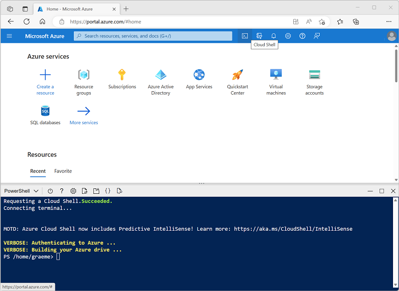

---
lab:
  title: استكشاف تصنيف الصور
---

# استكشاف تصنيف الصور

توفر خدمة *رؤية الذكاء الاصطناعي في Azure* نماذج مفيدة مبنية مسبقًا للعمل مع الصور، ولكنك ستحتاج غالبًا إلى تدريب نموذجك الخاص على رؤية الكمبيوتر. على سبيل المثال، افترض أن منظمة حفاظ على الحياة البرية تريد تتبع مشاهد الحيوانات باستخدام الكاميرات الحساسة للحركة. ويمكن بعد ذلك استخدام الصور التي التقطتها الكاميرات للتحقق من وجود أنواع معينة في منطقة معينة والمساعدة في جهود حفظ الأنواع المهددة بالانقراض. ولتحقيق ذلك، ستستفيد المنظمة من *نموذج تصنيف الصور* الذي يتم تدريبه على تحديد أنواع مختلفة من الحيوانات في الصور الفوتوغرافية الملتقطة.

في Azure، يمكنك استخدام خدمة ***رؤية مخصصة*** لتدريب نموذج تصنيف الصورة بناءً على الصور الموجودة. يوجد عنصران لإنشاء حل تصنيف الصور. أولاً، يجب تدريب نموذج للتعرف على الفئات المختلفة باستخدام الصور الموجودة. بعد ذلك، عندما يتم تدريب النموذج، يجب عليك نشره كخدمة يمكن أن تستهلكها التطبيقات.

لاختبار قدرات خدمة Custom Vision، سنستخدم تطبيق سطر أوامر بسيطًا يتم تشغيله في Cloud Shell. تنطبق نفس المبادئ والوظائف في حلول العالم الحقيقي، مثل مواقع الويب أو تطبيقات الهاتف المحمول.

## قبل أن تبدأ

لإكمال هذا التمرين المعملي، ستحتاج إلى [اشتراك Azure](https://azure.microsoft.com/free?azure-portal=true) الذي لديك فيه حق الوصول الإداري.

## إنشاء مورد *خدمات ذكاء اصطناعي في Azure*

يمكنك استخدام خدمة الرؤية المخصصة بإنشاء إما مورد **رؤية مخصصة** أو مورد **خدمات الذكاء الاصطناعي في Azure**.

>**ملاحظة** لا يتوفر كل مورد في كل منطقة. سواء قمت بإنشاء مورد رؤية مخصص أو خدمات معرفية، فلا يمكن استخدام سوى الموارد التي تم إنشاؤها في [مناطق معينة](https://azure.microsoft.com/global-infrastructure/services/?products=cognitive-services) للوصول إلى خدمات الرؤية المخصصة. من أجل البساطة، يتم تحديد المنطقة مسبقاً لك في إرشادات التكوين أدناه.

أنشئ مورد **خدمات الذكاء الاصطناعي في Azure** في اشتراكك في Azure.

1. افتح مدخل Azure في [https://portal.azure.com](https://portal.azure.com?azure-portal=true)، وسجّل الدخول باستخدام حساب Microsoft الخاص بك.

1. انقر فوق زر **＋أنشئ مورد** وابحث عن *خدمات ذكاء اصطناعي في Azure*. حدد **إنشاء** **خطة خدمات الذكاء الاصطناعي في Azure**. سيتم نقلك إلى صفحة لإنشاء مورد خدمات ذكاء اصطناعي في Azure. قم بتكوينه بالإعدادات التالية:
    - **الاشتراك**: *اشتراك Azure الخاص بك*.
    - **مجموعة الموارد**: *أنشئ مجموعة موارد جديدة ذات اسم فريد*.
    - **المنطقة**: شرق الولايات المتحدة
    - **الاسم**: *أدخل اسمًا مميزًا*.
    - **مستوى التسعير**: قياسي S0
    - **By checking this box I acknowledge that I have read and understood all the terms below**: محدد.

1. راجع المورد وأنشئه، وانتظر حتى يكتمل التوزيع. ثم انتقل إلى المورد الموزع.

1. عرض صفحة **المفاتيح ونقطة النهاية** لمورد خدمات الذكاء الاصطناعي في Azure. ستحتاج نقطة النهاية والمفاتيح للاتصال من تطبيقات العميل.

## إنشاء مشروع Custom Vision

لتدريب نموذج اكتشاف العنصر، تحتاج إلى إنشاء مشروع رؤية مخصصة بناءً على مورد التدريب الخاص بك. للقيام بذلك، ستستخدم مدخل Custom Vision.

1. قم بتنزيل واستخراج صور التدريب من[https://aka.ms/animal-images](https://aka.ms/animal-images). يتم توفير هذه الصور في مجلد مضغوط، والذي يحتوي عند فك ضغطه على مجلدات فرعية تسمى **فيل**، **زرافة**، **أسد**.

1. افتح علامة تبويب مستعرض جديدة، واستعرض للوصول إلى مدخل الرؤية المخصصة في [https://customvision.ai](https://customvision.ai?azure-portal=true). إذا طُلب منك ذلك، قم بتسجيل الدخول باستخدام حساب Microsoft المرتبط باشتراك Azure الخاص بك ووافق على شروط الخدمة.

1. في مدخل Custom Vision، أنشئ مشروعًا جديدًا بالإعدادات التالية:

    - **الاسم**: التعرف على الحيوانات
    - **الوصف**: تصنيف الصور للحيونات
    - **المورد**: *مورد خدمات ذكاء اصطناعي في Azure الذي أنشأته مسبقًا*
    - **أنواع المشاريع**: التصنيف
    - **Classification Types**: متعدد الفئات (علامة واحدة لكل صورة)
    - **المجالات**: عام \[A2]

1. انقر فوق **أضف صورة**، وحدد جميع الملفات الموجودة في مجلد **فيل** الذي قمت بفكه مسبقًا. ثم قم بتحميل ملفات الصور، مع تحديد العلامة *فيل*، على النحو التالي:

    

1. استخدم الزر **إضافة صور** ([+]) لتحميل الصور في **مجلد الزرافة** باستخدام علامة *زرافة*والصور في مجلد **أسد** مع علامة *أسد*.

1. استكشف الصور التي قمت بتحميلها في مشروع الرؤية المخصصة - يجب أن يكون هناك 17 صورة لكل فصل، على النحو التالي:

    

1. في مشروع Custom Vision، فوق الصور، انقر فوق **"تدريب"** لتدريب نموذج تصنيف باستخدام الصور ذات العلامات. حدد خيار **تدريب سريع**، ثم انتظر حتى يكتمل تكرار التدريب.

    > **تلميح**: قد يستغرق التدريب بضع دقائق. أثناء الانتظار، تحقق من [كيف يمكن أن تساعد صور الفهود الثلجية الذكاء الاصطناعي في إنقاذ الأنواع من الانقراض](https://news.microsoft.com/transform/snow-leopard-selfies-ai-save-species/)، والذي يصف مشروعًا حقيقيًا يستخدم رؤية الكمبيوتر لتتبع الحيوانات المهددة بالانقراض في البرية.

1. عند تدريب تكرار النموذج، راجع مقاييس الأداء *الدقة**والاستدعاء*و*AP* - تقيس هذه دقة التنبؤ لنموذج التصنيف، ويجب أن تكون جميعها عالية.

## اختبار النموذج

قبل نشر هذا التكرار للنموذج لتستخدمه التطبيقات، يجب عليك اختباره.

1. فوق مقاييس الأداء، انقر فوق **اختبار سريع**.

1. في المربع **عنوان URL للصورة**، اكتب `https://aka.ms/giraffe` وأنقر فوق زر **صورة الاختبار السريع (➔)**.

1. اعرض التوقعات التي يعرضها نموذجك - يجب أن تكون درجة احتمالية *زرافة* أعلى، كما يلي:

    

1. أغلق نافذة **اختبار سريع**.

## نَشر نموذج تصنيف الصور

أنت الآن جاهز لنشر نموذجك المدرّب واستخدامه من تطبيق عميل.

1. انقر فوق **&#128504; Publish** لنشر النموذج المدربين مع الإعدادات التالية:
    - **اسم النموذج**: الحيوانات
    - **مورد التوقع**: *خدمات ذكاء اصطناعي في Azure أو مورد توقع الرؤية المخصصة الذي قمت بإنشائه مسبقًا*.

1. بعد النشر، انقر فوق *"عنوان URL للتنبؤ"* (&#127760;) لرؤية المعلومات المطلوبة لاستخدام النموذج المنشور.

    

لاحقًا، ستحتاج إلى عنوان URL المناسب وقيم مفتاح التنبؤ للحصول على تنبؤ من عنوان URL للصورة، لذلك احتفظ بمربع الحوار هذا مفتوحًا وتابع إلى المهمة التالية.

## إعداد تطبيق لعميل

لاختبار قدرات خدمة «الرؤية المخصصة»، سنستخدم تطبيق سطر أوامر بسيط يعمل في Cloud Shell على Azure.

1. في مدخل Microsoft Azure، حدد زر **Cloud shell** (**[>_]**) أعلى الصفحة يمين مربع البحث. يؤدي ذلك إلى فتح جزء Cloud Shell في أسفل المدخل.

    في المرة الأولى التي تفتح فيها Cloud Shell، قد يُطلب منك اختيار نوع shell التي تريد استخدامها (*Bash* أو *PowerShell).* إذا كان الأمر كذلك، حدد **PowerShell**.

    إذا تمت مطالبتك بإنشاء سعة تخزينية لـ Cloud Shell، فتأكد من تحديد اشتراكك وحدد **إنشاء تخزين**. ثم انتظر دقيقة أو نحو ذلك لإنشاء التخزين.

    عندما تكون cloud shell جاهزة، يجب أن تبدو مشابهة لما يلي:
    
    

    > **تلميح**: تأكد من أن نوع shell المشار إليه في أعلى يسار جزء Cloud Shell هو *PowerShell*. إذا كان *Bash*، فقم بالتبديل إلى *PowerShell* باستخدام القائمة المنسدلة.

    لاحظ أنه يمكنك تغيير حجم غلاف السحابة عن طريق سحب شريط الفاصل أعلى الجزء، أو باستخدام أيقونات **&#8212;** و **&#9723;** و**X** في أعلى يسار الجزء لتصغير الجزء وتكبيره وإغلاقه. لمزيد من المعلومات حول استخدام Azure Cloud Shell، راجع [وثائق Azure Cloud Shell](https://docs.microsoft.com/azure/cloud-shell/overview).

2. في الأمر shell، أدخل الأوامر التالية لتنزيل الملفات لهذا التمرين وحفظها في مجلد يسمى **ai-900** (بعد إزالة هذا المجلد إذا كان موجودًا بالفعل)

    ```PowerShell
    rm -r ai-900 -f
    git clone https://github.com/MicrosoftLearning/AI-900-AIFundamentals ai-900
    ```

3. بعد تنزيل الملفات، أدخل الأوامر التالية للتغيير إلى الدليل **ai-900** وتحرير ملف التعليمات البرمجية لهذا التمرين:

    ```PowerShell
    cd ai-900
    code classify-image.ps1
    ```

    لاحظ كيف يفتح هذا محررًا مثل المحرر الموجود في الصورة أدناه:

     

     > **تلميح**: يمكنك استخدام شريط الفاصل بين سطر أوامر cloud shell ومحرر التعليمات البرمجية لتغيير حجم الأجزاء.

4. لا تقلق كثيراً بشأن تفاصيل الرمز. الشيء المهم هو أنه يبدأ ببعض التعليمات البرمجية لتحديد عنوان URL للتوقع والمفتاح لنموذج الرؤية المخصصة. ستحتاج إلى تحديث هذه بحيث تستخدم بقية التعليمات البرمجية النموذج الخاص بك.

    احصل على *عنوان URL للتوقع* و*مفتاح التوقع* من مربع الحوار الذي تركته مفتوحًا في علامة تبويب مستعرض ويب مشروع الرؤية المخصصة. **تحتاج إلى استخدام الإصدارات *إذا كان لديك عنوان URL للصورة*.**

    استخدم هذه القيم لاستبدال **YOUR_PREDICTION_URL** والعناصر النائبة لـ **YOUR_PREDICTION_KEY** في ملف التعليمات البرمجية.

    بعد لصق قيم عنوان URL للتنبؤ ومفتاح التنبؤ، يجب أن يتشابه أول سطرين من التعليمات البرمجية مع هذا:

    ```PowerShell
    $predictionUrl="https..."
    $predictionKey ="1a2b3c4d5e6f7g8h9i0j...."
    ```

5. بعد إجراء التغييرات على المتغيرات في التعليمات البرمجية، اضغط على **CTRL+S** لحفظ الملف. ثم اضغط على **Ctrl+Q** لإغلاق محرر التعليمات البرمجية.

## اختبار تطبيق العميل

الآن يمكنك استخدام نموذج تطبيق العميل لتصنيف الصور استنادًا إلى الحيوان الذي تحتوي عليه.

1. أدخل الأمر التالي في جزء PowerShell لتشغيل التعليمات البرمجية:

    ```PowerShell
    ./classify-image.ps1 1
    ```

    تستخدم هذه التعليمة البرمجية نموذجك لتصنيف الصورة التالية:

    

1. راجع التوقع، والذي يجب أن يكون **زرافة**.

1. الآن دعونا نجرب صورة أخرى. قم بإجراء هذا الأمر:

    ```PowerShell
    ./classify-image.ps1 2
    ```

    هذه المرة يتم تصنيف الصورة التالية:

    

1. تحقق من أن النموذج يصنف هذه الصورة على أنها **فيل**.

1. دعونا نجرب مرة أخرى. قم بإجراء هذا الأمر:

    ```PowerShell
    ./classify-image.ps1 3
    ```

    النتيجة النهائية تبدو هكذا:

    

1. تحقق من أن النموذج يصنف هذه الصورة على أنها **أسد**.

نأمل أن يصنف نموذج تصنيف الصور بشكل صحيح جميع الصور الثلاث.


