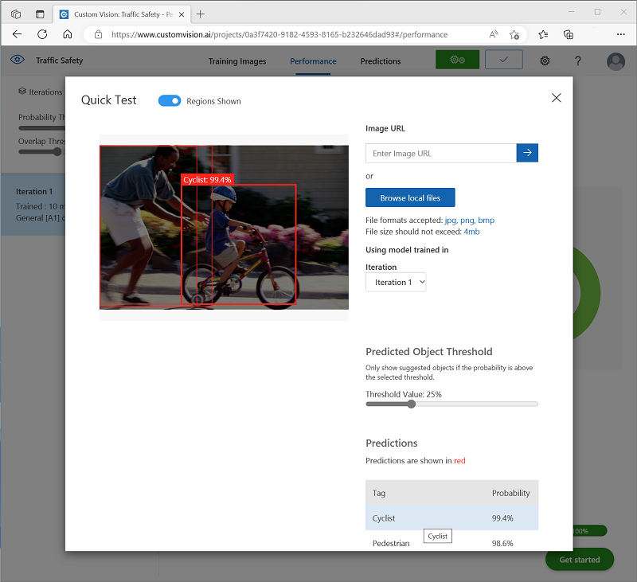

---
lab:
  title: استكشاف الكشف عن العناصر
---

# استكشاف الكشف عن العناصر

> **ملاحظة** لإكمال هذا النشاط المعملي، ستحتاج إلى [اشتراك Azure](https://azure.microsoft.com/free?azure-portal=true) الذي لديك فيه حق الوصول الإداري.

يعد *اكتشاف الكائن* أحد أشكال رؤية الكمبيوتر حيث يتم تدريب نموذج التعلم الآلي على تصنيف الحالات الفردية للكائنات في صورة ما، والإشارة إلى *المربع المحيط* الذي يحدد موقعه. يمكنك التفكير في هذا على أنه تقدم من *تصنيف الصور* (حيث يجيب النموذج على السؤال "ما هذه الصورة؟") إلى حلول بناء حيث يمكننا أن نسأل النموذج "ما هي الكائنات في هذه الصورة، وأين توجد ؟ ".

على سبيل المثال، قد تحدد مبادرة السلامة على الطرق المشاة وراكبي الدراجات بأنهم أكثر مستخدمي الطرق ضعفا عند تقاطعات المرور. باستخدام الكاميرات لمراقبة التقاطعات، يمكن تحليل صور مستخدمي الطرق للكشف عن المشاة وراكبي الدراجات من أجل مراقبة أعدادهم أو حتى تغيير سلوك إشارات المرور.

توفر خدمة **Custom Vision** المعرفية في Microsoft Azure حلاً مستندًا إلى مجموعة النظراء لإنشاء نماذج مخصصة للكشف عن الكائنات ونشرها. في Azure، يمكنك استخدام خدمة Custom Vision لتدريب نموذج الكشف عن العناصر استنادا إلى الصور الموجودة. هناك عنصران لإنشاء حل الكشف عن العناصر. أولا، يجب تدريب نموذج للكشف عن موقع وفئة العناصر باستخدام الصور المسماة. بعد ذلك، عندما يتم تدريب النموذج، يجب عليك نشره كخدمة يمكن أن تستهلكها التطبيقات.

لاختبار قدرات خدمة Custom Vision لاكتشاف الكائنات في الصور، سنستخدم تطبيق سطر أوامر بسيط يعمل في Cloud Shell. تنطبق نفس المبادئ والوظائف في حلول العالم الحقيقي، مثل مواقع الويب أو تطبيقات الأجهزة المحمولة.

## إنشاء مورد *الخدمات المعرفية*

يمكنك استخدام خدمة Custom Vision بإنشاء إما مورد **رؤية مخصصة** أو مورد ** الخدمات المعرفية**.

> **ملاحظة** لا يتوفر كل مورد في كل منطقة. سواء قمت بإنشاء مورد Custom Vision أو Cognitive Services، فلا يمكن استخدام سوى الموارد التي تم إنشاؤها في [مناطق معينة](https://azure.microsoft.com/global-infrastructure/services/?products=cognitive-services) للوصول إلى خدمات Custom Vision. من أجل البساطة، يتم تحديد المنطقة مسبقاً لك في إرشادات التكوين أدناه.

أنشئ مورد **Cognitive Services** في اشتراكك في Azure.

1. في علامة تبويب مستعرض أخرى، افتح مدخل Azure في [https://portal.azure.com](https://portal.azure.com?azure-portal=true)، وقم بتسجيل الدخول باستخدام حساب Microsoft الخاص بك.

1. انقر فوق **&#65291;إنشاء** زر مورد والبحث عن *الخدمات المعرفية* وإنشاء مورد الخدمات **المعرفية ** مع الإعدادات التالية:
    - **الاشتراك**: *اشتراك Azure الخاص بك*.
    - **مجموعة الموارد**: *أنشئ مجموعة موارد جديدة ذات اسم فريد*.
    - **المنطقة**: شرق الولايات المتحدة
    - **الاسم**: *أدخل اسمًا مميزًا*.
    - **مستوى التسعير**: قياسي S0
    - **By checking this box I acknowledge that I have read and understood all the terms below**: محدد.

1. راجع المورد وأنشئه، وانتظر حتى يكتمل التوزيع. ثم انتقل إلى المورد الموزع.

1. عرض صفحة **Keys and Endpoint** لمورد الخدمات المعرفية. ستحتاج نقطة النهاية والمفاتيح للاتصال من تطبيقات العميل.

## إنشاء مشروع Custom Vision

لتدريب نموذج اكتشاف العنصر، تحتاج إلى إنشاء مشروع رؤية مخصصة بناءً على مورد التدريب الخاص بك. للقيام بذلك، ستستخدم مدخل Custom Vision.

1. في علامة تبويب مستعرض جديدة، افتح مدخل "Custom Vision" في [https://customvision.ai](https://customvision.ai?azure-portal=true)، ثم سجل الدخول باستخدام حساب Microsoft المقترن باشتراك Azure.

1. إنشاء مشروع جديد بالإعدادات التالية:
    - **الاسم**: أمان نسبة استخدام الشبكة
    - **الوصف**: الكشف عن الكائنات للسلامة على الطرق.
    - **المورد**: * المورد الذي أنشأته مسبقًا*.
    - **أنواع المشروع**: الكشف عن الكائنات
    - **المجالات**: عام \[A1]

1. انتظر المشروع إلى إنشاء وفتح في المستعرض.

## إضافة الصور ووضع علامة لها

لتدريب نموذج اكتشاف الكائن، تحتاج إلى تحميل الصور التي تحتوي على الفئات التي تريد أن يحددها النموذج، وتمييزها للإشارة إلى المربعات المحيطة لكل مثيل كائن.

1. قم بتنزيل واستخراج صور التدريب من [https://aka.ms/traffic-images](https://aka.ms/traffic-images). يحتوي المجلد المستخرج على مجموعة من صور راكبي الدراجات والمشاة.

1. في مدخل Custom Vision، في مشروع الكشف عن كائن **Traffic Safety** ، حدد **Add images** وقم بتحميل جميع الصور في المجلد المستخرج.

    

1. بعد تحميل الصور، حدد أول صورة تفتحها.

1. اضغط على الماوس فوق أي كائن (دراج أو مشاة) في الصورة حتى يتم عرض منطقة تم اكتشافها تلقائيا. ثم حدد الكائن، وإذا لزم الأمر، قم بتغيير حجم المنطقة المحيطة به. بدلاً من ذلك، يمكنك ببساطة السحب حول الكائن لإنشاء منطقة.

    عند تحديد الكائن بإحكام داخل المنطقة المستطيلة، أدخل العلامة المناسبة للكائن (*دراج* أو *مشاة*) واستخدم الزر **Tag region** (**+**) لإضافة العلامة إلى المشروع.

    

1. استخدم الارتباط **التالي** (**(>)** على اليمين للانتقال إلى الصورة التالية، ووضع علامة على عناصرها. ثم ما عليك سوى الاستمرار في العمل من خلال مجموعة الصور بأكملها، ووضع علامات على كل دراج ومشاة.

    أثناء وضع علامة على الصور، لاحظ ما يلي:

    - تحتوي بعض الصور على كائنات متعددة، من المحتمل أن تكون من أنواع مختلفة. وضع علامة على كل منها، حتى إذا تداخلت.
    - بعد إدخال علامة مرة واحدة، يمكنك تحديدها من القائمة عند وضع علامات على كائنات جديدة.
    - يمكنك العودة إلى الأمام من خلال الصور لضبط العلامات.

    

1. عند الانتهاء من وضع علامات على الصورة الأخيرة، أغلق محرر **Image Detail** وفي صفحة **Training Images** ضمن **Tags**، حدد **Tagged** لمشاهدة جميع الصور ذات العلامات:

    

## تدريب واختبار نموذج

الآن بعد أن قمت بتمييز الصور في مشروعك، فأنت جاهز لتدريب نموذج.

1. في مشروع Custom Vision، انقر فوق **Train** لتدريب نموذج اكتشاف كائن باستخدام الصور ذات العلامات. حدد خيار **Quick Training**

    > **تلميح**: قد يستغرق التدريب عدة دقائق. أثناء الانتظار، راجع [تحليلات الفيديو للمدن الذكية](https://www.microsoft.com/research/video/video-analytics-for-smart-cities/)، والتي تصف مشروعا حقيقيا لاستخدام رؤية الكمبيوتر في مبادرة تحسين السلامة على الطرق.

2. عند اكتمال التدريب، راجع مقاييس أداء *الدقة* *والاستدعاء* *وmAP* - تقيس هذه المقاييس جودة التنبؤ لنموذج الكشف عن الكائنات، ويجب أن تكون جميعها عالية بشكل معقول.

3. اضبط **عتبة الاحتمال** على اليسار، وقم بزيادته من 50٪ إلى 90٪ ولاحظ التأثير على مقاييس الأداء. يحدد هذا الإعداد قيمة الاحتمال التي يجب أن يفي بها كل تقييم علامة أو يتجاوزها لحسابها كتنبؤ.

    

4. في أعلى يمين الصفحة، انقر فوق **اختبار سريع**، ثم في المربع **عنوان URL للصورة** ، أدخل `https://aka.ms/pedestrian-cyclist` النتائج واعرضها.

    في الجزء الموجود على اليمين، ضمن **Predictions**، يتم سرد كل كائن تم اكتشافه مع العلامة والاحتمالات الخاصة به. حدد كل كائن لمشاهدته مميزا في الصورة.

    قد لا تكون جميع العناصر المتوقعة صحيحة - بعد كل شيء، يشارك راكبو الدراجات والمشاة العديد من الميزات الشائعة. التنبؤات التي يكون النموذج أكثر ثقة بشأنها لها أعلى قيم الاحتمال. استخدم شريط تمرير **قيمة الحد** لإزالة العناصر ذات الاحتمال المنخفض. يجب أن تكون قادرا على العثور على نقطة يتم فيها تضمين التنبؤات الصحيحة فقط (ربما عند حوالي 85-90٪).

    

5. ثم أغلق نافذة **Quick Test**.

## نشر نموذج الكشف عن الكائنات

أنت الآن جاهز لنشر نموذجك المدرّب واستخدامه من تطبيق عميل.

1. انقر فوق **&#128504; Publish** لنشر النموذج المدربين مع الإعدادات التالية:
    - **اسم النموذج**: السلامة المرورية
    - **Prediction resource**:  *مورد الذي أنشأته مسبقًا*.

1. بعد النشر، انقر فوق *Prediction URL* (&#127760;) لرؤية المعلومات المطلوبة لاستخدام النموذج المنشور.

    

لاحقًا، ستحتاج إلى عنوان URL المناسب وقيم مفتاح التنبؤ للحصول على تنبؤ من عنوان URL للصورة، لذلك احتفظ بمربع الحوار هذا مفتوحًا وتابع إلى المهمة التالية.

## إعداد تطبيق عميل

لاختبار قدرات خدمة Custom Vision، سنستخدم تطبيق سطر أوامر بسيط يعمل في cloud shell على Azure.

1. قم بالتبديل مرة أخرى إلى علامة تبويب المستعرض التي تحتوي على مدخل Microsoft Azure، وحدد زر **Cloud shell** (**[>_]**) في أعلى الصفحة إلى يمين مربع البحث. يؤدي هذا إلى فتح جزء cloud shell في أسفل المدخل.

    في المرة الأولى التي تفتح فيها Cloud Shell، قد يُطلب منك اختيار نوع shell التي تريد استخدامها (*Bash* أو *PowerShell).* إذا كان الأمر كذلك، فحدد **PowerShell**.

    إذا تمت مطالبتك بإنشاء تخزين ل Cloud Shell، فتأكد من تحديد اشتراكك وحدد **Create storage**. ثم انتظر دقيقة أو نحو ذلك لإنشاء التخزين.

    عندما تكون shell السحابية جاهزة، يجب أن تبدو مشابهة لما يلي:
    
    

    > **تلميح**: تأكد من أن نوع shell المشار إليه في الجزء العلوي الأيسر من جزء Cloud Shell هو *PowerShell*. إذا كان *Bash*، فقم بالتبديل إلى *PowerShell* باستخدام القائمة المنسدلة.

    لاحظ أنه يمكنك تغيير حجم غلاف السحابة عن طريق سحب شريط الفاصل أعلى الجزء، أو باستخدام أيقونات **&#8212;** و **&#9723;** و**X** في أعلى يسار الجزء لتصغير الجزء وتكبيره وإغلاقه. لمزيد من المعلومات حول استخدام Azure Cloud Shell، راجع [وثائق Azure Cloud Shell](https://docs.microsoft.com/azure/cloud-shell/overview).

2. في الأمر shell، أدخل الأوامر التالية لتنزيل الملفات لهذا التمرين وحفظها في مجلد يسمى **ai-900** (بعد إزالة هذا المجلد إذا كان موجودا بالفعل)

    ```PowerShell
    rm -r ai-900 -f
    git clone https://github.com/MicrosoftLearning/AI-900-AIFundamentals ai-900
    ```

3. بعد تنزيل الملفات، أدخل الأوامر التالية للتغيير إلى دليل **ai-900** وتحرير ملف التعليمات البرمجية لهذا التمرين:

    ```PowerShell
    cd ai-900
    code detect-objects.ps1
    ```

    لاحظ كيف يفتح هذا محررا مثل المحرر الموجود في الصورة أدناه:

     

     > **تلميح**: يمكنك استخدام شريط الفاصل بين سطر أوامر cloud shell ومحرر التعليمات البرمجية لتغيير حجم الأجزاء.

4. لا تقلق كثيراً بشأن تفاصيل الرمز. الشيء المهم هو أنه يبدأ ببعض التعليمات البرمجية لتحديد عنوان URL للتنبؤ والمفتاح لنموذج Custom Vision الخاص بك. ستحتاج إلى تحديثها بحيث تستخدم بقية التعليمات البرمجية النموذج الخاص بك.

    احصل على *عنوان URL للتنبؤ* *ومفتاح التنبؤ* من مربع الحوار الذي تركته مفتوحا في علامة تبويب المستعرض لمشروع Custom Vision. تحتاج إلى استخدام الإصدارات *إذا كان لديك عنوان URL للصورة*.

    استخدم هذه القيم لاستبدال **أصحاب YOUR_PREDICTION_URL** والمكان **YOUR_PREDICTION_KEY** في ملف التعليمات البرمجية.

    بعد لصق قيم عنوان URL للتنبؤ ومفتاح التنبؤ، يجب أن يتشابه أول سطرين من التعليمات البرمجية مع هذا:

    ```PowerShell
    $predictionUrl="https..."
    $predictionKey ="1a2b3c4d5e6f7g8h9i0j...."
    ```

5. بعد إجراء التغييرات على المتغيرات في التعليمات البرمجية، اضغط **على CTRL+S** لحفظ الملف. ثم اضغط **على CTRL+Q** لإغلاق محرر التعليمات البرمجية.

## اختبار تطبيق العميل

الآن يمكنك استخدام نموذج تطبيق العميل للكشف عن راكبي الدراجات والمشاة في الصور.

1. أدخل الأمر التالي في جزء PowerShell لتشغيل التعليمات البرمجية:

    ```PowerShell
    ./detect-objects.ps1 1
    ```

    تستخدم هذه التعليمة البرمجية النموذج الخاص بك للكشف عن العناصر في الصورة التالية:

    

1. راجع التنبؤ، الذي يسرد أي كائنات تم اكتشافها مع احتمال بنسبة 90٪ أو أكثر، جنبا إلى جنب مع إحداثيات مربع إحاطة حول موقعها.

1. الآن دعونا نجرب صورة أخرى. شغَّل هذا الأمر:

    ```PowerShell
    ./detect-objects.ps1 2
    ```

    هذه المرة يتم تحليل الصورة التالية:

    

نأمل أن يكون نموذج الكشف عن الكائنات الخاص بك قد قام بعمل جيد للكشف عن المشاة وراكبي الدراجات في صور الاختبار.

## معرفة المزيد

يظهر هذا التمرين بعض قدرات خدمة Custom Vision فقط. لمعرفة المزيد حول ما يمكنك القيام به بهذه الخدمة، راجع [صفحة الرؤية المخصصة](https://azure.microsoft.com/services/cognitive-services/custom-vision-service/).
