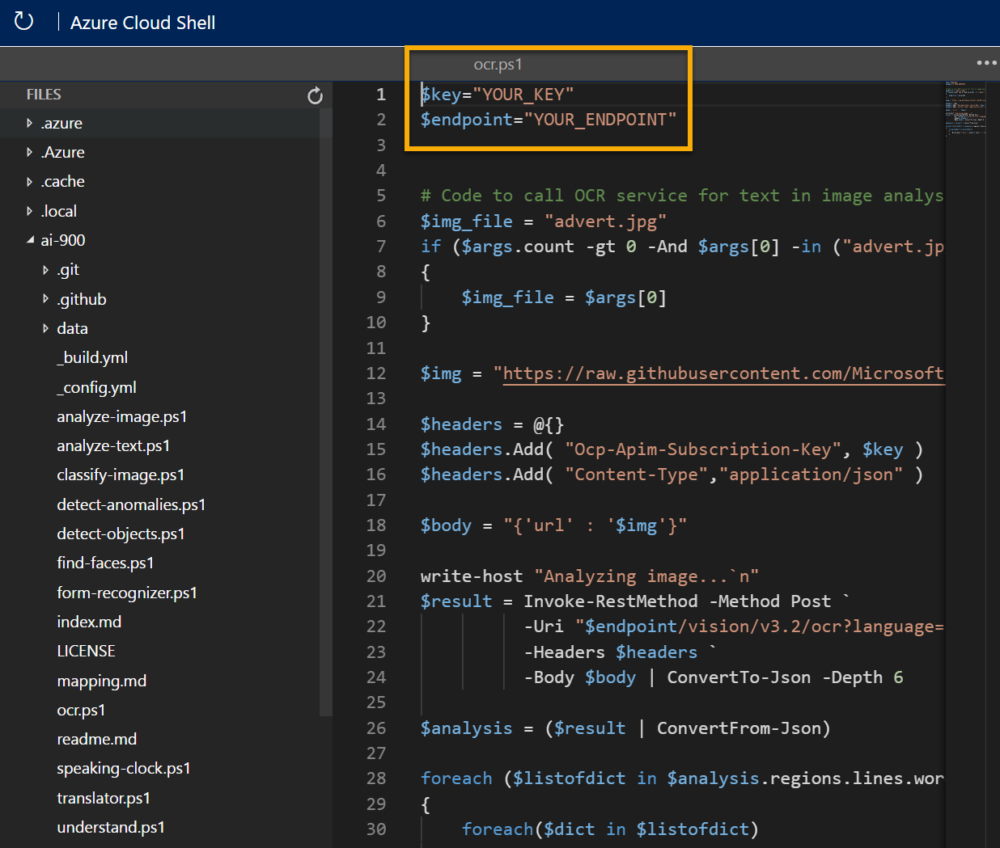

---
lab:
  title: استكشاف تقنية التعرف البصري على الحروف
---

# استكشاف تقنية التعرف البصري على الحروف

> **ملاحظة** لإكمال هذا النشاط المعملي، ستحتاج إلى [اشتراك Azure](https://azure.microsoft.com/free?azure-portal=true) الذي لديك فيه حق الوصول الإداري.

يتمثل أحد تحديات رؤية الكمبيوتر الشائعة في اكتشاف النص وتفسيره في صورة. غالبًا ما يشار إلى هذا النوع من المعالجة باسم *التعرف البصري على الأحرف* (OCR). توفر Read API في Microsoft الوصول إلى إمكانات التعرف البصري على الحروف. 

لاختبار إمكانات Read API، سنستخدم تطبيق سطر أوامر بسيط يعمل في Cloud Shell. تنطبق نفس المبادئ والوظائف في حلول العالم الحقيقي، مثل مواقع الويب أو تطبيقات الهاتف.

## استخدام خدمة Azure الذكاء الاصطناعي Vision لقراءة النص في صورة

**توفر خدمة Azure الذكاء الاصطناعي Vision** الدعم لمهام التعرف البصري على الحروف، بما في ذلك:

- واجهة برمجة تطبيقات **Read** التي تم تحسينها للمستندات الأكبر. يتم استخدام واجهة برمجة التطبيقات هذا بشكل غير متزامن، ويمكن استخدامه لكل من النص المطبوع والنص المكتوب بخط اليد.

## *إنشاء مورد خدمات* Azure الذكاء الاصطناعي

يمكنك استخدام خدمة Azure الذكاء الاصطناعي Vision عن طريق إنشاء مورد **Computer Vision** أو **مورد خدمات** Azure الذكاء الاصطناعي.

إذا لم تكن قد فعلت ذلك بالفعل، فقم **بإنشاء مورد خدمات** Azure الذكاء الاصطناعي في اشتراك Azure.

1. في علامة تبويب مستعرض أخرى، افتح مدخل Azure في [https://portal.azure.com](https://portal.azure.com?azure-portal=true)، وقم بتسجيل الدخول باستخدام حساب Microsoft الخاص بك.

1. **انقر فوق &65291; أنشئ زر مورد** وابحث عن *خدمات* Azure الذكاء الاصطناعي. حدد **إنشاء** **خطة خدمات** الذكاء الاصطناعي Azure. سيتم نقلك إلى صفحة لإنشاء مورد خدمات Azure الذكاء الاصطناعي. قم بتكوينه بالإعدادات التالية:
    - **الاشتراك**: *اشتراك Azure الخاص بك*.
    - **مجموعة الموارد**: *أنشئ مجموعة موارد جديدة ذات اسم فريد*.
    - **Region**: *اختر أي منطقة متوفرة*.
    - **الاسم**: *أدخل اسمًا مميزًا*.
    - **مستوى التسعير**: قياسي S0
    - **By checking this box I acknowledge that I have read and understood all the terms below**: محدد.

1. راجع المورد وأنشئه، وانتظر حتى يكتمل التوزيع. ثم انتقل إلى المورد الموزع.

1. **اعرض صفحة Keys and Endpoint** لمورد خدمات Azure الذكاء الاصطناعي. ستحتاج نقطة النهاية والمفاتيح للاتصال من تطبيقات العميل.

## تشغيل Cloud Shell

لاختبار قدرات خدمة «الرؤية المخصصة»، سنستخدم تطبيق سطر أوامر بسيط يعمل في Cloud Shell على Azure.

1. في مدخل Azure، حدد زر **[>_]** *(Cloud Shell)* أعلى الصفحة يمين مربع البحث. يؤدي ذلك إلى فتح جزء Cloud Shell في أسفل المدخل. 

    

1. في المرة الأولى التي تفتح فيها Cloud Shell، قد يُطلب منك اختيار نوع shell التي تريد استخدامها (*Bash* أو *PowerShell).* حدد **PowerShell**. إذا لم ترى هذا الخيار، تخطي الخطوة.  

1. إذا تمت مطالبتك بإنشاء سعة تخزينية لشركة Cloud Shell، فتأكد من تحديد اشتراكك وحدد **Create storage**. ثم انتظر دقيقة أو نحو ذلك لإنشاء التخزين.

    

1. تأكد من تبديل نوع shell المشار إليه في أعلى يسار جزء Cloud Shell إلى *PowerShell*. إذا كان *Bash*، فقم بالتبديل إلى *PowerShell* باستخدام القائمة المنسدلة.

     

1. انتظر حتى يبدأ PowerShell. يجب أن ترى الشاشة التالية في مدخل Azure:  

     

## كوّن تطبيق عميل وقم بتشغيله

الآن بعد أن أصبح لديك طراز مخصص، يمكنك تشغيل تطبيق عميل بسيط يستخدم خدمة «OCR».

1. في shell الأمر، أدخل الأمر التالي لتحميل نموذج التطبيق وحفظه إلى مجلد يسمى «ai-900».

    ```PowerShell
    git clone https://github.com/MicrosoftLearning/AI-900-AIFundamentals ai-900
    ```

    >**تلميح** إذا كنت قد استخدمت هذا الأمر بالفعل في نشاط معملي آخر لاستنساخ مستودع *ai-900*، فيمكنك تخطي هذه الخطوة.

1. يتم تحميل الملفات إلى مجلد يسمى **ai-900**. نريد الآن رؤية جميع الملفات في تخزين Cloud Shell الخاص بك والعمل معهم. اكتب الأمر التالي في shell:

    ```PowerShell
    code .
    ```

    لاحظ كيف يفتح هذا محررًا مثل المحرر الموجود في الصورة أدناه: 

    

1. في جزء **Files** على اليسار، قم بتوسيع **ai-900** وحدد **ocr.ps1**. يحتوي هذا الملف على بعض التعليمات البرمجية التي تستخدم خدمة "رؤية الكمبيوتر" للكشف عن نص في صورة وتحليله كما موضح هنا:

    

1. لا تقلق كثيرا بشأن تفاصيل التعليمات البرمجية، الشيء المهم هو أنه يحتاج إلى عنوان URL لنقطة النهاية وأي من مفاتيح مورد خدمات Azure الذكاء الاصطناعي. انسخ هذه من صفحة **Keys and Endpoints** لموردك من مدخل Azure وألصقها في محرر التعليمات البرمجية، مستبدلًا قيم العنصر النائب **YOUR_KEY** و **YOUR_ENDPOINT** على التوالي.

    > **تلميح** قد تحتاج إلى استخدام شريط الفاصل لضبط ناحية الشاشة أثناء العمل مع أجزاء **Keys and Endpoint** و**Editor**.

    بعد لصق قيم المفتاح ونقطة النهاية، يجب أن يكون السطران الأولان من التعليمات البرمجية مشابهين لهذا:

    ```PowerShell
    $key="1a2b3c4d5e6f7g8h9i0j...."    
    $endpoint="https..."
    ```

1. في أعلى يمين جزء المحرر، استخدم الزر **...** لفتح القائمة ثم حدد **Save** لحفظ التغييرات. ثم افتح القائمة مرة أخرى وحدد **Close Editor**. الآن بعد أن قمت بإعداد المفتاح ونقطة النهاية، يمكنك استخدام مورد خدمات Azure الذكاء الاصطناعي لاستخراج نص من صورة.

    دعونا نستخدم **Read** API. في هذه الحالة، لديك صورة إعلانية لشركة Northwind Traders الوهمية للبيع بالتجزئة تتضمن بعض النصوص.

    سيحلل نموذج تطبيق العميل الصورة التالية:

    

1. أدخل الأمر التالي في جزء PowerShell لتشغيل التعليمات البرمجية:

    ```PowerShell
    cd ai-900
    ./ocr.ps1 advert.jpg
    ```

1. راجع التفاصيل الموجودة في الصورة. يتم تنظيم النص الموجود في الصورة في بنية هرمية من المناطق والخطوط والكلمات، وتقرأ التعليمات البرمجية كل هذا لاسترداد النتائج.

    لاحظ أن موقع النص يشار إليه بالإحداثيات العلوية اليسرى، وعرض وارتفاع *bounding box* كما هو موضح هنا:

    

1. الآن دعونا نجرب صورة أخرى:

    

    لتحليل الصورة الثانية، أدخل الأمر التالي:

    ```PowerShell
    ./ocr.ps1 letter.jpg
    ```

1. راجع نتائج التحليل للصورة الثانية. كما يجب أن ترجع النص والمربعات المحيطة بالنص.

## معرفة المزيد

يظهر هذا التطبيق البسيط فقط بعض من قدرات OCR لخدمة «رؤية الكمبيوتر». لمعرفة المزيد حول ما يمكنك القيام به مع هذه الخدمة، راجع [صفحة OCR](https://docs.microsoft.com/azure/cognitive-services/computer-vision/overview-ocr).
