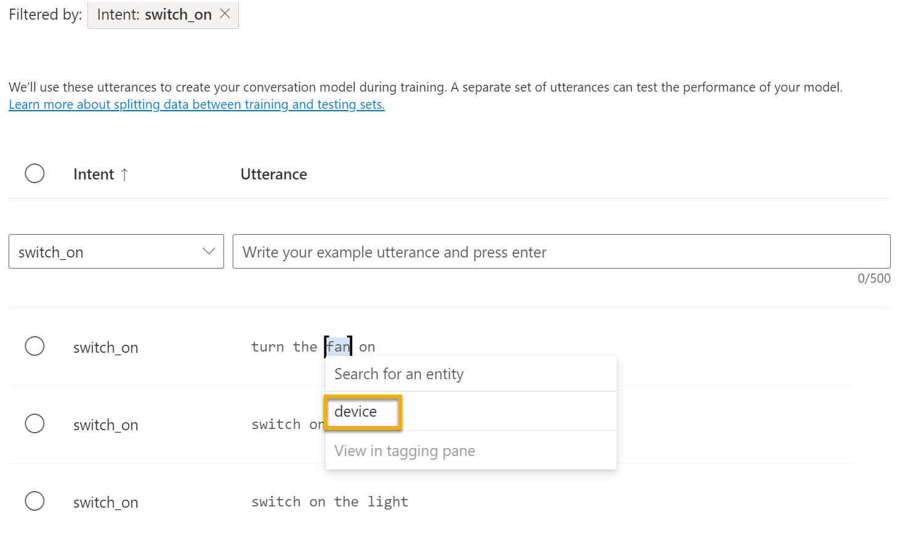

---
lab:
  title: استكشاف فهم اللغة
---

# <a name="explore-language-understanding"></a>استكشاف فهم اللغة

> **ملاحظة** لإكمال هذا النشاط المعملي، ستحتاج إلى [اشتراك Azure](https://azure.microsoft.com/free?azure-portal=true) الذي لديك فيه حق الوصول الإداري.

نتوقع أن تتمكن أجهزة الكمبيوتر من استخدام الذكاء الاصطناعي بشكل متزايد من أجل فهم الأوامر المنطوقة أو المكتوبة باللغة الطبيعية. على سبيل المثال، قد تحتاج إلى تطبيق نظام أتمتة منزلية يمكنك من التحكم في الأجهزة في منزلك باستخدام الأوامر الصوتية مثل "تشغيل الضوء" أو "تشغيل المروحة"، وجعل الجهاز الذي يعمل بطاقة الذكاء الاصطناعي يفهم الأمر ويتخذ الإجراء المناسب.

لاختبار إمكانات خدمة Conversational Language Understanding، سنستخدم تطبيق سطر أوامر يعمل في Cloud Shell. تنطبق نفس المبادئ والوظائف في حلول العالم الحقيقي، مثل مواقع الويب أو تطبيقات الهاتف.

## <a name="create-a-language-service-resource"></a>إنشاء مورد *خدمة Language*

يمكنك استخدام خدمة Conversational Language Understanding عن طريق إنشاء مورد **خدمة Language**.

إذا لم تكن قد قمت بذلك بالفعل، فأنشئ مورد **خدمة Language** في اشتراكك في Azure.

1. في علامة تبويب مستعرض أخرى، افتح مدخل Azure في [https://portal.azure.com](https://portal.azure.com?azure-portal=true)، وقم بتسجيل الدخول باستخدام حساب Microsoft الخاص بك.

1. انقر فوق الزر **&#65291;Create a resource**، وابحث عن *Language service*، وأنشئ مورد **خدمة Language** من خلال الإعدادات التالية:
    - تحديد ميزات إضافية: *احتفظ بالميزات الافتراضية وانقر فوق Continue لإنشاء موردك*  
    - **الاشتراك**: *اشتراك Azure الخاص بك*.
    - **مجموعة الموارد**: *أنشئ مجموعة موارد جديدة ذات اسم فريد*.
    - **المنطقة**: شرق الولايات المتحدة 2
    - **الاسم**: *أدخل اسمًا مميزًا*.
    - **Pricing tier**: S (1000 مكالمة في الدقيقة)
    - **By checking this box I certify that I have reviewed and acknowledge the terms in the Responsible AI Notice.** : محدد.

1. راجع المورد وأنشئه، وانتظر حتى يكتمل التوزيع.

### <a name="create-a-conversational-language-understanding-app"></a>إنشاء تطبيق Conversational Language Understanding

لفهم اللغة الطبيعية باستخدام تطبيق Conversational Language Understanding، يمكنك إنشاء التطبيق، ثم إضافة الكيانات والأهداف والألفاظ لتحديد الأوامر التي تريد التطبيق.

1. في علامة تبويب مستعرض جديدة، افتح مدخل Language Studio في [https://language.azure.com](https://language.azure.com?azure-portal=true)، ثم سجل الدخول باستخدام حساب Microsoft المقترن باشتراك Azure.

1. إذا طلب منك اختيار مورد Language، حدد الإعدادات التالية:
    - **Azure directory**: دليل Azure الذي يحتوي على اشتراكك.
    - **Azure subscription**: اشتراك Azure الخاص بك.
    - **Language resource**: مورد Language الذي أنشأته مسبقًا.

    >**تلميح** إذا ***لم*** تتم مطالبتك باختيار مورد لغة، فقد يرجع ذلك إلى وجود موارد لغة متعددة في اشتراكك؛ وفي هذه الحالة:
    >1. في الشريط الموجود أعلى الصفحة، انقر فوق الزر **Settings (&#9881;)**.
    >1. في الصفحة **Settings** اعرض علامة التبويب **Resources**.
    >1. حدد مورد اللغة الخاص بك، وانقر فوق **Switch resource**.
    >1. في أعلى الصفحة، انقر فوق **Language Studio** للعودة إلى الصفحة الرئيسية في Language Studio.

1. في الجزء العلوي من المدخل، في قائمة **Create new**، حدد **Conversational Language Understanding**.

1. في مربع الحوار **Create a project**، في الصفحة **Enter basic information**، أدخل التفاصيل التالية وانقر فوق **Next**:
    - **الاسم**: *إنشاء اسم فريد*
    - **الوصف**: أتمتة المنزل البسيطة
    - **لغة النطق الأساسية**: الإنجليزية
    - **Enable multiple languages in project**: *Do not select*

    

    >**تلميح** اكتب *اسم المشروع* الخاص بك، الذي سوف تستخدمه لاحقًا.

1. في الصفحة *Review and finish* انقر فوق **Create**.

### <a name="create-intents-utterances-and-entities"></a>إنشاء المقاصد والأقوال والكيانات

يعد *الهدف* عبارة عن إجراء تريد تنفيذه، على سبيل المثال، قد ترغب في تشغيل مصباح أو إيقاف تشغيل مروحة. في هذه الحالة، ستحدد هدفين: أحدهما لتشغيل الجهاز والآخر لإيقاف تشغيل الجهاز. لكل قصد، عليك تحديد نماذج التعبيرات التي تشير إلى *الأقوال* المستخدمة للإشارة إلى تحقيق النية.

1. في الجزء **Schema definition**، تأكد من تحديد **Intents** ثم انقر فوق **Add**، وأضِف هدفاً بالاسم **switch_on** (بالأحرف الصغيرة) وانقر فوق **Add intent**.

    
    

1. انقر فوق الهدف **switch_on**. سينقلك إلى صفحة **Data labeling**. في القائمة المنسدلة **Intent**، حدد **switch_on**. بجانب الهدف **switch_on** اكتب لفظة ***turn the light on*** واضغط **Enter** لإرسال هذا اللفظ إلى القائمة.

    

1. تحتاج خدمة Language إلى خمسة أمثلة ألفاظ مختلفة على الأقل لكل هدف لتدريب نموذج اللغة بشكل كافٍ. أضف أربعة أمثلة لفظية أخرى إلى هدف **switch_on**:  
    - ***قم بتشغيل المروحة***
    - ***put the fan on***
    - ***تثبيت الضوء***
    - ***switch on the light***
    - ***turn the fan on***

1. في جزء **Labeling entities for training** على الجانب الأيمن من الشاشة، حدد **Labels**، ثم حدد **Add entity**. اكتب **device** (بأحرف صغيرة)، وحدد **List** وحدد **Add entity**.

     
    

1. عند نطق ***turn the fan on*** ميز الكلمة "fan". ثم في القائمة التي تظهر، في المربع *Search for an entity* حدد **device**.

    

1. افعل الشيء نفسه مع جميع الأقوال. ضع علامة على بقية *fan* أو العبارات *الخفيفة* باستخدام كيان **device**. عند الانتهاء، تحقق من أن لديك الألفاظ التالية وانقر فوق **Save changes**:

    | **intent** | **utterance** | **الكيان** |
    | --------------- | ------------------ | ------------------ |
    | switch_on   | وضع المروحة في حالة التشغيل      | الجهاز - *select fan* |
    | switch_on   | إشعال المصباح    | الجهاز - *select light* |
    | switch_on   | تشغيل المصباح | الجهاز - *select light* |
    | switch_on   | تشغيل المروحة     | الجهاز - *select fan* |
    | switch_on   | تشغيل المروحة   | الجهاز - *select fan* |
    | switch_on   | إضاءة المصباح   | الجهاز - *select light* |

     

1. في الجزء على اليسار، انقر فوق **Schema definition** وتحقق من إدراج الهدف **switch_on** خاصتك. ثم انقر فوق **Add** وأضِف هدفاً جديداً باسم **switch_off** (بأحرفٍ صغيرة).

     

1. انقر على الهدف **switch_off**. سينقلك إلى صفحة **Data labeling**. في القائمة المنسدلة **Intent**، حدد **switch_off**. بجانب هدف **switch_off**، أضف الكلام ***turn the light off***.

1. أضف خمسة أمثلة لفظية أخرى إلى هدف **switch_off**.
    - ***إيقاف تشغيل المروحة***
    - ***إيقاف تشغيل المروحة***
    - ***put the light off***
    - ***turn off the light***
    - ***switch the fan off***

1. ضع علامة على الكلمات *الخفيفة* أو *fan* باستخدام كيان **device**. عند الانتهاء، تحقق من أن لديك الألفاظ التالية وانقر فوق **Save changes**:  

    | **intent** | **utterance** | **الكيان** | 
    | --------------- | ------------------ | ------------------ |
    | switch_off   | وضع المروحة في حالة إيقاف التشغيل    | الجهاز - *select fan* | 
    | switch_off   | إطفاء المصباح  | الجهاز - *select light* |
    | switch_off   | إيقاف تشغيل المصباح | الجهاز - *select light* |
    | switch_off   | إيقاف المروحة | الجهاز - *select fan* |
    | switch_off   | إيقاف تشغيل المروحة | الجهاز - *select fan* |
    | switch_off   | إيقاف إضاءة المصباح | الجهاز - *select light* |

### <a name="train-the-model"></a>تدريب النموذج

الآن أنت مستعد لاستخدام المقاصد والكيانات التي حددتها لتدريب نموذج لغة المحادثة لتطبيقك.

1. على الجانب الأيسر من Language Studio، حدد **Training jobs**، ثم حدد **Start a training job**. استخدام الإعدادات التالية: 
    - **Train a new model**: *Selected and choose a model name*
    - **وضع التدريب**: تدريب قياسي (مجاني)
    - **تقسيم البيانات**: *حدد تقسيم مجموعة الاختبارات تلقائياً من بيانات التدريب، واحتفظ بالنسب المئوية الافتراضية*
    - انقر فوق **Train** أسفل الصفحة.

1. انتظر حتى يكتمل التدريب. 

### <a name="deploy-and-test-the-model"></a>نشر النموذج واختباره

لاستخدام النموذج المدرَّب في تطبيق العميل، يجب عليك نشره كنقطة نهاية يمكن لتطبيقات العميل أن ترسل إليها ألفاظ جديدة؛ من خلالها سيتم توقع الأهداف والكيانات.

1. على الجانب الأيسر من Language Studio، انقر فوق **Deploying a model**.

1. حدد اسم نموذجك وانقر فوق **Add deployment**. استخدم الإعدادات التالية:
    - **Create or select an existing deployment name**: *حدد create a new deployment name. أضف اسم فريد*.
    - **Assign trained model to your deployment name**:  *حدد اسم النموذج المدرب*.
    - انقر فوق **Deploy**

    >**تلميح** اكتب *اسم التوزيع*الخاص بك، الذي سوف تستخدمه لاحقًا. 

1. عندما يتم نشر النموذج، انقر فوق **Testing deployments** على الجانب الأيسر من الصفحة، ثم حدد النموذج الموزع الخاص بك ضمن **Deployment name**.

1. أدخل النص التالي، ثم حدد **Run the test**:

    *تشغيل الضوء*

     

    راجع النتيجة التي تم إرجاعها، مع ملاحظة أنها تتضمن الهدف المتوقع (الذي يجب أن يكون **switch_on**) والكيان المتوقع (**device**) مع درجات الثقة التي تشير إلى احتمال احتساب النموذج لـ الهدف والكيان المتوقعين. تُظهر علامة التبويب JSON الثقة النسبية لكل هدف محتمل (الهدف الذي يتمتع بأعلى درجة ثقة هو الهدف المتوقع)

1. امسح مربع النص واختبر النموذج من خلال الألفاظ التالية ضمن *Enter your own text, or upload a text document*:
    - *إيقاف تشغيل المروحة*
    - *تثبيت الضوء*
    - *إيقاف تشغيل المروحة*

## <a name="run-cloud-shell"></a>تشغيل Cloud Shell

الآن دعنا نجرب نموذجك المُوزَّع. للقيام بذلك، سنستخدم تطبيق سطر أوامر يعمل في Cloud Shell في Azure. 

1. بعد ترك علامة تبويب المستعرض مع فتح برنامج Language Studio، قم بالتبديل مرة أخرى إلى علامة تبويب المستعرض التي تحتوي على مدخل Azure.

1. في مدخل Azure، حدد زر **[>_]** *(Cloud Shell)* أعلى الصفحة يمين مربع البحث. يؤدي النقر فوق الزر إلى فتح جزء Cloud Shell في الجزء السفلي من المدخل.

    

1. في المرة الأولى التي تفتح فيها Cloud Shell، قد يُطلب منك اختيار نوع shell التي تريد استخدامها (*Bash* أو *PowerShell).* حدد **PowerShell**. إذا لم ترى هذا الخيار، تخطي الخطوة.  

1. إذا تمت مطالبتك بإنشاء سعة تخزينية لشركة Cloud Shell، فتأكد من تحديد اشتراكك وحدد **Create storage**. ثم انتظر دقيقة أو نحو ذلك لإنشاء التخزين. 

    

1. تأكد من تبديل نوع shell المشار إليه في أعلى يسار جزء Cloud Shell إلى *PowerShell*. إذا كان *Bash*، فقم بالتبديل إلى *PowerShell* باستخدام القائمة المنسدلة.

     

1. انتظر حتى يبدأ PowerShell. يجب أن ترى الشاشة التالية في مدخل Azure:  

     

## <a name="configure-and-run-a-client-application"></a>كوّن تطبيق عميل وقم بتشغيله

لنفتح الآن برنامجاً نصياً مكتوباً مسبقاً ونعدله، سيقوم البرنامج النصي هذا بتشغيل تطبيق العميل.

1. في shell الأمر، أدخل الأمر التالي لتحميل نموذج التطبيق وحفظه إلى مجلد يسمى «ai-900».

    ```PowerShell
    git clone https://github.com/MicrosoftLearning/AI-900-AIFundamentals ai-900
    ```

    >**ملاحظة** إذا كنت قد استخدمت هذا الأمر بالفعل في نشاط معملي آخر لاستنساخ مستودع *ai-900*، فيمكنك تخطي هذه الخطوة.

1. يتم تحميل الملفات إلى مجلد يسمى **ai-900** نريد الآن رؤية جميع الملفات الموجودة في هذا المجلد والعمل معها. اكتب الأوامر التالية في shell:

     ```PowerShell
    cd ai-900
    code .
    ```

    لاحظ كيفية فتح البرنامج النصي للمحرر مثل ذلك الموجود في الصورة التالية: 

    

1. في جزء **Files** على اليمين، حدد الملف **understand.ps1** في المجلد **ai-900**. يحتوي هذا الملف على بعض التعليمات البرمجية التي تستخدم نموذج "Conversational Language Understanding" خاصتك. 

    

    لا تقلق كثيراً بشأن تفاصيل الرمز. الشيء المهم هو أنك ستستخدم الإرشادات أدناه لتعديل الملف لتحديد نموذج اللغة الذي دربته. 

1. قم بالتبديل مرة أخرى إلى علامة تبويب المستعرض التي تحتوي على **Language Studio**. ثم في Language Studio، افتح صفحة **Deploying a model** وحدد النموذج الخاص بك. ثم انقر فوق الزر **Get prediction URL**. توجد المعلومات التي تحتاج إليها في مربع الحوار هذا:
    - نقطة النهاية للنموذج الخاص بك: يمكنك نسخ نقطة النهاية من مربع **Prediction URL**.
    - مفتاح النموذج الخاص بك: يوجد المفتاح في ** نموذج الطلب كـ **Sample request**Ocp-Apim-Subscription-Key**، ويبدو مشابهاً لـ ***0ab1c23de4f56gh7i8901234jkl567m8***.

1. انسخ قيمة نقطة النهاية، ثم قم بالتبديل مرة أخرى إلى علامة تبويب المستعرض التي تحتوي على Cloud Shell والصقها في محرر التعليمات البرمجية، واستبدل **YOUR_ENDPOINT** (داخل علامتي الاقتباس). كرر هذه العملية للمفتاح، مع استبدال **YOUR_KEY**.

1. بعد ذلك، استبدل **YOUR_PROJECT_NAME** باسم مشروعك، واستبدل **YOUR_DEPLOYMENT_NAME** باسم النموذج المنشور. يجب أن تبدو الأسطر الأولى من التعليمات البرمجية مشابهة لما تراه أدناه:

    ```PowerShell
    $endpointUrl="https://some-name.cognitiveservices.azure.com/language/..."
    $key = "0ab1c23de4f56gh7i8901234jkl567m8"
    $projectName = "name"
    $deploymentName = "name"
    ```

1. في أعلى يمين جزء المحرر، استخدم الزر **...** لفتح القائمة ثم حدد **Save** لحفظ التغييرات. ثم افتح القائمة مرة أخرى وحدد **Close Editor**.

1. أدخل الأمر التالي في جزء PowerShell لتشغيل التعليمات البرمجية:

    ```PowerShell
    ./understand.ps1 "Turn on the light"
    ```

1. راجع النتائج. كان يجب أن يتنبأ التطبيق بأن الإجراء المقصود هو تشغيل الضوء.

1. الآن جرب أمر آخر:

    ```PowerShell
    ./understand.ps1 "Switch the fan off"
    ```

1. راجع النتائج من هذا الأمر. كان يجب أن يتنبأ التطبيق بأن الإجراء المقصود هو تشغيل الضوء.

1. تجربة مع عدد قليل من الأوامر أكثر؛ بما في ذلك الأوامر التي لم يتم تدريب النموذج لدعمها، مثل "مرحبًا" أو "شغل الفرن". يجب أن يفهم التطبيق بشكل عام الأوامر التي يتم تعريف نموذج اللغة الخاص به لها، ويفشل بأمان في الإدخال الآخر.

>**ملاحظة** في كل مرة ستحتاج إلى البدء بـ **./understand.ps1** متبوعًا بالعبارة. قم بتضمين علامات الاقتباس حول العبارة الخاصة بك.

## <a name="learn-more"></a>معرفة المزيد

لا يعرض هذا التطبيق سوى بعض إمكانات ميزة Conversational Language Understanding في خدمة Language. لمعرفة المزيد حول ما يمكنك القيام به مع هذه الخدمة، راجع [صفحة Conversational Language Understanding](https://docs.microsoft.com/azure/cognitive-services/language-service/conversational-language-understanding/overview). 
