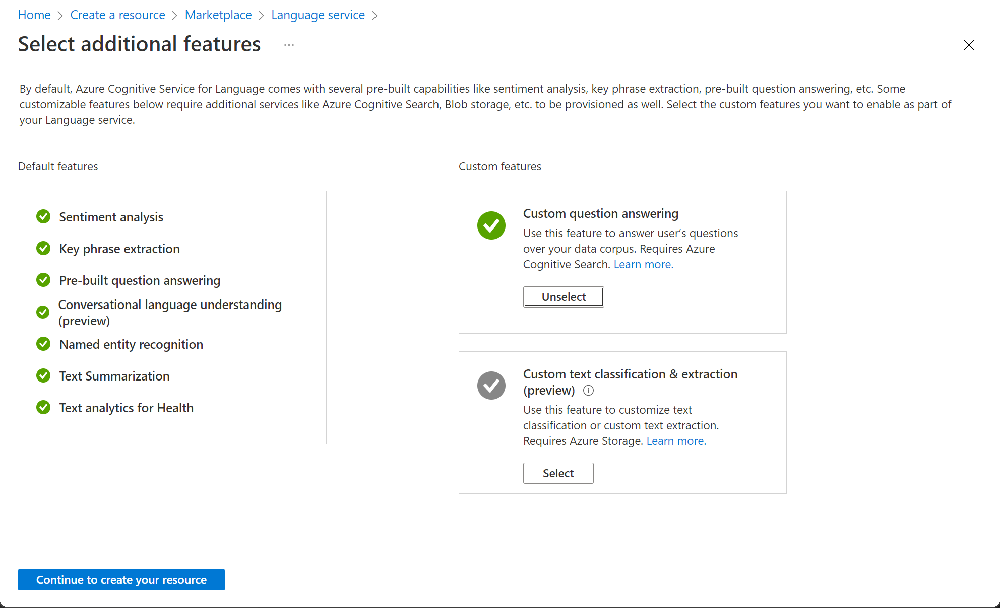

---
lab:
  title: استكشاف الإجابة عن الأسئلة
---

# استكشاف الإجابة عن الأسئلة

> **ملاحظة** لإكمال هذا النشاط المعملي، ستحتاج إلى [اشتراك Azure](https://azure.microsoft.com/free?azure-portal=true) الذي لديك فيه حق الوصول الإداري.

بالنسبة لسيناريوهات دعم العملاء، من الشائع إنشاء بوت يمكنه تفسير الأسئلة المتداولة والإجابة عليها من خلال نافذة دردشة موقع ويب أو بريد إلكتروني أو واجهة صوتية. واجهة بوت الكامنة هي قاعدة معرفية من الأسئلة والأجوبة المناسبة التي يمكن لبوت البحث عن ردود مناسبة.

## إنشاء قاعدة معارف مخصصة للإجابة على الأسئلة

تمكنك ميزة الإجابة على الأسئلة من خدمة Language من إنشاء قاعدة معارف بسرعة، إما عن طريق إدخال أزواج الأسئلة والأجوبة أو من مستند موجود أو صفحة ويب. ويمكن بعد ذلك استخدام بعض قدرات معالجة اللغة الطبيعية المدمجة لتفسير الأسئلة والعثور على إجابات مناسبة.

1. افتح مدخل Azure في [https://portal.azure.com](https://portal.azure.com?azure-portal=true)، وسجّل الدخول باستخدام حساب Microsoft الخاص بك.

1. انقر فوق الزر **&#65291;Create a resource**، وابحث عن *Language service*، ثم أنشئ مورد **Language service** باستخدام الإعدادات التالية، ثم انقر فوق **Continue لإنشاء المورد**: **Select Additional Features**
    - **Default features**: *احتفظ بالميزات الافتراضية*.
    - **Custom features**: *حدد custom question answering*.

    

1. في الصفحة **Create Language**، حدد الإعدادات التالية:
    - **الاشتراك**: *اشتراك Azure الخاص بك*.
    - **مجموعة الموارد**: *حدد مجموعة موارد موجودة أو أنشئ مجموعة موارد جديدة*.
    - **Name**: *اسم فريد لمورد Language الخاص بك*.
    - **Pricing tier**: S (1000 مكالمة في الدقيقة)
    - **Azure search region**: *اختر أي موقع متوفر*.
    - **Azure search pricing tier**: Free F (3 Indexes) - (*إذا كان هذا المستوى غير متوفر، حدد Standard S (50 Indexes)* )
    - **By checking this box I certify that I have reviewed and acknowledge the terms in the Responsible AI Notice**: *محدد*.

    > **ملاحظة** إذا وفرت بالفعل موارد **Azure Cognitive Search** لـ free-tier، فقد لا تسمح لك حصة الاستخدام بإنشاء مورد آخر. وفي هذه الحالة، حدد مستوى آخر غير **Free F**.

1. انقر فوق **Review and create**، ثم انقر فوق **Create**. انتظر توزيع خدمة Language التي ستدعم قاعدة المعارف المخصصة للإجابة على الأسئلة.

1. في علامة تبويب مستعرض جديدة، افتح مدخل Language Studio في [https://language.azure.com](https://language.azure.com?azure-portal=true)، ثم سجل الدخول باستخدام حساب Microsoft المقترن باشتراك Azure.

1. إذا طلب منك اختيار مورد Language، حدد الإعدادات التالية:
    - **Azure directory**: دليل Azure الذي يحتوي على اشتراكك.
    - **Azure subscription**: اشتراك Azure الخاص بك.
    - **Language resource**: مورد Language الذي أنشأته مسبقًا.

1. إذا ***لم*** تتم مطالبتك باختيار مورد language، فقد يرجع ذلك إلى وجود موارد Language متعددة في اشتراكك؛ وفي هذه الحالة:
    1. في الشريط الموجود أعلى الصفحة، انقر فوق الزر **Settings (&#9881;)**.
    2. في الصفحة **Settings** اعرض علامة التبويب **Resources**.
    3. حدد مورد language الذي أنشأته للتو، وانقر فوق **Switch resource**.
    4. في أعلى الصفحة، انقر فوق **Language Studio** للعودة إلى الصفحة الرئيسية في Language Studio.

1. في أعلى مدخل Language Studio، في القائمة **Create new**، حدد **Custom question answering**.

1. في صفحة **Choose language setting for resource *your resource***، حدد **I want to select the language when I create a project in this resource** وانقر فوق **Next**.

1. في الصفحة **Enter basic information** أدخل التفاصيل التالية وانقر فوق **Next**:
    - **Language resource**: *اختر مورد language الخاص بك*.  
    - **Azure search resource**: *اختر مورد بحث Azure الخاص بك*.
    - **Name**: MargiesTravel
    - **Description**: A simple knowledge base
    - **Source language**: English
    - **Default answer when no answer is returned**: No answer found

1. في الصفحة **Review and finish** انقر فوق **Create project**.

1. سيتم نقلك إلى صفحة **Manage sources**. انقر فوق **&#65291;Add source** وحدد **URLs**.

1. في المربع **Add URLs**، انقر فوق **+ Add url**. اكتب ما يلي وحدد **Add all**:
    - **URL name**: MargiesKB
    - **URL**: `https://raw.githubusercontent.com/MicrosoftLearning/AI-900-AIFundamentals/main/data/qna/margies_faq.docx`
    - **Classify file structure**: *Auto-detect* 

## تحرير قاعدة المعرفة

تستند قاعدة معرفتك إلى التفاصيل الواردة في وثيقة الأسئلة الشائعة وبعض الردود المحددة مسبقا. يمكنك إضافة أزواج الأسئلة والأجوبة المخصصة لتكملتهم.

1. انقر فوق **Edit knowledge base** في اللوحة على الجانب الأيسر. ثم انقر فوق **+ Add question pair**.

1. في مربع **Questions**، اكتب `Hello`، ثم انقر فوق **Submit changes**.

1. انقر فوق **+ Add alternate phrase** واكتب `Hi`، ثم انقر فوق **Submit changes**.

1. في المربع **Answer and prompts** اكتب `Hello`. حافظ على أن يكون **Source**: Editorial.

1. انقر فوق **Submit**. ثم في أعلى الصفحة انقر فوق **Save changes**. قد تحتاج إلى تغيير حجم نافذتك لرؤية الزر.

## تدريب واختبار قاعدة المعارف

الآن بعد أن أصبح لديك قاعدة معارف، يمكنك اختبارها.

1. في أعلى الصفحة، انقر فوق **Test** لاختبار قاعدة المعارف الخاصة بك.

1. في جزء الاختبار، في الأسفل أدخل رسالة *Hi*. يجب إرجاع رد **Hello**.

1. في جزء الاختبار، في الأسفل أدخل رسالة *I want to book a flight*. يجب إرجاع رد مناسب من الأسئلة الشائعة.

    > **ملاحظة** يتضمن الرد *إجابة قصيرة* بالإضافة إلى *مقطع إجابة* مطول أكثر - يظهر مقطع الإجابة النص الكامل في مستند FAQ لأقرب سؤال مطابق، في حين يتم استخراج الإجابة القصيرة بذكاء من المقطع. يمكنك التحكم فيما إذا كانت الإجابة القصيرة واردة من الاستجابة باستخدام خانة الاختيار **«عرض إجابة قصيرة»** أعلى جزء الاختبار.

1. جرب سؤالا آخر، مثل *How can I cancel a reservation?*

1. عند الانتهاء من اختبار قاعدة المعرفة، انقر فوق **Test** لإغلاق جزء الاختبار.

## إنشاء بوت لقاعدة المعرفة

توفر قاعدة المعرفة خدمة خلفية يمكن لتطبيقات العميل استخدامها للإجابة على الأسئلة من خلال نوع من واجهة المستخدم. تطبيقات العميل هذه عادة ما تكون بوت. لجعل قاعدة المعرفة متاحة للبوت، يجب نشرها كخدمة يمكن الوصول إليها عبر HTTP. يمكنك بعد ذلك استخدام خدمة Azure Bot لإنشاء واستضافة برنامج بوت يستخدم قاعدة المعرفة للإجابة على أسئلة المستخدمين.

1. على يمين الصفحة Language Studio، انقر فوق **Deploy knowledge base**.

1. في أعلى الصفحة، انقر فوق **Deploy**. سيسألك مربع حوار عما إذا كنت تريد نشر المشروع. حدد **نشر**.

1. بعد توزيع الخدمة، انقر فوق **Create a Bot**. يؤدي هذا إلى فتح مدخل Azure في علامة تبويب مستعرض جديدة حتى تتمكن من إنشاء تطبيق ويب بوت في اشتراك Azure.

1. في مدخل Microsoft Azure، أنشئ Web App Bot. (قد ترى رسالة تحذير للتحقق من أن مصدر القالب موثوق به. لا تحتاج إلى اتخاذ أي إجراء لهذه الرسالة.) تابع عن طريق تحديث الإعدادات التالية:

    - **تفاصيل المشروع**
        - **الاشتراك**: *اشتراكك في Azure*
        - **مجموعة الموارد**: *مجموعة الموارد التي تحتوي على مورد اللغة خاصتك*
    - **تفاصيل المثيل**
        - **موقع مجموعة الموارد**: *نفس موقع خدمة اللغة.*
    - **Azure Bot**
        - **مقبض الروبوت**: *اسم فريد للروبوت الخاص بك* (*تم ملؤه مسبقا*)
    - **اختر مستوى التسعير الخاص بك**
        - **مستوى التسعير**: مجاني (F0) (قد تحتاج إلى تحديد *تغيير الخطة*)
    - **معرف تطبيق Microsoft**
        - **نوع الإنشاء**: *حدد إنشاء هوية مدارة جديدة يعينها المستخدم* 

5. حدد **Next: Web App >** لمتابعة تحديث الإعدادات. 
    - **App Service**
        - **اسم التطبيق**: *نفس **مؤشر البوت** مع **.azurewebsites.net** ملحق تلقائيًا*
        - **لغة SDK**: *اختر إما C# أو Node.js*
    - ⁧**⁩خطة خدمة التطبيق⁧**⁩
        - **نوع الإنشاء**: *حدد إنشاء خطة خدمة تطبيق جديدة*
    - **إعدادات التطبيق**
        - **مفتاح مورد اللغة**: *ستحتاج إلى نسخ مفتاح مورد اللغة ولصقه هنا.* 
        
        > **ملاحظه** للانتقال إلى مفتاح مورد اللغة، افتح [https://portal.azure.com](https://portal.azure.com?azure-portal=true). في الصفحة الرئيسية، انقر فوق *مجموعات الموارد* وحدد موقع مجموعة الموارد التي أنشأت مورد اللغة فيها. حدد مورد اللغة وانتقل إلى القائمة اليسرى الخاصة به. ثم حدد *المفاتيح ونقطة النهاية*. انسخ أحد المفاتيح. 

    -  
        - **اسم مشروع اللغة**: MargiesTravel
        - **اسم مضيف نقطة نهاية خدمة اللغة**: *تم ملؤه مسبقا بنقطة نهاية خدمة اللغة*
    - **تفاصيل خدمة اللغة**
        - **معرف الاشتراك**: *تم ملؤه مسبقا بمعرف الاشتراك الخاص بك*
        - **اسم مجموعة الموارد**: *تم ملؤه مسبقا باسم مجموعة الموارد*
        - **اسم الحساب**: *تم ملؤه مسبقا باسم المورد الخاص بك*

1. حدد **"استعراض + إنشاء"**.

1. انتظر حتى يتم إنشاء البوت الخاص بك (رمز الإشعار في أعلى اليمين، والذي يبدو وكأنه جرس، سيتم تحريكه أثناء الانتظار). ثم في الإشعار الذي اكتمل النشر، انقر فوق **Go to resource** (أو بدلا من ذلك، في الصفحة الرئيسية، انقر فوق **Resource groups**، افتح مجموعة الموارد حيث أنشأت بوت تطبيق الويب، وانقر فوقه.)

1. في الجزء الأيسر من روبوت الدردشة الخاص بك ابحث عن **Settings**، انقر فوق **Test in Web Chat**، وانتظر حتى يعرض روبوت الدردشة رسالة **Hello and Welcome** (قد يستغرق الأمر بضع ثوان للتهيئة).

1. استخدم واجهة الدردشة الاختبارية لضمان أن يجيب البوت الخاص بك على الأسئلة من قاعدة معرفتك كما هو متوقع. على سبيل المثال، جرب إرسال *I need to cancel my hotel*.

تجربة مع بوت. ربما ستجد أنه يمكنه الإجابة على أسئلة ضمن الأسئلة الشائعة بدقة تامة، ولكن سيكون لديه قدرة محدودة على تفسير الأسئلة التي لم يتم تدريبه عليها. يمكنك دائما استخدام Language Studio لتحرير قاعدة المعارف لتحسينها، وإعادة نشرها.

## معرفة المزيد

- لمعرفة المزيد عن خدمة Question Answering، راجع [الوثائق](https://docs.microsoft.com/azure/cognitive-services/language-service/question-answering/overview).
- لمعرفة المزيد حول خدمة بوت Microsoft، اعرض [صفحة خدمة Azure Bot](https://azure.microsoft.com/services/bot-service/).
