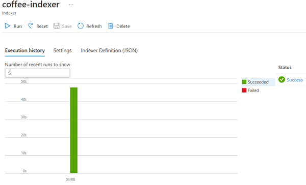
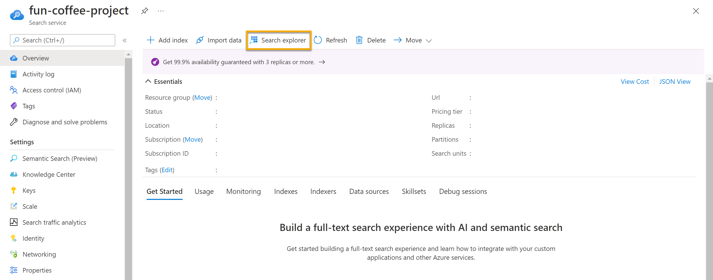

---
lab:
  title: استكشاف التنقيب عن المعلومات
---

# استكشاف التنقيب عن المعلومات

> **ملاحظة** لإكمال هذا النشاط المعملي، ستحتاج إلى [اشتراك Azure](https://azure.microsoft.com/free?azure-portal=true) الذي لديك فيه حق الوصول الإداري.

لنتخيل أنك تعمل في Fourth Coffee، وهي سلسلة مقاهي وطنية. يُطلب منك المساعدة في بناء حل للتنقيب عن المعرفة يجعل من السهل البحث عن رؤى حول تجارب العملاء. تقرر إنشاء فهرس Azure Cognitive Search باستخدام البيانات المستخرجة من مراجعات العملاء.  

سوف تتعلم من خلال هذا التمرين المعملي ما يلي:

- إنشاء موارد Azure
- استخراج البيانات من مصدر بيانات
- إثراء البيانات بمهارات الذكاء الاصطناعي
- استخدام مفهرس Azure في مدخل Azure
- الاستعلام عن فهرس البحث
- مراجعة النتائج المحفوظة في Knowledge Store

## موارد Azure المطلوبة

يتطلب الحل الذي ستنشئه لـ Fourth Coffee الموارد التالية في اشتراك Azure الخاص بك:

- مورد **Azure Cognitive Search**، الذي سيدير الفهرسة والاستعلام.
- مورد **خدمات Azure الذكاء الاصطناعي** ، والذي يوفر خدمات الذكاء الاصطناعي للمهارات التي يمكن أن يستخدمها حل البحث الخاص بك لإثراء البيانات في مصدر البيانات باستخدام رؤى تم إنشاؤها الذكاء الاصطناعي.

    > **ملاحظه** يجب أن تكون موارد خدمات Azure Cognitive Search وAzure الذكاء الاصطناعي في نفس الموقع!

- **حساب تخزين** مع حاويات الكائنات الثنائية كبيرة الحجم والذي سيخزن المستندات الخام ومجموعات أخرى من الجداول أو الكائنات أو الملفات.

### إنشاء مورد *Azure Cognitive Search*

1. «تسجيل الدخول» إلى ⁧[⁩مدخل Azure⁧](https://portal.azure.com/learn.docs.microsoft.com?azure-portal=true)⁩.

1. انقر فوق زر **＋Create a resource**، وابحث عن *Azure Cognitive Search*، وأنشئ مورد **Azure Cognitive Search** باستخدام الإعدادات التالية:

    - **الاشتراك**: *اشتراك Azure الخاص بك*.
    - **مجموعة الموارد**: *أنشئ مجموعة موارد جديدة ذات اسم فريد*.
    - **Service name**: *اسم فريد*.
    - **Location**: *اختر أي منطقة متوفرة*.
    - **مستوى التسعير**: أساسي

1. حدد ⁧**⁩Review + create⁧**⁩، وبعد أن تظهر لك استجابة ⁧**⁩Validation Success⁧**⁩، حدد ⁧**⁩Create⁧**⁩.

1. بعد اكتمال التوزيع، حدد ⁧**⁩Go to resource⁧**⁩. في صفحة النظرة العامة على Azure Cognitive Search، يمكنك إضافة فهارس واستيراد البيانات والبحث في الفهارس التي تم إنشاؤها.

### إنشاء مورد خدمات Azure الذكاء الاصطناعي

ستحتاج إلى توفير مورد **خدمات Azure الذكاء الاصطناعي** الموجود في نفس موقع مورد Azure Cognitive Search. سيستخدم حل البحث الخاص بك هذا المورد لإثراء البيانات الموجودة في مخزن البيانات بالرؤى التي تم إنشاؤها بواسطة الذكاء الاصطناعي.

1. ارجع إلى الصفحة الرئيسية لمدخل Azure. انقر فوق ** الزر&#65291;إنشاء مورد** وابحث عن *خدمات Azure الذكاء الاصطناعي*. حدد **إنشاء** خطة **خدمات الذكاء الاصطناعي Azure** . سيتم نقلك إلى صفحة لإنشاء مورد خدمات Azure الذكاء الاصطناعي. قم بتكوينه بالإعدادات التالية:
    - **الاشتراك**: *اشتراك Azure الخاص بك*.
    - **Resource group**:  *نفس مجموعة الموارد مثل المورد Azure Cognitive Search*.
    - **Region**: *نفس موقع مورد Azure Cognitive Search*.
    - **Name**: *اسم فريد*.
    - **مستوى التسعير**: قياسي S0
    - **By checking this box I acknowledge that I have read and understood all the terms below**: محدد

1. حدد **Review + create**. بعد أن ترى الاستجابة **Validation Passed**، حدد **Create**.

1. انتظر حتى يكتمل النشر، ثم اعرض تفاصيل النشر.

### إنشاء حساب تخزين

1. ارجع إلى الصفحة الرئيسية Azure-Portal، ثم حدد الزر **+ Create a resource**.

1. ابحث عن *storage account*، وأنشئ مورد **storage account** باستخدام الإعدادات التالية: 
    - **الاشتراك**: *اشتراك Azure الخاص بك*.
    - **مجموعة الموارد**: *نفس مجموعة الموارد مثل Azure Cognitive Search وموارد خدمات Azure الذكاء الاصطناعي*.
    - **Storage account name**: *اسم فريد*.
    - **Location**: *اختر أي موقع متوفر*.
    - **الأداء:** قياسي
    - **التكرار**: التخزين المتكرر محليًا (LRS)

1. انقر فوق **Review**، ثم انقر فوق **Create**. انتظر حتى يكتمل النشر، ثم انتقل إلى المورد المنشور.

1. في حساب Azure Storage الذي أنشأته، في جزء القائمة الأيسر، حدد **Configuration** (ضمن **Setetings**).
1. قم بتغيير إعداد *السماح بالوصول المجهول لكائن ثنائي كبير الحجم* إلى **ممكن** ثم حدد **حفظ**.

## تحميل المستندات إلى Azure Storage

1. في جزء القائمة الأيمن، حدد **Containers**.

    

1. حدد **+ Container**. يفتح جزء على جانبك الأيمن.

1. أدخل الإعدادات التالية، وانقر فوق **Create**:
    - **الاسم**: مراجعات القهوة  
    - **مستوى الوصول العام**: حاوية (وصول مجهول للقراءة للحاويات والكائنات الثنائية كبيرة الحجم)
    - **Advanced**: *دون تغييرات*.

1. في علامة تبويب مستعرض جديدة، قم بتنزيل المستندات المضغوطة من https://aka.ms/km-documents ، ثم استخرج الملفات إلى مجلد *reviews*.

1. في مدخل Microsoft Azure، حدد حاوية *coffee-reviews*. في الحاوية حدد **Upload**.

    

1. في جزء **Upload blob**، حدد **Select a file**.

1. في نافذة المستكشف، حدد **all** الملفات الموجودة في مجلد *reviews*، وحدد **Open**، ثم حدد **Upload**.

    

1. بعد اكتمال التحميل، يمكنك إغلاق جزء **Upload blob**. الآن مستنداتك في حاوية تخزين *coffee-reviews*.

## فهرسة المستندات

بمجرد أن تكون لديك المستندات في التخزين، يمكنك استخدام Azure Cognitive Search لاستخراج الرؤى من المستندات. يوفر Azure-Portal *Import data wizard*. باستخدام هذا المعالج، يمكنك تلقائيا إنشاء فهرس ومفهرس لمصادر البيانات المدعومة. ستستخدم المعالج لإنشاء فهرس، واستيراد مستندات البحث من موقع التخزين إلى فهرس Azure Cognitive Search.

1. في مدخل Microsoft Azure، استعرض وصولاً إلى مورد Azure Cognitive Search. ثم، في صفحة **Overview** حدد **Import data**.

    

1. في صفحة **الاتصال ببياناتك**، في قائمة **مصدر البيانات**، حدد **Azure Blob Storage**. ثم أكمل تفاصيل مخزن البيانات بالقيم التالية:
    - **Data Source**: Azure Blob Storage
    - **اسم مصدر البيانات**: coffee-customer-data
    - **البيانات المراد استخراجها**: المحتوى وبيانات التعريف
    - **وضع التحليل**: افتراضي
    - **سلسلة الاتصال**: *حدد **اختيار اتصال موجود**. حدد حساب التخزين الخاص بك، وحدد حاوية **coffee-reviews**، ثم انقر فوق **Select**.
    - **مصادقة الهوية المُدارة**: لا شيء
    - **Container name**: *تتم تعبئة هذا الإعداد تلقائيًا بعد اختيار اتصال موجود*.
    - **Blob folder**: *اترك هذا فارغًا*.
    - **الوصف**: مراجعات لمقاهي Fourth Coffee.

1. حدد **Next: Add cognitive skills (Optional)**.

1. في قسم **إرفاق الخدمات المعرفية** ، حدد مورد خدمات Azure الذكاء الاصطناعي.  

1. في القسم **إضافة إثراءات**:
    - غيّر **اسم مجموعة المهارات** إلى **مجموعة مهارات القهوة**.
    - حدد خانة الاختيار **تمكين OCR ودمج كل النص في حقل merged_content**.
        > **ملاحظة** من المهم تحديد **Enable OCR** لعرض جميع خيارات الحقول الغنية.
    - تأكد من تعيين **حقل بيانات المصدر** إلى **merged_content**.
    - غيّر **مستوى دقة الإثراء** إلى **صفحات (5000 مجموعة حرف)**.
    - لا تحدد *Enable incremental enrichment*
    - حدد الحقول الغنية التالية:

        | المهارة المعرفية | المعلمة | اسم الحقل |
        | --------------- | ---------- | ---------- |
        | استخراج أسماء المواقع | | المواقع |
        | استخراج العبارات الرئيسية | | keyphrases |
        | اكتشاف التوجه | | التوجه |
        | إنشاء علامات من الصور | | imageTags |
        | إنشاء تسميات توضيحية من الصور | | imageCaption |

1. ضمن **Save Enrichments to a Knowledge Store**، حدد:
    - إسقاطات الصور
    - المستندات
    - Pages
    - Key phrases
    - Entities
    - تفاصيل الصور
    - مراجع الصور

    > **ملاحظة** يظهر تحذير يطلب **Storage Account Connection String**.
    >
    > 
    >
    > 1. حدد رابط **Choose an existing connection**. اختر حساب التخزين الذي أنشأته سابقًا.
    > 1. انقر فوق **+ Container** لإنشاء حاوية جديدة تسمى **knowledge-store** مع تعيين مستوى الخصوصية إلى **خاص**، وحدد **Create**.
    > 1. ثم حدد حاوية **knowledge-store** ثم انقر فوق **Select** أسفل الشاشة.

1. حدد **Azure blob projections: Document**. سيظهر إعداد *Container name* مع حاوية *knowledge-store* التي تمت تعبئتها تلقائياً. لا تقم بتغيير اسم الحاوية.

1. حدد **Next: Customize target index**. غيّر **Index name** إلى **coffee-index**.

1. تأكد من أن **Key** مضبوط على **metadata_storage_path**. اترك **Suggester name** فارغا و **Search mode** ممتلئا تلقائيا.

1. راجع الإعدادات الافتراضية لحقول الفهرس. حدد **filterable** لجميع الحقول التي تم تحديدها مسبقاً بشكل افتراضي.

    

1. حدد ⁧**⁩Next: Create an indexer⁧**⁩.

1. غيّر **Indexer name** إلى **coffee-indexer**.

1. اترك **الجدول** معيناً على **مرة واحدة**.

1. وسّع **Advanced options**. تأكد من تحديد الخيار **Base-64 Encode Keys**، حيث يمكن لمفاتيح الترميز أن تجعل الفهرس أكثر كفاءة.

1. حدد **إرسال** لإنشاء مصدر البيانات ومجموعة المهارات والفهرس والمفهرس. يتم تشغيل المفهرس تلقائياً ويقوم بتشغيل خط أنابيب الفهرسة، والذي:
    - يستخرج محتويات وحقول بيانات تعريف الوثيقة من مصدر البيانات.
    - يدير مجموعة مهارات المهارات المعرفية لإنشاء حقول غنية أكثر.
    - يعين الحقول المستخرجة إلى الفهرس.

1. في النصف السفلي من صفحة **Overview** لمورد Azure Cognitive Search الخاص بك، حدد علامة التبويب **Indexers**. تعرض علامة تبويب هذه **coffee-indexer** التي تم انشائها حديثًا. انتظر دقيقة، ثم حدد **&orarr; Refresh** حتى تشير **Status** إلى النجاح.

1. حدد اسم المفهرس لمعرفة المزيد من التفاصيل.

    

## الاستعلام عن الفهرس

استخدم مستكشف البحث لكتابة الاستعلامات واختبارها. مستكشف البحث أداة مدرجة في مدخل Microsoft Azure تمنحك طريقة سهلة للتحقق من جودة فهرس البحث. يمكنك استخدام مستكشف البحث لكتابة استعلامات ومراجعة النتائج في JSON.

1. في صفحة *نظرة عامة* لخدمة البحث، حدد **مستكشف البحث** أعلى الشاشة.

   

1. لاحظ كيف أن الفهرس المحدد هو *coffee-index* الذي أنشأته.

    

    في حقل ⁧**⁩Query string⁧**⁩، أدخل ⁧`search=*&$count=true`⁩، ثم حدد ⁧**⁩Search⁧**⁩. يعرض استعلام البحث جميع المستندات الموجودة في فهرس البحث، بما في ذلك عدد جميع المستندات في الحقل **@odata.count**. يجب أن يُرجع فهرس البحث مستند JSON مدرجًا فيه نتائج البحث.

    > **ملاحظه** إذا ظهرت رسالة **To search in the portal, please allow the portal origin in your index CORS settings**، وحدد **Allow portal**، ثم حدد **Search**.

1. الآن دعونا نباشر بتصفية حسب الموقع. في حقل ⁧`search=locations:'Chicago'`⁩Query string⁧**⁩، أدخل ⁧**⁩، ثم حدد ⁧**⁩Search⁧**⁩. يبحث الاستعلام في جميع المستندات الموجودة في الفهرس وعوامل التصفية لمراجعات ذات موقع في شيكاغو.

1. الآن دعونا نصفي حسب التوجه. في حقل ⁧`search=sentiment:'negative'`⁩Query string⁧**⁩، أدخل ⁧**⁩، ثم حدد ⁧**⁩Search⁧**⁩. يبحث الاستعلام في جميع المستندات الموجودة في الفهرس وعوامل التصفية لمراجعات ذات توجه سلبي.

   > **ملاحظة** راجع كيفية فرز النتائج بواسطة `@search.score`. هذه هي النتيجة التي حددها محرك البحث لإظهار مدى تطابق النتائج مع الاستعلام المحدد.

1. إحدى المشكلات التي قد نرغب في حلها هي سبب وجود مراجعات معينة. دعنا نلقِ نظرة على العبارات الرئيسية المرتبطة بالمراجعة السلبية. ما هو برأيك سبب المراجعة؟

## مراجعة مخزن المعرفة

دعنا نرَ قوة مخزن المعرفة أثناء العمل. عند تشغيل *Import data wizard*، يمكنك أيضاً إنشاء مخزن معرفة. ستجد داخل مخزن المعرفة أن البيانات المخصّصة المستخرجة من مهارات الذكاء الاصطناعي تستمر في شكل إسقاطات وجداول.

1. في مدخل Azure، انتقل مرةً أخرى إلى حساب Azure Storage خاصتك.

1. في جزء القائمة الأيمن، حدد **Containers**. حدد حاوية **knowledge-store**.

    

1. حدد أي عنصر، ثم انقر فوق ملف **objectprojection.json**.

    

1. انقر فوق **Edit** لرؤية JSON الذي تم إنتاجه لأحد المستندات من مخزن بيانات Azure.

    

1. حدد عنوان storage blob في أعلى يسار الشاشة للعودة إلى *Containers* لـ Storage account.

    

1. في *Containers*، حدد الحاوية *coffee-skillset-image-projection*. حدد أي من العناصر.

    

1. حدد أي من ملفات *.jpg*. انقر فوق **Edit** لمشاهدة الصورة المخزنة من المستند. لاحظ كيف يتم تخزين جميع الصور من المستندات بهذه الطريقة.

    

1. حدد عنوان storage blob في أعلى يسار الشاشة للعودة إلى *Containers* لـ Storage account.

1. حدد **Storage browser** على اللوحة اليسرى، وحدد **Tables**. يوجد جدول لكل كيان في الفهرس. حدد الجدول *coffeeSkillsetKeyPhrases*.

    ألق نظرة على العبارات الرئيسية التي تمكن مخزن المعرفة من التقاطها من المحتوى في المراجعات. العديد من الحقول هي مفاتيح، حتى تتمكن من ربط الجداول مثل قاعدة بيانات ارتباطية. الحقل الأخير يظهر العبارات الرئيسية التي اُستخرِجت بواسطة مجموعة المهارات.

## معرفة المزيد

فهرس البحث البسيط هذا فقط هو بعض إمكانيات خدمة Azure Cognitive Search. لمعرفة المزيد حول ما يمكنك القيام به مع هذه الخدمة، يرجى مراجعة[صفحة خدمة Azure Cognitive Search](/azure/search/search-what-is-azure-search).
