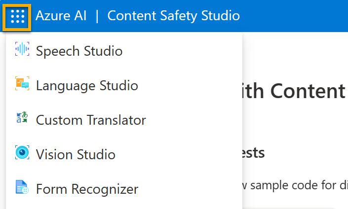

---
lab:
  title: استكشاف Content خزينة ty Studio
---

تساعد خدمات Azure الذكاء الاصطناعي المستخدمين على إنشاء تطبيقات الذكاء الاصطناعي باستخدام واجهات برمجة التطبيقات والنماذج الجاهزة والمبنية مسبقا وقابلة للتخصيص. في هذا التمرين، ستلقي نظرة على إحدى الخدمات، Azure الذكاء الاصطناعي Content خزينة ty، في Content خزينة ty Studio. 

يمكنك Content خزينة ty Studio من استكشاف كيفية إدارة محتوى النص والصورة. يمكنك إجراء اختبارات على نموذج النص أو الصور والحصول على درجة خطورة تتراوح من آمنة إلى عالية لكل فئة. في هذا التمرين المعملي، ستقوم بإنشاء مورد خدمة واحدة في Content خزينة ty Studio واختبار وظائفه. 

> **لاحظ** أن الهدف من هذا التمرين هو الحصول على فهم عام لكيفية توفير خدمات Azure الذكاء الاصطناعي واستخدامها. يتم استخدام المحتوى خزينة المثال، ولكن لا يتوقع منك اكتساب معرفة شاملة بسلامة المحتوى في هذا التمرين!

## التنقل في Content خزينة ty Studio 

1. افتح [Content خزينة ty Studio](https://contentsafety.cognitive.azure.com?azure-portal=true). إذا لم تقم بتسجيل الدخول، فستحتاج إلى تسجيل الدخول. حدد **تسجيل الدخول** في الجزء العلوي الأيسر من الشاشة. استخدم البريد الإلكتروني وكلمة المرور المقترنين باشتراك Azure لتسجيل الدخول. 

1. تم إعداد Content خزينة ty Studio مثل العديد من الاستوديوهات الأخرى لخدمات Azure الذكاء الاصطناعي. في القائمة في أعلى الشاشة، انقر فوق الأيقونة الموجودة على يسار *Azure الذكاء الاصطناعي*. سترى قائمة منسدلة من الاستوديوهات الأخرى المصممة للتطوير باستخدام خدمات Azure الذكاء الاصطناعي. يمكنك النقر فوق الأيقونة مرة أخرى لإخفاء القائمة.

  

## إقران مورد بالاستوديو 

قبل استخدام الاستوديو، تحتاج إلى إقران مورد خدمات Azure الذكاء الاصطناعي بالاستوديو. اعتمادا على الاستوديو، قد تجد أنك بحاجة إلى مورد خدمة واحدة محدد، أو يمكنك استخدام مورد عام متعدد الخدمات. في حالة Content خزينة ty Studio، يمكنك استخدام الخدمة عن طريق إنشاء مورد محتوى خزينة *ty* لخدمة واحدة أو *مورد خدمات Azure الذكاء الاصطناعي* العام متعدد الخدمات. في الخطوات أدناه، سنقوم بإنشاء مورد محتوى خزينة ty لخدمة واحدة. 

1. في الجزء العلوي الأيسر من الشاشة، انقر فوق أيقونة **الإعدادات**. 

1. في **صفحة الإعدادات**، سترى *علامة تبويب الدليل* وعلامة *تبويب المورد*. في *علامة التبويب Resource*، حدد **Create a new resource**. ينقلك هذا إلى الصفحة لإنشاء مورد في مدخل Microsoft Azure.

> ***ملاحظة** تسمح علامة التبويب الدليل* للمستخدمين بتحديد دلائل مختلفة لإنشاء الموارد منها. لا تحتاج إلى تغيير إعداداته إلا إذا كنت ترغب في استخدام دليل مختلف. 

1. في *صفحة إنشاء محتوى خزينة ty* في [مدخل Microsoft Azure](https://portal.azure.com?auzre-portal=true)، تحتاج إلى تكوين العديد من التفاصيل لإنشاء المورد الخاص بك. قم بتكوينه بالإعدادات التالية:
    - **الاشتراك**: *اشتراك Azure الخاص بك*.
    - **مجموعة الموارد**: *أنشئ مجموعة موارد جديدة ذات اسم فريد*.
    - **Region**: *اختر أي منطقة متوفرة*.
    - **الاسم**: *أدخل اسمًا مميزًا*.
    - **مستوى** التسعير: F0 مجاني

1. حدد **Review + Create** وراجع التكوين. ثم حدد **إنشاء**. ستشير الشاشة إلى وقت اكتمال النشر. 

*مبروك! لقد قمت للتو بإنشاء مورد خدمات Azure الذكاء الاصطناعي أو توفيره. المورد الذي قمت بتوفيره على وجه الخصوص هو مورد خدمة Content خزينة ty أحادي الخدمة.*

1. عند اكتمال النشر، افتح علامة تبويب جديدة وارجع إلى [Content خزينة ty Studio](https://contentsafety.cognitive.azure.com?azure-portal=true). 

1. حدد أيقونة **الإعدادات** في الجزء العلوي الأيسر من الشاشة مرة أخرى. هذه المرة يجب أن ترى أنه تمت إضافة المورد الذي تم إنشاؤه حديثا إلى القائمة.  

1. في صفحة content خزينة ty Studio الإعدادات، حدد مورد خدمة Azure الذكاء الاصطناعي الذي أنشأته للتو وانقر فوق **Use resource** في أسفل الشاشة. سيتم نقلك مرة أخرى إلى الصفحة الرئيسية للاستوديو. الآن يمكنك البدء في استخدام الاستوديو مع المورد الذي تم إنشاؤه حديثا.

## جرب الإشراف على النص في Content خزينة ty Studio

1. في الصفحة الرئيسية Content خزينة ty Studio، ضمن *Run moderation tests*، انتقل إلى **مربع Moderate text content** وانقر فوق **Try it out**.
1. ضمن تشغيل اختبار بسيط، انقر فوق **خزينة Content**. لاحظ أنه يتم عرض النص في المربع أدناه. 
1. انقر فوق **Run test**. يؤدي تشغيل اختبار إلى استدعاء نموذج التعلم العميق ل Content خزينة ty Service. تم بالفعل تدريب نموذج التعلم العميق على التعرف على المحتوى غير الآمن.
1. في *لوحة النتائج* ، افحص النتائج. هناك أربعة مستويات خطورة من آمنة إلى عالية، وأربعة أنواع من المحتوى الضار. هل تعتبر خدمة content خزينة ty الذكاء الاصطناعي أن هذه العينة مقبولة أم لا؟ ما يجب ملاحظته هو أن النتائج تقع ضمن فاصل الثقة. يمكن لنموذج مدرب تدريبا جيدا، مثل أحد نماذج Azure الذكاء الاصطناعي الجاهزة، إرجاع النتائج التي لها احتمال كبير لمطابقة ما يمكن أن يطلقه الإنسان على النتيجة. في كل مرة تقوم فيها بتشغيل اختبار، يمكنك استدعاء النموذج مرة أخرى. 
1. الآن جرب عينة أخرى. حدد النص ضمن المحتوى العنيف مع الخطأ الإملائي. تحقق من عرض المحتوى في المربع أدناه.
1. انقر فوق **تشغيل الاختبار** وافحص النتائج في لوحة النتائج مرة أخرى. 

يمكنك إجراء الاختبارات على جميع العينات المقدمة، ثم فحص النتائج.

## تحقق من المفاتيح ونقطة النهاية

يمكن برمجة هذه القدرات التي اختبرتها في جميع أنواع التطبيقات. يمكن العثور على المفاتيح ونقطة النهاية المستخدمة لتطوير التطبيق في كل من Content خزينة ty Studio ومدخل Azure. 

1. في Content خزينة ty Studio، انتقل مرة أخرى إلى **صفحة الإعدادات**، مع *تحديد علامة التبويب Resources*. ابحث عن المورد الذي استخدمته. مرر عبر لرؤية نقطة النهاية والمفتاح لموردك. 
1. في مدخل Microsoft Azure، سترى أن هذه هي *نفس* نقطة النهاية والمفاتيح *المختلفة* لموردك. للتحقق من ذلك، انتقل إلى مدخل [Microsoft Azure](https://portal.azure.com?auzre-portal=true). ابحث *عن المحتوى خزينة في* شريط البحث العلوي. ابحث عن المورد وانقر فوقه. في القائمة اليسرى، ابحث ضمن *إدارة* الموارد للمفاتيح ** ونقاط النهاية. حدد **Keys and Endpoints لعرض نقطة النهاية والمفاتيح** لموردك. 

بعد الانتهاء، يمكنك حذف المورد Content خزينة ty من مدخل Microsoft Azure. حذف المورد هو طريقة لتقليل التكاليف التي تتراكم عند وجود المورد في الاشتراك. للقيام بذلك، انتقل إلى **صفحة نظرة عامة** لمورد المحتوى خزينة ty. حدد **حذف** في أعلى الشاشة. 
